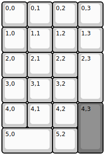

## lfkeyboards/lfkpad

[layout](lfkpad-kle.json) - [PCB](lfkpad.kicad_pcb)

{:loading="lazy"}

[Open in keyboard-layout-editor](http://www.keyboard-layout-editor.com/##@@=0,0&=0,1&=0,2&=0,3;&@=1,0&=1,1&=1,2&=1,3;&@=2,0&=2,1&=2,2&_h:2;&=2,3;&@=3,0&=3,1&=3,2;&@=4,0&=4,1&=4,2&_c=#777777&h:2;&=4,3;&@_c=#cccccc&w:2;&=5,0&=5,2)

{:loading="lazy"}

