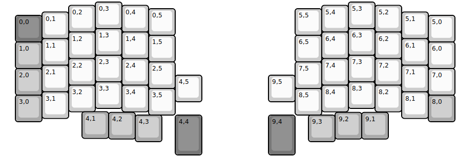
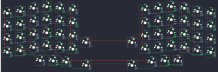

## lily58/lily58

[layout](lily58-kle.json) - [PCB](lily58.kicad_pcb)

{:loading="lazy"}

[Open in keyboard-layout-editor](http://www.keyboard-layout-editor.com/##@@_x:3.5;&=0,3&_x:8.5;&=5,3;&@_x:2.5&y:-0.875;&=0,2&_x:1.0;&=0,4&_x:6.5;&=5,4&_x:1.0;&=5,2;&@_x:5.5&y:-0.875;&=0,5&_x:4.5;&=5,5;&@_x:1.5&y:-0.875;&=0,1&_x:12.5;&=5,1;&@_x:0.5&y:-0.875&c=#777777;&=0,0&_x:14.5&c=#cccccc;&=5,0;&@_x:3.5&y:-0.5;&=1,3&_x:8.5;&=6,3;&@_x:2.5&y:-0.875;&=1,2&_x:1.0;&=1,4&_x:6.5;&=6,4&_x:1.0;&=6,2;&@_x:5.5&y:-0.875;&=1,5&_x:4.5;&=6,5;&@_x:1.5&y:-0.875;&=1,1&_x:12.5;&=6,1;&@_x:0.5&y:-0.875&c=#aaaaaa;&=1,0&_x:14.5&c=#cccccc;&=6,0;&@_x:3.5&y:-0.5;&=2,3&_x:8.5;&=7,3;&@_x:2.5&y:-0.875;&=2,2&_x:1.0;&=2,4&_x:6.5;&=7,4&_x:1.0;&=7,2;&@_x:5.5&y:-0.875;&=2,5&_x:4.5;&=7,5;&@_x:1.5&y:-0.875;&=2,1&_x:12.5;&=7,1;&@_x:0.5&y:-0.875&c=#aaaaaa;&=2,0&_x:14.5&c=#cccccc;&=7,0;&@_x:6.5&y:-0.75;&=4,5&_x:2.5;&=9,5;&@_x:3.5&y:-0.75;&=3,3&_x:8.5;&=8,3;&@_x:2.5&y:-0.875;&=3,2&_x:1.0;&=3,4&_x:6.5;&=8,4&_x:1.0;&=8,2;&@_x:5.5&y:-0.875;&=3,5&_x:4.5;&=8,5;&@_x:1.5&y:-0.875;&=3,1&_x:12.5;&=8,1;&@_x:0.5&y:-0.875&c=#aaaaaa;&=3,0&_x:14.5;&=8,0;&@_x:3&y:-0.375;&=4,1;&@_x:4&y:-0.975;&=4,2&_x:7.5;&=9,2&=9,1;&@_x:5&y:-0.9;&=4,3&_x:0.5&c=#777777&h:1.5;&=4,4&_x:2.5&h:1.5;&=9,4&_x:0.5&c=#aaaaaa;&=9,3)

{:loading="lazy"}

