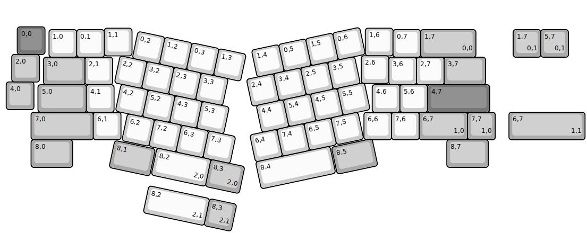
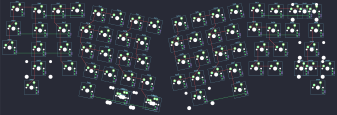

## linworks/dolice

[layout](dolice-kle.json) - [PCB](dolice.kicad_pcb)

{:loading="lazy"}

[Open in keyboard-layout-editor](http://www.keyboard-layout-editor.com/##@@_x:0.55&y:0.9&c=#777777;&=0,0;&@_x:3.7&y:-0.95&c=#cccccc;&=1,1&_x:8.45;&=1,6;&@_x:1.7&y:-0.95;&=1,0&=0,1&_x:10.45;&=0,7&_c=#aaaaaa&w:2;&=1,7%0A%0A%0A0,0;&@_x:0.35&y:-0.1;&=2,0;&@_x:13&y:-0.95&c=#cccccc;&=2,6;&@_x:1.5&y:-0.95&c=#aaaaaa&w:1.5;&=3,0&_c=#cccccc;&=2,1&_x:10.0;&=3,6&=2,7&_c=#aaaaaa&w:1.5;&=3,7;&@_x:0.15&y:-0.1;&=4,0;&@_x:1.3&y:-0.9&w:1.75;&=5,0&_c=#cccccc;&=4,1&_x:9.35;&=4,6&=5,6&_c=#777777&w:2.25;&=4,7;&@_x:1.05&c=#aaaaaa&w:2.25;&=7,0&_c=#cccccc;&=6,1&_x:8.8;&=6,6&=7,6&_c=#aaaaaa&w:1.75;&=6,7%0A%0A%0A1,0&=7,7%0A%0A%0A1,0;&@_x:1.05&w:1.5;&=8,0&_x:13.55&w:1.5;&=8,7;&@_r:12&x:5.05&y:-6.0&c=#cccccc;&=0,2&=1,2&=0,3&=1,3;&@_x:4.6;&=2,2&=3,2&=2,3&=3,3;&@_x:4.85;&=4,2&=5,2&=4,3&=5,3;&@_x:5.3;&=6,2&=7,2&=6,3&=7,3;&@_x:6.6&w:2;&=8,2%0A%0A%0A2,0&_c=#aaaaaa&w:1.25;&=8,3%0A%0A%0A2,0;&@_x:5.05&y:-0.95&w:1.5;&=8,1;&@_r:-12&x:8.45&y:-1.45&c=#cccccc;&=1,4&=0,5&=1,5&=0,6;&@_x:8.05;&=2,4&=3,4&=2,5&=3,5;&@_x:8.2;&=4,4&=5,4&=4,5&=5,5;&@_x:7.75;&=6,4&=7,4&=6,5&=7,5;&@_x:7.75&w:2.75;&=8,4;&@_x:10.55&y:-0.95&c=#aaaaaa&w:1.5;&=8,5;&@_r:0&x:18.5&y:-7.65;&=1,7%0A%0A%0A0,1&=5,7%0A%0A%0A0,1;&@_x:18.35&y:2.0&w:2.75;&=6,7%0A%0A%0A1,1;&@_r:12&x:6.6&y:0.4&c=#cccccc&w:2.25;&=8,2%0A%0A%0A2,1&_c=#aaaaaa;&=8,3%0A%0A%0A2,1)

{:loading="lazy"}

