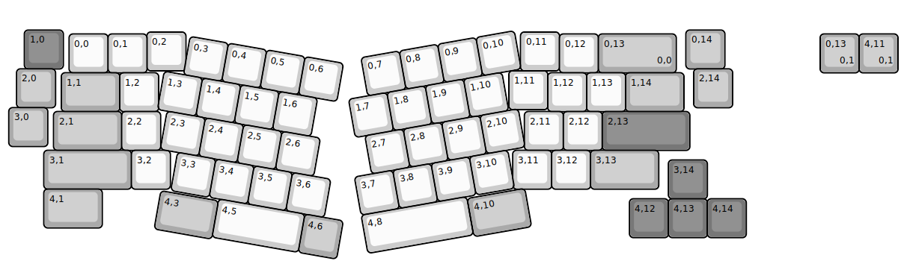
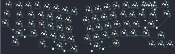

## linworks/em8

[layout](em8-kle.json) - [PCB](em8.kicad_pcb)

{:loading="lazy"}

[Open in keyboard-layout-editor](http://www.keyboard-layout-editor.com/##@@_x:0.55&y:0.7&c=#777777;&=1,0&_x:16.0&c=#aaaaaa;&=0,14;&@_x:3.7&y:-0.95&c=#cccccc;&=0,2&_x:8.6;&=0,11;&@_x:1.7&y:-0.95;&=0,0&=0,1&_x:10.6;&=0,12&_c=#aaaaaa&w:2;&=0,13%0A%0A%0A0,0;&@_x:0.35&y:-0.1;&=2,0&_x:16.4;&=2,14;&@_x:13&y:-0.95&c=#cccccc;&=1,11;&@_x:1.5&y:-0.95&c=#aaaaaa&w:1.5;&=1,1&_c=#cccccc;&=1,2&_x:10.0;&=1,12&=1,13&_c=#aaaaaa&w:1.5;&=1,14;&@_x:0.15&y:-0.1;&=3,0;&@_x:1.3&y:-0.9&w:1.75;&=2,1&_c=#cccccc;&=2,2&_x:9.35;&=2,11&=2,12&_c=#777777&w:2.25;&=2,13;&@_x:1.05&c=#aaaaaa&w:2.25;&=3,1&_c=#cccccc;&=3,2&_x:8.8;&=3,11&=3,12&_c=#aaaaaa&w:1.75;&=3,13;&@_x:17.1&y:-0.75&c=#777777;&=3,14;&@_x:1.05&y:-0.25&c=#aaaaaa&w:1.5;&=4,1;&@_x:16.1&y:-0.75&c=#777777;&=4,12&=4,13&=4,14;&@_r:10&x:4.9&y:-6.05&c=#cccccc;&=0,3&=0,4&=0,5&=0,6;&@_x:4.4;&=1,3&=1,4&=1,5&=1,6;&@_x:4.65;&=2,3&=2,4&=2,5&=2,6;&@_x:5.1;&=3,3&=3,4&=3,5&=3,6;&@_x:6.35&w:2.25;&=4,5&_c=#aaaaaa;&=4,6;&@_x:4.85&y:-0.95&w:1.5;&=4,3;&@_r:-10&x:8.8&y:-2.05&c=#cccccc;&=0,7&=0,8&=0,9&=0,10;&@_x:8.3;&=1,7&=1,8&=1,9&=1,10;&@_x:8.55;&=2,7&=2,8&=2,9&=2,10;&@_x:8.1;&=3,7&=3,8&=3,9&=3,10;&@_x:8.1&w:2.75;&=4,8;&@_x:10.86&y:-0.95&c=#aaaaaa&w:1.5;&=4,10;&@_r:0&x:21.0&y:-7.25;&=0,13%0A%0A%0A0,1&=4,11%0A%0A%0A0,1)

{:loading="lazy"}

