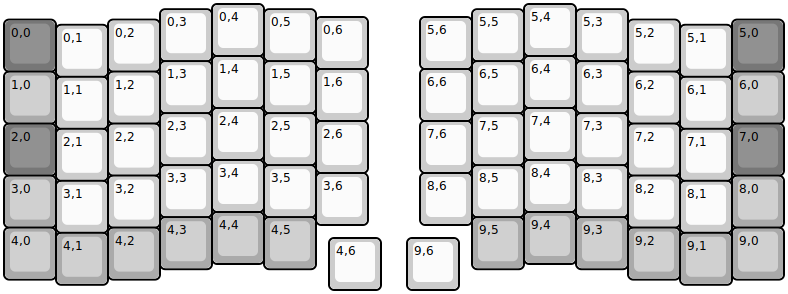
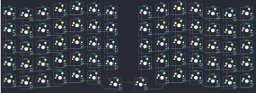

## lyra/lyra

[layout](lyra-kle.json) - [PCB](lyra.kicad_pcb)

{:loading="lazy"}

[Open in keyboard-layout-editor](http://www.keyboard-layout-editor.com/##@@_x:4;&=0,4&_x:5;&=5,4;&@_x:3&y:-0.9;&=0,3&_x:1;&=0,5&_x:3;&=5,5&_x:1;&=5,3;&@_x:6&y:-0.85;&=0,6&_x:1;&=5,6;&@_y:-0.95&c=#777777;&=0,0&_x:1&c=#cccccc;&=0,2&_x:9;&=5,2&_x:1&c=#777777;&=5,0;&@_x:1&y:-0.9&c=#cccccc;&=0,1&_x:11;&=5,1;&@_x:4&y:-0.4;&=1,4&_x:5;&=6,4;&@_x:3&y:-0.9;&=1,3&_x:1;&=1,5&_x:3;&=6,5&_x:1;&=6,3;&@_x:6&y:-0.85;&=1,6&_x:1;&=6,6;&@_y:-0.95&c=#aaaaaa;&=1,0&_x:1&c=#cccccc;&=1,2&_x:9;&=6,2&_x:1&c=#aaaaaa;&=6,0;&@_x:1&y:-0.9&c=#cccccc;&=1,1&_x:11;&=6,1;&@_x:4&y:-0.4;&=2,4&_x:5;&=7,4;&@_x:3&y:-0.9;&=2,3&_x:1;&=2,5&_x:3;&=7,5&_x:1;&=7,3;&@_x:6&y:-0.85;&=2,6&_x:1;&=7,6;&@_y:-0.95&c=#777777;&=2,0&_x:1&c=#cccccc;&=2,2&_x:9;&=7,2&_x:1&c=#777777;&=7,0;&@_x:1&y:-0.9&c=#cccccc;&=2,1&_x:11;&=7,1;&@_x:4&y:-0.4;&=3,4&_x:5;&=8,4;&@_x:3&y:-0.9;&=3,3&_x:1;&=3,5&_x:3;&=8,5&_x:1;&=8,3;&@_x:6&y:-0.85;&=3,6&_x:1;&=8,6;&@_y:-0.95&c=#aaaaaa;&=3,0&_x:1&c=#cccccc;&=3,2&_x:9;&=8,2&_x:1&c=#aaaaaa;&=8,0;&@_x:1&y:-0.9&c=#cccccc;&=3,1&_x:11;&=8,1;&@_x:4&y:-0.4&c=#aaaaaa;&=4,4&_x:5;&=9,4;&@_x:3&y:-0.9;&=4,3&_x:1;&=4,5&_x:3;&=9,5&_x:1;&=9,3;&@_y:-0.8;&=4,0&_x:1;&=4,2&_x:9;&=9,2&_x:1;&=9,0;&@_x:1&y:-0.9;&=4,1&_x:11;&=9,1;&@_x:6.25&y:-0.9&c=#cccccc;&=4,6&_x:0.5;&=9,6)

{:loading="lazy"}

