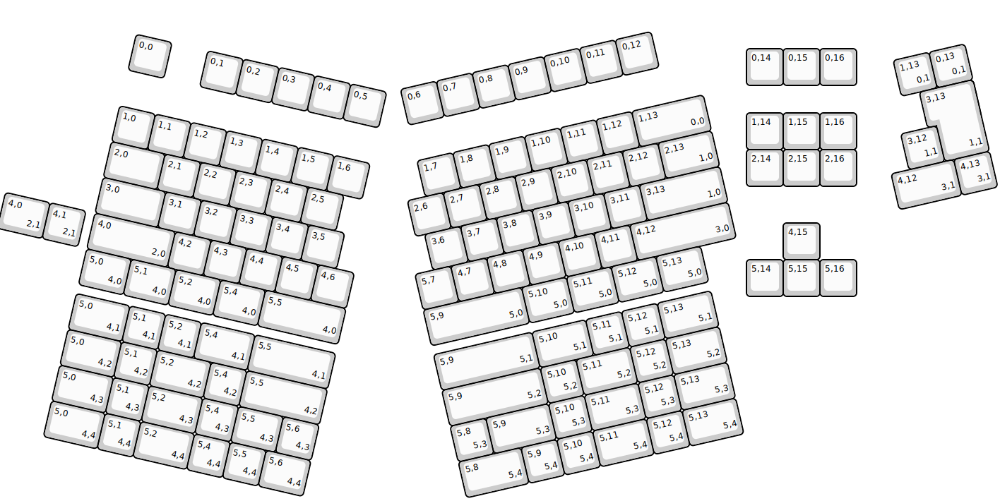
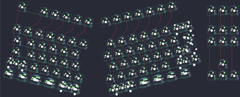

## lz/lzghost

[layout](lzghost-kle.json) - [PCB](lzghost.kicad_pcb)

{:loading="lazy"}

[Open in keyboard-layout-editor](http://www.keyboard-layout-editor.com/##@@_x:20.25&y:1.25;&=0,14&=0,15&=0,16;&@_x:20.25&y:0.75;&=1,14&=1,15&=1,16;&@_x:20.25;&=2,14&=2,15&=2,16;&@_x:21.25&y:1.0;&=4,15;&@_x:20.25;&=5,14&=5,15&=5,16;&@_r:13&x:3.75&y:-8.0;&=0,0&_x:1.0;&=0,1&=0,2&=0,3&=0,4&=0,5;&@_x:3.75&y:1.0;&=1,0&=1,1&=1,2&=1,3&=1,4&=1,5&=1,6;&@_x:3.75&w:1.5;&=2,0&=2,1&=2,2&=2,3&=2,4&=2,5;&@_x:3.75&w:1.75;&=3,0&=3,1&=3,2&=3,3&=3,4&=3,5;&@_x:3.75&w:2.25;&=4,0%0A%0A%0A2,0&=4,2&=4,3&=4,4&=4,5&=4,6;&@_x:3.75&w:1.25;&=5,0%0A%0A%0A4,0&_w:1.25;&=5,1%0A%0A%0A4,0&_w:1.25;&=5,2%0A%0A%0A4,0&_w:1.25;&=5,4%0A%0A%0A4,0&_w:2.25;&=5,5%0A%0A%0A4,0;&@_r:-13&x:10&y:-2.25;&=0,6&=0,7&=0,8&=0,9&=0,10&=0,11&=0,12;&@_x:10&y:1.0;&=1,7&=1,8&=1,9&=1,10&=1,11&=1,12&_w:2;&=1,13%0A%0A%0A0,0;&@_x:9.5;&=2,6&=2,7&=2,8&=2,9&=2,10&=2,11&=2,12&_w:1.5;&=2,13%0A%0A%0A1,0;&@_x:9.75;&=3,6&=3,7&=3,8&=3,9&=3,10&=3,11&_w:2.25;&=3,13%0A%0A%0A1,0;&@_x:9.25;&=5,7&=4,7&=4,8&=4,9&=4,10&=4,11&_w:2.75;&=4,12%0A%0A%0A3,0;&@_x:9.25&w:2.75;&=5,9%0A%0A%0A5,0&_w:1.25;&=5,10%0A%0A%0A5,0&_w:1.25;&=5,11%0A%0A%0A5,0&_w:1.25;&=5,12%0A%0A%0A5,0&_w:1.25;&=5,13%0A%0A%0A5,0;&@_r:13&x:1.25&y:-6.75&w:1.25;&=4,0%0A%0A%0A2,1&=4,1%0A%0A%0A2,1;&@_x:3.75&y:1.25&w:1.5;&=5,0%0A%0A%0A4,1&=5,1%0A%0A%0A4,1&=5,2%0A%0A%0A4,1&_w:1.5;&=5,4%0A%0A%0A4,1&_w:2.25;&=5,5%0A%0A%0A4,1;&@_x:3.75&w:1.5;&=5,0%0A%0A%0A4,2&=5,1%0A%0A%0A4,2&_w:1.5;&=5,2%0A%0A%0A4,2&=5,4%0A%0A%0A4,2&_w:2.25;&=5,5%0A%0A%0A4,2;&@_x:3.75&w:1.5;&=5,0%0A%0A%0A4,3&=5,1%0A%0A%0A4,3&_w:1.5;&=5,2%0A%0A%0A4,3&=5,4%0A%0A%0A4,3&_w:1.25;&=5,5%0A%0A%0A4,3&=5,6%0A%0A%0A4,3;&@_x:3.75&w:1.5;&=5,0%0A%0A%0A4,4&=5,1%0A%0A%0A4,4&_w:1.5;&=5,2%0A%0A%0A4,4&=5,4%0A%0A%0A4,4&=5,5%0A%0A%0A4,4&_w:1.25;&=5,6%0A%0A%0A4,4;&@_r:-13&x:23.25&y:-4.25;&=1,13%0A%0A%0A0,1&=0,13%0A%0A%0A0,1;&@_x:24&w:1.25&h:2&w2:1.5&h2:1&x2:-0.25;&=3,13%0A%0A%0A1,1;&@_x:23;&=3,12%0A%0A%0A1,1;&@_x:22.5&w:1.75;&=4,12%0A%0A%0A3,1&=4,13%0A%0A%0A3,1;&@_x:9.25&y:1.0&w:2.75;&=5,9%0A%0A%0A5,1&_w:1.5;&=5,10%0A%0A%0A5,1&=5,11%0A%0A%0A5,1&=5,12%0A%0A%0A5,1&_w:1.5;&=5,13%0A%0A%0A5,1;&@_x:9.25&w:2.75;&=5,9%0A%0A%0A5,2&=5,10%0A%0A%0A5,2&_w:1.5;&=5,11%0A%0A%0A5,2&=5,12%0A%0A%0A5,2&_w:1.5;&=5,13%0A%0A%0A5,2;&@_x:9.25;&=5,8%0A%0A%0A5,3&_w:1.75;&=5,9%0A%0A%0A5,3&=5,10%0A%0A%0A5,3&_w:1.5;&=5,11%0A%0A%0A5,3&=5,12%0A%0A%0A5,3&_w:1.5;&=5,13%0A%0A%0A5,3;&@_x:9.25&w:1.75;&=5,8%0A%0A%0A5,4&=5,9%0A%0A%0A5,4&=5,10%0A%0A%0A5,4&_w:1.5;&=5,11%0A%0A%0A5,4&=5,12%0A%0A%0A5,4&_w:1.5;&=5,13%0A%0A%0A5,4)

{:loading="lazy"}

