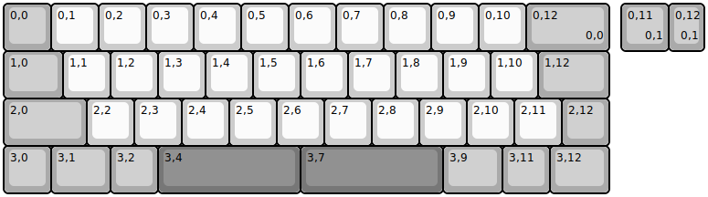
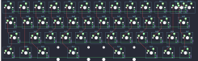

## m3n3van/m3n3van

[layout](m3n3van-kle.json) - [PCB](m3n3van.kicad_pcb)

{:loading="lazy"}

[Open in keyboard-layout-editor](http://www.keyboard-layout-editor.com/##@@_c=#aaaaaa;&=0,0&_c=#cccccc;&=0,1&=0,2&=0,3&=0,4&=0,5&=0,6&=0,7&=0,8&=0,9&=0,10&_c=#aaaaaa&w:1.75;&=0,12%0A%0A%0A0,0;&@_w:1.25;&=1,0&_c=#cccccc;&=1,1&=1,2&=1,3&=1,4&=1,5&=1,6&=1,7&=1,8&=1,9&=1,10&_c=#aaaaaa&w:1.5;&=1,12;&@_w:1.75;&=2,0&_c=#cccccc;&=2,2&=2,3&=2,4&=2,5&=2,6&=2,7&=2,8&=2,9&=2,10&=2,11&_c=#aaaaaa;&=2,12;&@=3,0&_w:1.25;&=3,1&=3,2&_c=#777777&w:3;&=3,4&_w:3;&=3,7&_c=#aaaaaa&w:1.25;&=3,9&=3,11&_w:1.25;&=3,12;&@_x:13.0&y:-4;&=0,11%0A%0A%0A0,1&_w:0.75;&=0,12%0A%0A%0A0,1)

{:loading="lazy"}

