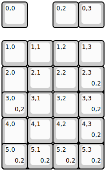
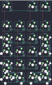

## macro1/macro1

[layout](macro1-kle.json) - [PCB](macro1.kicad_pcb)

{:loading="lazy"}

[Open in keyboard-layout-editor](http://www.keyboard-layout-editor.com/##@@=0,0&_x:1;&=0,2&=0,3;&@_y:0.5;&=1,0&=1,1&=1,2&=1,3;&@=2,0%0A%0A%0A0,0&=2,1&=2,2&_h:2;&=2,3%0A%0A%0A0,0;&@=3,0%0A%0A%0A0,0&=3,1&=3,2;&@=4,0%0A%0A%0A0,0&=4,1&=4,2&_h:2;&=4,3%0A%0A%0A0,0;&@_w:2;&=5,0%0A%0A%0A0,0&=5,2%0A%0A%0A0,0;&@_y:-4.0;&=2,0%0A%0A%0A0,2&_x:-1&h:2;&=2,0%0A%0A%0A0,1&_x:2;&=2,3%0A%0A%0A0,1&_x:-1;&=2,3%0A%0A%0A0,2;&@=3,0%0A%0A%0A0,2&_x:2;&=3,3%0A%0A%0A0,1&_x:-1;&=3,3%0A%0A%0A0,2;&@=4,0%0A%0A%0A0,2&_x:-1&h:2;&=4,0%0A%0A%0A0,1&_x:2;&=4,3%0A%0A%0A0,1&_x:-1;&=4,3%0A%0A%0A0,2;&@=5,0%0A%0A%0A0,2&=5,1%0A%0A%0A0,1&_x:-1;&=5,1%0A%0A%0A0,2&_w:2;&=5,2%0A%0A%0A0,1&_x:-2;&=5,2%0A%0A%0A0,2&=5,3%0A%0A%0A0,2)

{:loading="lazy"}

