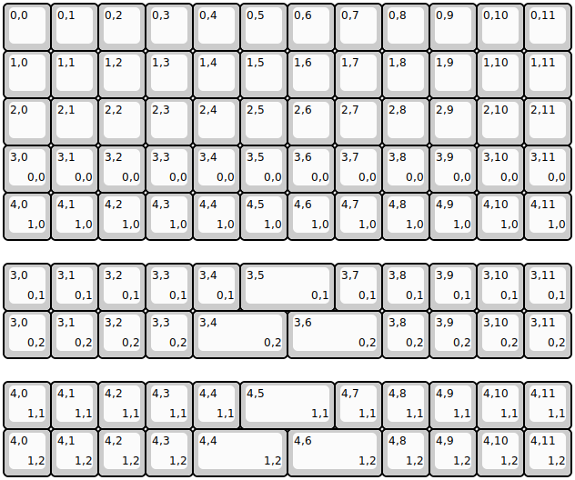
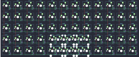

## maplecomputing/jnao

[layout](jnao-kle.json) - [PCB](jnao.kicad_pcb)

{:loading="lazy"}

[Open in keyboard-layout-editor](http://www.keyboard-layout-editor.com/##@@=0,0&=0,1&=0,2&=0,3&=0,4&=0,5&=0,6&=0,7&=0,8&=0,9&=0,10&=0,11;&@=1,0&=1,1&=1,2&=1,3&=1,4&=1,5&=1,6&=1,7&=1,8&=1,9&=1,10&=1,11;&@=2,0&=2,1&=2,2&=2,3&=2,4&=2,5&=2,6&=2,7&=2,8&=2,9&=2,10&=2,11;&@=3,0%0A%0A%0A0,0&=3,1%0A%0A%0A0,0&=3,2%0A%0A%0A0,0&=3,3%0A%0A%0A0,0&=3,4%0A%0A%0A0,0&=3,5%0A%0A%0A0,0&=3,6%0A%0A%0A0,0&=3,7%0A%0A%0A0,0&=3,8%0A%0A%0A0,0&=3,9%0A%0A%0A0,0&=3,10%0A%0A%0A0,0&=3,11%0A%0A%0A0,0;&@=4,0%0A%0A%0A1,0&=4,1%0A%0A%0A1,0&=4,2%0A%0A%0A1,0&=4,3%0A%0A%0A1,0&=4,4%0A%0A%0A1,0&=4,5%0A%0A%0A1,0&=4,6%0A%0A%0A1,0&=4,7%0A%0A%0A1,0&=4,8%0A%0A%0A1,0&=4,9%0A%0A%0A1,0&=4,10%0A%0A%0A1,0&=4,11%0A%0A%0A1,0;&@_y:0.5;&=3,0%0A%0A%0A0,1&=3,1%0A%0A%0A0,1&=3,2%0A%0A%0A0,1&=3,3%0A%0A%0A0,1&=3,4%0A%0A%0A0,1&_w:2;&=3,5%0A%0A%0A0,1&=3,7%0A%0A%0A0,1&=3,8%0A%0A%0A0,1&=3,9%0A%0A%0A0,1&=3,10%0A%0A%0A0,1&=3,11%0A%0A%0A0,1;&@=3,0%0A%0A%0A0,2&=3,1%0A%0A%0A0,2&=3,2%0A%0A%0A0,2&=3,3%0A%0A%0A0,2&_w:2;&=3,4%0A%0A%0A0,2&_w:2;&=3,6%0A%0A%0A0,2&=3,8%0A%0A%0A0,2&=3,9%0A%0A%0A0,2&=3,10%0A%0A%0A0,2&=3,11%0A%0A%0A0,2;&@_y:0.5;&=4,0%0A%0A%0A1,1&=4,1%0A%0A%0A1,1&=4,2%0A%0A%0A1,1&=4,3%0A%0A%0A1,1&=4,4%0A%0A%0A1,1&_w:2;&=4,5%0A%0A%0A1,1&=4,7%0A%0A%0A1,1&=4,8%0A%0A%0A1,1&=4,9%0A%0A%0A1,1&=4,10%0A%0A%0A1,1&=4,11%0A%0A%0A1,1;&@=4,0%0A%0A%0A1,2&=4,1%0A%0A%0A1,2&=4,2%0A%0A%0A1,2&=4,3%0A%0A%0A1,2&_w:2;&=4,4%0A%0A%0A1,2&_w:2;&=4,6%0A%0A%0A1,2&=4,8%0A%0A%0A1,2&=4,9%0A%0A%0A1,2&=4,10%0A%0A%0A1,2&=4,11%0A%0A%0A1,2)

{:loading="lazy"}

