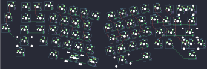
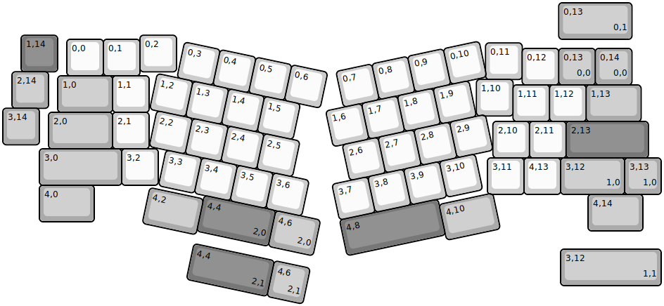
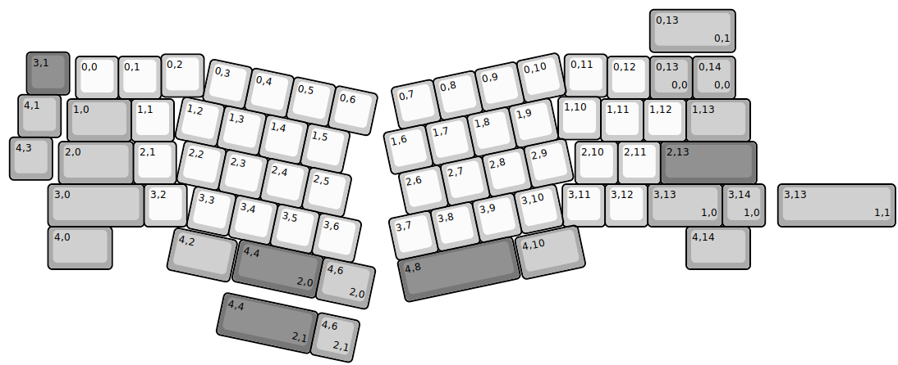
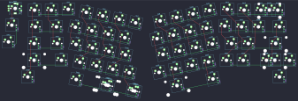
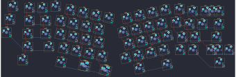
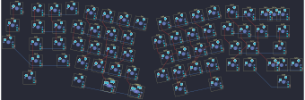

## mechlovin/adelais

[layout](adelais-kle.json) - [PCB](adelais.kicad_pcb)

{:loading="lazy"}

[Open in keyboard-layout-editor](http://www.keyboard-layout-editor.com/##@@_x:0.5&y:0.89&c=#777777;&=1,14&_x:2.25&c=#cccccc;&=0,2;&@_x:1.75&y:-0.89;&=0,0&=0,1;&@_x:13.2&y:-0.9;&=0,11;&@_x:14.2&y:-0.85;&=0,12&_c=#aaaaaa;&=0,13%0A%0A%0A0,0&=0,14%0A%0A%0A0,0;&@_x:0.25&y:-0.36;&=2,14;&@_x:1.5&y:-0.89&w:1.5;&=1,0&_c=#cccccc;&=1,1;&@_x:12.95&y:-0.9;&=1,10;&@_x:13.95&y:-0.85;&=1,11&=1,12&_c=#aaaaaa&w:1.5;&=1,13;&@_y:-0.36;&=3,14;&@_x:1.25&y:-0.89&w:1.75;&=2,0&_c=#cccccc;&=2,1;&@_x:13.4&y:-0.75;&=2,10&=2,11&_c=#777777&w:2.25;&=2,13;&@_x:1&y:-0.25&c=#aaaaaa&w:2.25;&=3,0&_c=#cccccc;&=3,2;&@_x:13.25&y:-0.75;&=3,11&=4,13&_c=#aaaaaa&w:1.75;&=3,12%0A%0A%0A1,0;&@_x:1&y:-0.25&w:1.5;&=4,0;&@_x:16&y:-0.75&w:1.5;&=4,14;&@_rx:2.25&ry:0.75&x:14.75&y:3.5;&=3,13%0A%0A%0A1,0;&@_r:12&rx:0&ry:0&x:5.1&c=#cccccc;&=0,3&=0,4&=0,5&=0,6;&@_x:4.55;&=1,2&=1,3&=1,4&=1,5;&@_x:4.75;&=2,2&=2,3&=2,4&=2,5;&@_x:5.22;&=3,3&=3,4&=3,5&=3,6;&@_x:6.5&c=#777777&w:2;&=4,4%0A%0A%0A2,0&_c=#aaaaaa&w:1.25;&=4,6%0A%0A%0A2,0;&@_x:5&y:-0.9&w:1.5;&=4,2;&@_r:-12&x:8.5&y:-1.35&c=#cccccc;&=0,7&=0,8&=0,9&=0,10;&@_x:8;&=1,6&=1,7&=1,8&=1,9;&@_x:8.25;&=2,6&=2,7&=2,8&=2,9;&@_x:7.75;&=3,7&=3,8&=3,9&=3,10;&@_x:7.75&c=#777777&w:2.75;&=4,8;&@_x:10.5&y:-0.85&c=#aaaaaa&w:1.5;&=4,10;&@_r:0&x:15.2&y:-8.9&w:2;&=0,13%0A%0A%0A0,1;&@_rx:0.75&x:14.5&y:6.75&w:2.75;&=3,12%0A%0A%0A1,1;&@_r:12&rx:0&x:6.5&y:5.35&c=#777777&w:2.25;&=4,4%0A%0A%0A2,1&_c=#aaaaaa;&=4,6%0A%0A%0A2,1)

{:loading="lazy"}

## mechlovin/adelais/adelais_en_ciel

[layout](adelais_en_ciel-kle.json) - [PCB](adelais_en_ciel.kicad_pcb)

{:loading="lazy"}

[Open in keyboard-layout-editor](http://www.keyboard-layout-editor.com/##@@_x:0.5&y:0.89&c=#777777;&=1,14&_x:2.25&c=#cccccc;&=0,2;&@_x:1.75&y:-0.89;&=0,0&=0,1;&@_x:13.2&y:-0.9;&=0,11;&@_x:14.2&y:-0.85;&=0,12&_c=#aaaaaa;&=0,13%0A%0A%0A0,0&=0,14%0A%0A%0A0,0;&@_x:0.25&y:-0.36;&=2,14;&@_x:1.5&y:-0.89&w:1.5;&=1,0&_c=#cccccc;&=1,1;&@_x:12.95&y:-0.9;&=1,10;&@_x:13.95&y:-0.85;&=1,11&=1,12&_c=#aaaaaa&w:1.5;&=1,13;&@_y:-0.36;&=3,14;&@_x:1.25&y:-0.89&w:1.75;&=2,0&_c=#cccccc;&=2,1;&@_x:13.4&y:-0.75;&=2,10&=2,11&_c=#777777&w:2.25;&=2,13;&@_x:1&y:-0.25&c=#aaaaaa&w:2.25;&=3,0&_c=#cccccc;&=3,2;&@_x:13.25&y:-0.75;&=3,11&=4,13&_c=#aaaaaa&w:1.75;&=3,12%0A%0A%0A1,0;&@_x:1&y:-0.25&w:1.5;&=4,0;&@_x:16&y:-0.75&w:1.5;&=4,14;&@_rx:2.25&ry:0.75&x:14.75&y:3.5;&=3,13%0A%0A%0A1,0;&@_r:12&rx:0&ry:0&x:5.1&c=#cccccc;&=0,3&=0,4&=0,5&=0,6;&@_x:4.55;&=1,2&=1,3&=1,4&=1,5;&@_x:4.75;&=2,2&=2,3&=2,4&=2,5;&@_x:5.22;&=3,3&=3,4&=3,5&=3,6;&@_x:6.5&c=#777777&w:2;&=4,4%0A%0A%0A2,0&_c=#aaaaaa&w:1.25;&=4,6%0A%0A%0A2,0;&@_x:5&y:-0.9&w:1.5;&=4,2;&@_r:-12&x:8.5&y:-1.35&c=#cccccc;&=0,7&=0,8&=0,9&=0,10;&@_x:8;&=1,6&=1,7&=1,8&=1,9;&@_x:8.25;&=2,6&=2,7&=2,8&=2,9;&@_x:7.75;&=3,7&=3,8&=3,9&=3,10;&@_x:7.75&c=#777777&w:2.75;&=4,8;&@_x:10.5&y:-0.85&c=#aaaaaa&w:1.5;&=4,10;&@_r:0&x:15.2&y:-8.9&w:2;&=0,13%0A%0A%0A0,1;&@_rx:0.75&x:14.5&y:6.75&w:2.75;&=3,12%0A%0A%0A1,1;&@_r:12&rx:0&x:6.5&y:5.35&c=#777777&w:2.25;&=4,4%0A%0A%0A2,1&_c=#aaaaaa;&=4,6%0A%0A%0A2,1)

{:loading="lazy"}

## mechlovin/adelais/adelais_en_ciel-rev2

[layout](adelais_en_ciel-rev2-kle.json) - [PCB](adelais_en_ciel-rev2.kicad_pcb)

{:loading="lazy"}

[Open in keyboard-layout-editor](http://www.keyboard-layout-editor.com/##@@_x:0.5&y:0.89&c=#777777;&=1,14&_x:2.25&c=#cccccc;&=0,2;&@_x:1.75&y:-0.89;&=0,0&=0,1;&@_x:13.2&y:-0.9;&=0,11;&@_x:14.2&y:-0.85;&=0,12&_c=#aaaaaa;&=0,13%0A%0A%0A0,0&=0,14%0A%0A%0A0,0;&@_x:0.25&y:-0.36;&=2,14;&@_x:1.5&y:-0.89&w:1.5;&=1,0&_c=#cccccc;&=1,1;&@_x:12.95&y:-0.9;&=1,10;&@_x:13.95&y:-0.85;&=1,11&=1,12&_c=#aaaaaa&w:1.5;&=1,13;&@_y:-0.36;&=3,14;&@_x:1.25&y:-0.89&w:1.75;&=2,0&_c=#cccccc;&=2,1;&@_x:13.4&y:-0.75;&=2,10&=2,11&_c=#777777&w:2.25;&=2,13;&@_x:1&y:-0.25&c=#aaaaaa&w:2.25;&=3,0&_c=#cccccc;&=3,2;&@_x:13.25&y:-0.75;&=3,11&=4,13&_c=#aaaaaa&w:1.75;&=3,12%0A%0A%0A1,0;&@_x:1&y:-0.25&w:1.5;&=4,0;&@_x:16&y:-0.75&w:1.5;&=4,14;&@_rx:2.25&ry:0.75&x:14.75&y:3.5;&=3,13%0A%0A%0A1,0;&@_r:12&rx:0&ry:0&x:5.1&c=#cccccc;&=0,3&=0,4&=0,5&=0,6;&@_x:4.55;&=1,2&=1,3&=1,4&=1,5;&@_x:4.75;&=2,2&=2,3&=2,4&=2,5;&@_x:5.22;&=3,3&=3,4&=3,5&=3,6;&@_x:6.5&c=#777777&w:2;&=4,4%0A%0A%0A2,0&_c=#aaaaaa&w:1.25;&=4,6%0A%0A%0A2,0;&@_x:5&y:-0.9&w:1.5;&=4,2;&@_r:-12&x:8.5&y:-1.35&c=#cccccc;&=0,7&=0,8&=0,9&=0,10;&@_x:8;&=1,6&=1,7&=1,8&=1,9;&@_x:8.25;&=2,6&=2,7&=2,8&=2,9;&@_x:7.75;&=3,7&=3,8&=3,9&=3,10;&@_x:7.75&c=#777777&w:2.75;&=4,8;&@_x:10.5&y:-0.85&c=#aaaaaa&w:1.5;&=4,10;&@_r:0&x:15.2&y:-8.9&w:2;&=0,13%0A%0A%0A0,1;&@_rx:0.75&x:14.5&y:6.75&w:2.75;&=3,12%0A%0A%0A1,1;&@_r:12&rx:0&x:6.5&y:5.35&c=#777777&w:2.25;&=4,4%0A%0A%0A2,1&_c=#aaaaaa;&=4,6%0A%0A%0A2,1)

{:loading="lazy"}

## mechlovin/adelais/adelais_en_ciel-rev3

[layout](adelais_en_ciel-rev3-kle.json) - [PCB](adelais_en_ciel-rev3.kicad_pcb)

{:loading="lazy"}

[Open in keyboard-layout-editor](http://www.keyboard-layout-editor.com/##@@_x:0.55&y:1.15&c=#777777;&=3,1;&@_x:3.7&y:-0.95&c=#cccccc;&=0,2&_x:8.45;&=0,11;&@_x:1.7&y:-0.95;&=0,0&=0,1&_x:10.45;&=0,12&_c=#aaaaaa;&=0,13%0A%0A%0A0,0&=0,14%0A%0A%0A0,0;&@_x:0.35&y:-0.1;&=4,1;&@_x:13&y:-0.95&c=#cccccc;&=1,10;&@_x:1.5&y:-0.95&c=#aaaaaa&w:1.5;&=1,0&_c=#cccccc;&=1,1&_x:10.0;&=1,11&=1,12&_c=#aaaaaa&w:1.5;&=1,13;&@_x:0.15&y:-0.1;&=4,3;&@_x:13.4&y:-0.9&c=#cccccc;&=2,10&=2,11&_c=#777777&w:2.25;&=2,13&_x:-16.35&c=#aaaaaa&w:1.75;&=2,0&_c=#cccccc;&=2,1;&@_x:1.05&c=#aaaaaa&w:2.25;&=3,0&_c=#cccccc;&=3,2&_x:8.8;&=3,11&=3,12&_c=#aaaaaa&w:1.75;&=3,13%0A%0A%0A1,0&=3,14%0A%0A%0A1,0;&@_x:1.05&w:1.5;&=4,0&_x:13.45&w:1.5;&=4,14;&@_r:12&x:5.05&y:-6.0&c=#cccccc;&=0,3&=0,4&=0,5&=0,6;&@_x:4.6;&=1,2&=1,3&=1,4&=1,5;&@_x:4.85;&=2,2&=2,3&=2,4&=2,5;&@_x:5.3;&=3,3&=3,4&=3,5&=3,6;&@_x:6.6&c=#777777&w:2;&=4,4%0A%0A%0A2,0&_c=#aaaaaa&w:1.25;&=4,6%0A%0A%0A2,0;&@_x:5.05&y:-0.95&w:1.5;&=4,2;&@_r:-12&x:8.45&y:-1.45&c=#cccccc;&=0,7&=0,8&=0,9&=0,10;&@_x:8.05;&=1,6&=1,7&=1,8&=1,9;&@_x:8.2;&=2,6&=2,7&=2,8&=2,9;&@_x:7.75;&=3,7&=3,8&=3,9&=3,10;&@_x:7.75&c=#777777&w:2.75;&=4,8;&@_x:10.55&y:-0.95&c=#aaaaaa&w:1.5;&=4,10;&@_r:0&x:15.15&y:-8.75&w:2;&=0,13%0A%0A%0A0,1;&@_x:18.15&y:3.1&w:2.75;&=3,13%0A%0A%0A1,1;&@_r:12&x:6.5&y:0.3&c=#777777&w:2.25;&=4,4%0A%0A%0A2,1&_c=#aaaaaa;&=4,6%0A%0A%0A2,1)

{:loading="lazy"}

## mechlovin/adelais/adelais_rev3

[layout](adelais_rev3-kle.json) - [PCB](adelais_rev3.kicad_pcb)

{:loading="lazy"}

[Open in keyboard-layout-editor](http://www.keyboard-layout-editor.com/##@@_x:0.5&y:0.89&c=#777777;&=1,14&_x:2.25&c=#cccccc;&=0,2;&@_x:1.75&y:-0.89;&=0,0&=0,1;&@_x:13.2&y:-0.9;&=0,11;&@_x:14.2&y:-0.85;&=0,12&_c=#aaaaaa;&=0,13%0A%0A%0A0,0&=0,14%0A%0A%0A0,0;&@_x:0.25&y:-0.36;&=2,14;&@_x:1.5&y:-0.89&w:1.5;&=1,0&_c=#cccccc;&=1,1;&@_x:12.95&y:-0.9;&=1,10;&@_x:13.95&y:-0.85;&=1,11&=1,12&_c=#aaaaaa&w:1.5;&=1,13;&@_y:-0.36;&=3,14;&@_x:1.25&y:-0.89&w:1.75;&=2,0&_c=#cccccc;&=2,1;&@_x:13.4&y:-0.75;&=2,10&=2,11&_c=#777777&w:2.25;&=2,13;&@_x:1&y:-0.25&c=#aaaaaa&w:2.25;&=3,0&_c=#cccccc;&=3,2;&@_x:13.25&y:-0.75;&=3,11&=4,13&_c=#aaaaaa&w:1.75;&=3,12%0A%0A%0A1,0;&@_x:1&y:-0.25&w:1.5;&=4,0;&@_x:16&y:-0.75&w:1.5;&=4,14;&@_rx:2.25&ry:0.75&x:14.75&y:3.5;&=3,13%0A%0A%0A1,0;&@_r:12&rx:0&ry:0&x:5.1&c=#cccccc;&=0,3&=0,4&=0,5&=0,6;&@_x:4.55;&=1,2&=1,3&=1,4&=1,5;&@_x:4.75;&=2,2&=2,3&=2,4&=2,5;&@_x:5.22;&=3,3&=3,4&=3,5&=3,6;&@_x:6.5&c=#777777&w:2;&=4,4%0A%0A%0A2,0&_c=#aaaaaa&w:1.25;&=4,6%0A%0A%0A2,0;&@_x:5&y:-0.9&w:1.5;&=4,2;&@_r:-12&x:8.5&y:-1.35&c=#cccccc;&=0,7&=0,8&=0,9&=0,10;&@_x:8;&=1,6&=1,7&=1,8&=1,9;&@_x:8.25;&=2,6&=2,7&=2,8&=2,9;&@_x:7.75;&=3,7&=3,8&=3,9&=3,10;&@_x:7.75&c=#777777&w:2.75;&=4,8;&@_x:10.5&y:-0.85&c=#aaaaaa&w:1.5;&=4,10;&@_r:0&x:15.2&y:-8.9&w:2;&=0,13%0A%0A%0A0,1;&@_rx:0.75&x:14.5&y:6.75&w:2.75;&=3,12%0A%0A%0A1,1;&@_r:12&rx:0&x:6.5&y:5.35&c=#777777&w:2.25;&=4,4%0A%0A%0A2,1&_c=#aaaaaa;&=4,6%0A%0A%0A2,1)

{:loading="lazy"}

## mechlovin/adelais/adelais_rev4

[layout](adelais_rev4-kle.json) - [PCB](adelais_rev4.kicad_pcb)

{:loading="lazy"}

[Open in keyboard-layout-editor](http://www.keyboard-layout-editor.com/##@@_x:0.5&y:0.89&c=#777777;&=1,14&_x:2.25&c=#cccccc;&=0,2;&@_x:1.75&y:-0.89;&=0,0&=0,1;&@_x:13.2&y:-0.9;&=0,11;&@_x:14.2&y:-0.85;&=0,12&_c=#aaaaaa;&=0,13%0A%0A%0A0,0&=0,14%0A%0A%0A0,0;&@_x:0.25&y:-0.36;&=2,14;&@_x:1.5&y:-0.89&w:1.5;&=1,0&_c=#cccccc;&=1,1;&@_x:12.95&y:-0.9;&=1,10;&@_x:13.95&y:-0.85;&=1,11&=1,12&_c=#aaaaaa&w:1.5;&=1,13;&@_y:-0.36;&=3,14;&@_x:1.25&y:-0.89&w:1.75;&=2,0&_c=#cccccc;&=2,1;&@_x:13.4&y:-0.75;&=2,10&=2,11&_c=#777777&w:2.25;&=2,13;&@_x:1&y:-0.25&c=#aaaaaa&w:2.25;&=3,0&_c=#cccccc;&=3,2;&@_x:13.25&y:-0.75;&=3,11&=4,13&_c=#aaaaaa&w:1.75;&=3,12%0A%0A%0A1,0;&@_x:1&y:-0.25&w:1.5;&=4,0;&@_x:16&y:-0.75&w:1.5;&=4,14;&@_rx:2.25&ry:0.75&x:14.75&y:3.5;&=3,13%0A%0A%0A1,0;&@_r:12&rx:0&ry:0&x:5.1&c=#cccccc;&=0,3&=0,4&=0,5&=0,6;&@_x:4.55;&=1,2&=1,3&=1,4&=1,5;&@_x:4.75;&=2,2&=2,3&=2,4&=2,5;&@_x:5.22;&=3,3&=3,4&=3,5&=3,6;&@_x:6.5&c=#777777&w:2;&=4,4%0A%0A%0A2,0&_c=#aaaaaa&w:1.25;&=4,6%0A%0A%0A2,0;&@_x:5&y:-0.9&w:1.5;&=4,2;&@_r:-12&x:8.5&y:-1.35&c=#cccccc;&=0,7&=0,8&=0,9&=0,10;&@_x:8;&=1,6&=1,7&=1,8&=1,9;&@_x:8.25;&=2,6&=2,7&=2,8&=2,9;&@_x:7.75;&=3,7&=3,8&=3,9&=3,10;&@_x:7.75&c=#777777&w:2.75;&=4,8;&@_x:10.5&y:-0.85&c=#aaaaaa&w:1.5;&=4,10;&@_r:0&x:15.2&y:-8.9&w:2;&=0,13%0A%0A%0A0,1;&@_rx:0.75&x:14.5&y:6.75&w:2.75;&=3,12%0A%0A%0A1,1;&@_r:12&rx:0&x:6.5&y:5.35&c=#777777&w:2.25;&=4,4%0A%0A%0A2,1&_c=#aaaaaa;&=4,6%0A%0A%0A2,1)

{:loading="lazy"}

