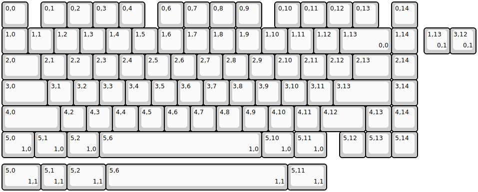
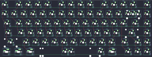
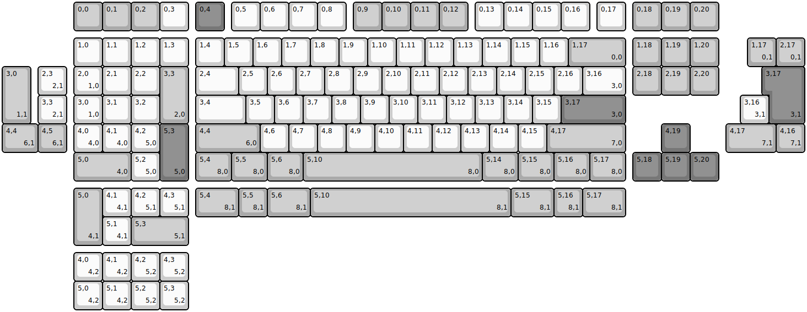
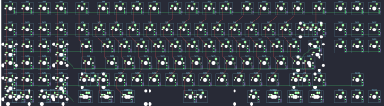

## mechlovin/hexkb/hex4b

[layout](hex4b-kle.json) - [PCB](hex4b.kicad_pcb)

{:loading="lazy"}

[Open in keyboard-layout-editor](http://www.keyboard-layout-editor.com/##@@=0,0&_x:0.5;&=0,1&=0,2&=0,3&=0,4&_x:0.5;&=0,6&=0,7&=0,8&=0,9&_x:0.5;&=0,10&=0,11&=0,12&=0,13&_x:0.5;&=0,14;&@=1,0&=1,1&=1,2&=1,3&=1,4&=1,5&=1,6&=1,7&=1,8&=1,9&=1,10&=1,11&=1,12&_w:2;&=1,13%0A%0A%0A0,0&=1,14;&@_w:1.5;&=2,0&=2,1&=2,2&=2,3&=2,4&=2,5&=2,6&=2,7&=2,8&=2,9&=2,10&=2,11&=2,12&_w:1.5;&=2,13&=2,14;&@_w:1.75;&=3,0&=3,1&=3,2&=3,3&=3,4&=3,5&=3,6&=3,7&=3,8&=3,9&=3,10&=3,11&_w:2.25;&=3,13&=3,14;&@_w:2.25;&=4,0&=4,2&=4,3&=4,4&=4,5&=4,6&=4,7&=4,8&=4,9&=4,10&=4,11&_w:1.75;&=4,12&=4,13&=4,14;&@_w:1.25;&=5,0%0A%0A%0A1,0&_w:1.25;&=5,1%0A%0A%0A1,0&_w:1.25;&=5,2%0A%0A%0A1,0&_w:6.25;&=5,6%0A%0A%0A1,0&_w:1.25;&=5,10%0A%0A%0A1,0&_w:1.25;&=5,11%0A%0A%0A1,0&_x:0.5;&=5,12&=5,13&=5,14;&@_x:16.25&y:-5;&=1,13%0A%0A%0A0,1&=3,12%0A%0A%0A0,1;&@_y:4.25&w:1.5;&=5,0%0A%0A%0A1,1&=5,1%0A%0A%0A1,1&_w:1.5;&=5,2%0A%0A%0A1,1&_w:7;&=5,6%0A%0A%0A1,1&_w:1.5;&=5,11%0A%0A%0A1,1)

{:loading="lazy"}

## mechlovin/hexkb/hex6c

[layout](hex6c-kle.json) - [PCB](hex6c.kicad_pcb)

{:loading="lazy"}

[Open in keyboard-layout-editor](http://www.keyboard-layout-editor.com/##@@_x:2.5&c=#aaaaaa;&=0,0&=0,1&=0,2&_c=#cccccc;&=0,3&_x:0.25&c=#777777;&=0,4&_x:0.25&c=#cccccc;&=0,5&=0,6&=0,7&=0,8&_x:0.25&c=#aaaaaa;&=0,9&=0,10&=0,11&=0,12&_x:0.25&c=#cccccc;&=0,13&=0,14&=0,15&=0,16&_x:0.25;&=0,17&_x:0.25&c=#aaaaaa;&=0,18&=0,19&=0,20;&@_x:2.5&y:0.25&c=#cccccc;&=1,0&=1,1&=1,2&=1,3&_x:0.25;&=1,4&=1,5&=1,6&=1,7&=1,8&=1,9&=1,10&=1,11&=1,12&=1,13&=1,14&=1,15&=1,16&_c=#aaaaaa&w:2;&=1,17%0A%0A%0A0,0&_x:0.25;&=1,18&=1,19&=1,20;&@_x:2.5&c=#cccccc;&=2,0%0A%0A%0A1,0&=2,1&=2,2&_c=#aaaaaa&h:2;&=3,3%0A%0A%0A2,0&_x:0.25&c=#cccccc&w:1.5;&=2,4&=2,5&=2,6&=2,7&=2,8&=2,9&=2,10&=2,11&=2,12&=2,13&=2,14&=2,15&=2,16&_w:1.5;&=3,16%0A%0A%0A3,0&_x:0.25&c=#aaaaaa;&=2,18&=2,19&=2,20;&@_x:2.5&c=#cccccc;&=3,0%0A%0A%0A1,0&=3,1&=3,2&_x:1.25&w:1.75;&=3,4&=3,5&=3,6&=3,7&=3,8&=3,9&=3,10&=3,11&=3,12&=3,13&=3,14&=3,15&_c=#777777&w:2.25;&=3,17%0A%0A%0A3,0;&@_x:2.5&c=#cccccc;&=4,0%0A%0A%0A4,0&=4,1%0A%0A%0A4,0&=4,2%0A%0A%0A5,0&_c=#777777&h:2;&=5,3%0A%0A%0A5,0&_x:0.25&c=#aaaaaa&w:2.25;&=4,4%0A%0A%0A6,0&_c=#cccccc;&=4,6&=4,7&=4,8&=4,9&=4,10&=4,11&=4,12&=4,13&=4,14&=4,15&_c=#aaaaaa&w:2.75;&=4,17%0A%0A%0A7,0&_x:1.25&c=#777777;&=4,19;&@_x:2.5&c=#aaaaaa&w:2;&=5,0%0A%0A%0A4,0&_c=#cccccc;&=5,2%0A%0A%0A5,0&_x:1.25&c=#aaaaaa&w:1.25;&=5,4%0A%0A%0A8,0&_w:1.25;&=5,5%0A%0A%0A8,0&_w:1.25;&=5,6%0A%0A%0A8,0&_w:6.25;&=5,10%0A%0A%0A8,0&_w:1.25;&=5,14%0A%0A%0A8,0&_w:1.25;&=5,15%0A%0A%0A8,0&_w:1.25;&=5,16%0A%0A%0A8,0&_w:1.25;&=5,17%0A%0A%0A8,0&_x:0.25&c=#777777;&=5,18&=5,19&=5,20;&@_x:26.0&y:-5.0&c=#aaaaaa;&=1,17%0A%0A%0A0,1&=2,17%0A%0A%0A0,1;&@_h:2;&=3,0%0A%0A%0A1,1&_x:0.25&c=#cccccc;&=2,3%0A%0A%0A2,1&_x:24.5&c=#777777&w:1.25&h:2&w2:1.5&h2:1&x2:-0.25;&=3,17%0A%0A%0A3,1;&@_x:1.25&c=#cccccc;&=3,3%0A%0A%0A2,1&_x:23.5;&=3,16%0A%0A%0A3,1;&@_c=#aaaaaa&w:1.25;&=4,4%0A%0A%0A6,1&=4,5%0A%0A%0A6,1&_x:23.0&w:1.75;&=4,17%0A%0A%0A7,1&=4,16%0A%0A%0A7,1;&@_x:2.5&y:1.25&h:2;&=5,0%0A%0A%0A4,1&_c=#cccccc;&=4,1%0A%0A%0A4,1&=4,2%0A%0A%0A5,1&=4,3%0A%0A%0A5,1&_x:0.25&c=#aaaaaa&w:1.5;&=5,4%0A%0A%0A8,1&=5,5%0A%0A%0A8,1&_w:1.5;&=5,6%0A%0A%0A8,1&_w:7;&=5,10%0A%0A%0A8,1&_w:1.5;&=5,15%0A%0A%0A8,1&=5,16%0A%0A%0A8,1&_w:1.5;&=5,17%0A%0A%0A8,1;&@_x:3.5&c=#cccccc;&=5,1%0A%0A%0A4,1&_c=#aaaaaa&w:2;&=5,3%0A%0A%0A5,1;&@_x:2.5&y:0.25&c=#cccccc;&=4,0%0A%0A%0A4,2&=4,1%0A%0A%0A4,2&=4,2%0A%0A%0A5,2&=4,3%0A%0A%0A5,2;&@_x:2.5;&=5,0%0A%0A%0A4,2&=5,1%0A%0A%0A4,2&=5,2%0A%0A%0A5,2&=5,3%0A%0A%0A5,2)

{:loading="lazy"}

