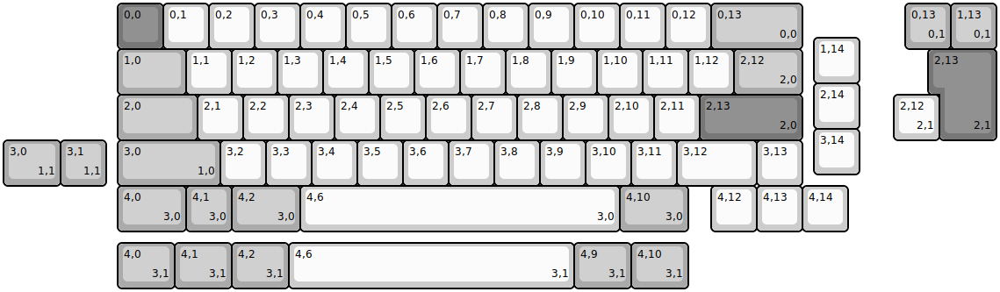
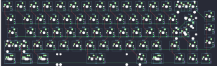

## mechlovin/wearhaus66/wh66

[layout](wh66-kle.json) - [PCB](wh66.kicad_pcb)

{:loading="lazy"}

[Open in keyboard-layout-editor](http://www.keyboard-layout-editor.com/##@@_x:2.5&c=#777777;&=0,0&_c=#cccccc;&=0,1&=0,2&=0,3&=0,4&=0,5&=0,6&=0,7&=0,8&=0,9&=0,10&=0,11&=0,12&_c=#aaaaaa&w:2;&=0,13%0A%0A%0A0,0;&@_x:17.75&y:-0.25&c=#cccccc;&=1,14;&@_x:2.5&y:-0.75&c=#aaaaaa&w:1.5;&=1,0&_c=#cccccc;&=1,1&=1,2&=1,3&=1,4&=1,5&=1,6&=1,7&=1,8&=1,9&=1,10&=1,11&=1,12&_c=#aaaaaa&w:1.5;&=2,12%0A%0A%0A2,0;&@_x:17.75&y:-0.25&c=#cccccc;&=2,14;&@_x:2.5&y:-0.75&c=#aaaaaa&w:1.75;&=2,0&_c=#cccccc;&=2,1&=2,2&=2,3&=2,4&=2,5&=2,6&=2,7&=2,8&=2,9&=2,10&=2,11&_c=#777777&w:2.25;&=2,13%0A%0A%0A2,0;&@_x:17.75&y:-0.25&c=#cccccc;&=3,14;&@_x:2.5&y:-0.75&c=#aaaaaa&w:2.25;&=3,0%0A%0A%0A1,0&_c=#cccccc;&=3,2&=3,3&=3,4&=3,5&=3,6&=3,7&=3,8&=3,9&=3,10&=3,11&_w:1.75;&=3,12&=3,13;&@_x:2.5&c=#aaaaaa&w:1.5;&=4,0%0A%0A%0A3,0&=4,1%0A%0A%0A3,0&_w:1.5;&=4,2%0A%0A%0A3,0&_c=#cccccc&w:7;&=4,6%0A%0A%0A3,0&_c=#aaaaaa&w:1.5;&=4,10%0A%0A%0A3,0&_x:0.5&c=#cccccc;&=4,12&=4,13&=4,14;&@_x:19.75&y:-5.0&c=#aaaaaa;&=0,13%0A%0A%0A0,1&=1,13%0A%0A%0A0,1;&@_x:20.5&c=#777777&w:1.25&h:2&w2:1.5&h2:1&x2:-0.25;&=2,13%0A%0A%0A2,1;&@_x:19.5&c=#cccccc;&=2,12%0A%0A%0A2,1;&@_c=#aaaaaa&w:1.25;&=3,0%0A%0A%0A1,1&=3,1%0A%0A%0A1,1;&@_x:2.5&y:1.25&w:1.25;&=4,0%0A%0A%0A3,1&_w:1.25;&=4,1%0A%0A%0A3,1&_w:1.25;&=4,2%0A%0A%0A3,1&_c=#cccccc&w:6.25;&=4,6%0A%0A%0A3,1&_c=#aaaaaa&w:1.25;&=4,9%0A%0A%0A3,1&_w:1.25;&=4,10%0A%0A%0A3,1)

{:loading="lazy"}

