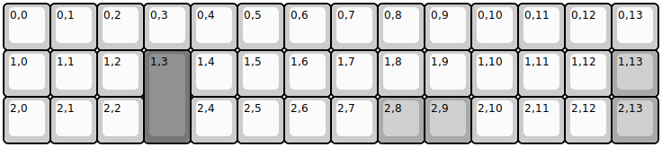
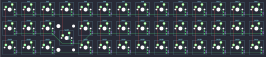
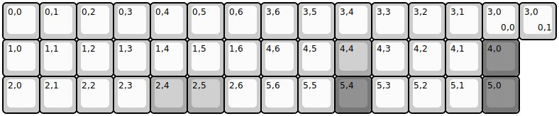
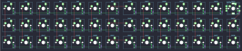
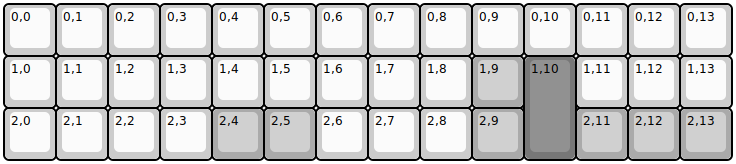
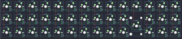

## mechwild/bde/bde-lefty

[layout](bde-lefty-kle.json) - [PCB](bde-lefty.kicad_pcb)

{:loading="lazy"}

[Open in keyboard-layout-editor](http://www.keyboard-layout-editor.com/##@@=0,0&=0,1&=0,2&=0,3&=0,4&=0,5&=0,6&=0,7&=0,8&=0,9&=0,10&=0,11&=0,12&=0,13;&@=1,0&=1,1&=1,2&_c=#777777&h:2;&=1,3&_c=#cccccc;&=1,4&=1,5&=1,6&=1,7&=1,8&=1,9&=1,10&=1,11&=1,12&_c=#aaaaaa;&=1,13;&@_c=#cccccc;&=2,0&=2,1&=2,2&_x:1;&=2,4&=2,5&=2,6&=2,7&_c=#aaaaaa;&=2,8&=2,9&_c=#cccccc;&=2,10&=2,11&=2,12&_c=#aaaaaa;&=2,13)

{:loading="lazy"}

## mechwild/bde/bde-rev2

[layout](bde-rev2-kle.json) - [PCB](bde-rev2.kicad_pcb)

{:loading="lazy"}

[Open in keyboard-layout-editor](http://www.keyboard-layout-editor.com/##@@=0,0&=0,1&=0,2&=0,3&=0,4&=0,5&=0,6&=3,6&=3,5&=3,4&=3,3&=3,2&=3,1&=3,0%0A%0A%0A0,0;&@=1,0&=1,1&=1,2&=1,3&=1,4&=1,5&=1,6&=4,6&=4,5&_c=#aaaaaa;&=4,4&_c=#cccccc;&=4,3&=4,2&=4,1&_c=#777777;&=4,0;&@_c=#cccccc;&=2,0&=2,1&=2,2&=2,3&_c=#aaaaaa;&=2,4&=2,5&_c=#cccccc;&=2,6&=5,6&=5,5&_c=#777777;&=5,4&_c=#cccccc;&=5,3&=5,2&=5,1&_c=#777777;&=5,0;&@_x:14&y:-3&c=#cccccc;&=3,0%0A%0A%0A0,1%0A%0A%0A%0A%0A%0Ae0)

{:loading="lazy"}

## mechwild/bde/bde-righty

[layout](bde-righty-kle.json) - [PCB](bde-righty.kicad_pcb)

{:loading="lazy"}

[Open in keyboard-layout-editor](http://www.keyboard-layout-editor.com/##@@=0,0&=0,1&=0,2&=0,3&=0,4&=0,5&=0,6&=0,7&=0,8&=0,9&=0,10&=0,11&=0,12&=0,13;&@=1,0&=1,1&=1,2&=1,3&=1,4&=1,5&=1,6&=1,7&=1,8&_c=#aaaaaa;&=1,9&_c=#777777&h:2;&=1,10&_c=#cccccc;&=1,11&=1,12&=1,13;&@=2,0&=2,1&=2,2&=2,3&_c=#aaaaaa;&=2,4&=2,5&_c=#cccccc;&=2,6&=2,7&=2,8&_c=#aaaaaa;&=2,9&_x:1;&=2,11&=2,12&=2,13)

{:loading="lazy"}

