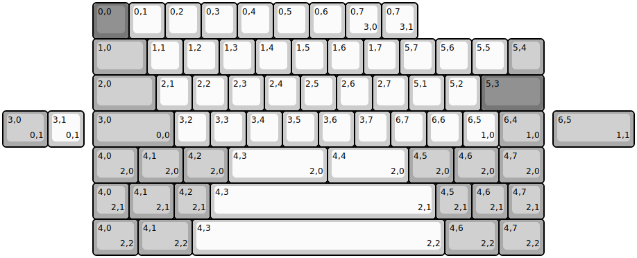
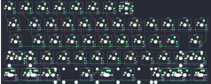

## mechwild/clunker

[layout](clunker-kle.json) - [PCB](clunker.kicad_pcb)

{:loading="lazy"}

[Open in keyboard-layout-editor](http://www.keyboard-layout-editor.com/##@@_x:2.5&c=#777777;&=0,0&_c=#cccccc;&=0,1&=0,2&=0,3&=0,4&=0,5&=0,6&=0,7%0A%0A%0A3,0;&@_x:2.5&c=#aaaaaa&w:1.5;&=1,0&_c=#cccccc;&=1,1&=1,2&=1,3&=1,4&=1,5&=1,6&=1,7&=5,7&=5,6&=5,5&_c=#aaaaaa;&=5,4;&@_x:2.5&w:1.75;&=2,0&_c=#cccccc;&=2,1&=2,2&=2,3&=2,4&=2,5&=2,6&=2,7&=5,1&=5,2&_c=#777777&w:1.75;&=5,3;&@_x:2.5&c=#aaaaaa&w:2.25;&=3,0%0A%0A%0A0,0&_c=#cccccc;&=3,2&=3,3&=3,4&=3,5&=3,6&=3,7&=6,7&=6,6&=6,5%0A%0A%0A1,0&_c=#aaaaaa&w:1.25;&=6,4%0A%0A%0A1,0;&@_x:2.5&w:1.25;&=4,0%0A%0A%0A2,0&_w:1.25;&=4,1%0A%0A%0A2,0&_w:1.25;&=4,2%0A%0A%0A2,0&_c=#cccccc&w:2.75;&=4,3%0A%0A%0A2,0&_w:2.25;&=4,4%0A%0A%0A2,0&_c=#aaaaaa&w:1.25;&=4,5%0A%0A%0A2,0&_w:1.25;&=4,6%0A%0A%0A2,0&_w:1.25;&=4,7%0A%0A%0A2,0;&@_x:10.5&y:-5&c=#cccccc;&=0,7%0A%0A%0A3,1%0A%0A%0A%0A%0A%0Ae0;&@_y:2&c=#aaaaaa&w:1.25;&=3,0%0A%0A%0A0,1&_c=#cccccc;&=3,1%0A%0A%0A0,1&_x:13.0&c=#aaaaaa&w:2.25;&=6,5%0A%0A%0A1,1;&@_x:2.5&y:1;&=4,0%0A%0A%0A2,1&_w:1.25;&=4,1%0A%0A%0A2,1&=4,2%0A%0A%0A2,1&_c=#cccccc&w:6.25;&=4,3%0A%0A%0A2,1&_c=#aaaaaa;&=4,5%0A%0A%0A2,1&=4,6%0A%0A%0A2,1&=4,7%0A%0A%0A2,1;&@_x:2.5&w:1.25;&=4,0%0A%0A%0A2,2&_w:1.5;&=4,1%0A%0A%0A2,2&_c=#cccccc&w:7;&=4,3%0A%0A%0A2,2&_c=#aaaaaa&w:1.5;&=4,6%0A%0A%0A2,2&_w:1.25;&=4,7%0A%0A%0A2,2)

{:loading="lazy"}

