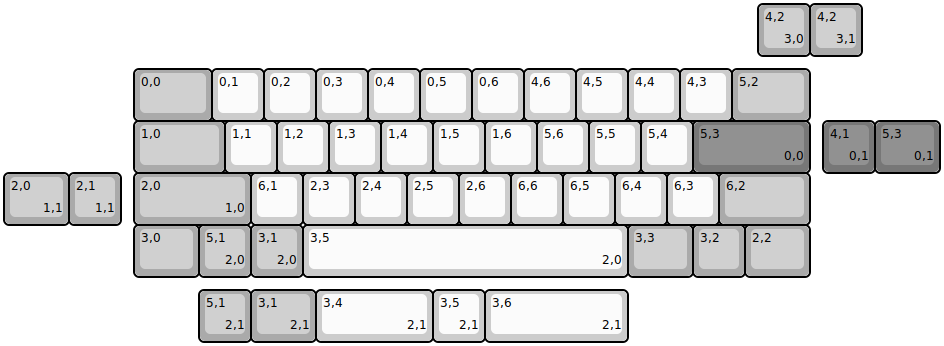
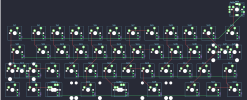

## mechwild/mercutio

[layout](mercutio-kle.json) - [PCB](mercutio.kicad_pcb)

{:loading="lazy"}

[Open in keyboard-layout-editor](http://www.keyboard-layout-editor.com/##@@_x:14.5&c=#aaaaaa;&=4,2%0A%0A%0A3,0;&@_x:2.5&y:0.25&w:1.5;&=0,0&_c=#cccccc;&=0,1&=0,2&=0,3&=0,4&=0,5&=0,6&=4,6&=4,5&=4,4&=4,3&_c=#aaaaaa&w:1.5;&=5,2;&@_x:2.5&w:1.75;&=1,0&_c=#cccccc;&=1,1&=1,2&=1,3&=1,4&=1,5&=1,6&=5,6&=5,5&=5,4&_c=#777777&w:2.25;&=5,3%0A%0A%0A0,0;&@_x:2.5&c=#aaaaaa&w:2.25;&=2,0%0A%0A%0A1,0&_c=#cccccc;&=6,1&=2,3&=2,4&=2,5&=2,6&=6,6&=6,5&=6,4&=6,3&_c=#aaaaaa&w:1.75;&=6,2;&@_x:2.5&w:1.25;&=3,0&=5,1%0A%0A%0A2,0&=3,1%0A%0A%0A2,0&_c=#cccccc&w:6.25;&=3,5%0A%0A%0A2,0&_c=#aaaaaa&w:1.25;&=3,3&=3,2&_w:1.25;&=2,2;&@_x:15.5&y:-5.25;&=4,2%0A%0A%0A3,1%0A%0A%0A%0A%0A%0Ae0;&@_x:15.75&y:1.25&c=#777777;&=4,1%0A%0A%0A0,1&_w:1.25;&=5,3%0A%0A%0A0,1;&@_c=#aaaaaa&w:1.25;&=2,0%0A%0A%0A1,1&=2,1%0A%0A%0A1,1;&@_x:3.75&y:1.25;&=5,1%0A%0A%0A2,1&_w:1.25;&=3,1%0A%0A%0A2,1&_c=#cccccc&w:2.25;&=3,4%0A%0A%0A2,1&=3,5%0A%0A%0A2,1&_w:2.75;&=3,6%0A%0A%0A2,1)

{:loading="lazy"}

