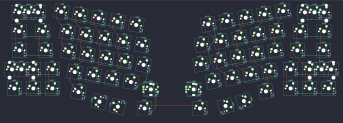
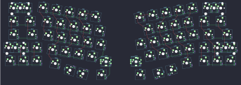

## mechwild/mokulua/mokulua-mirrored

[layout](mokulua-mirrored-kle.json) - [PCB](mokulua-mirrored.kicad_pcb)

{:loading="lazy"}

[Open in keyboard-layout-editor](http://www.keyboard-layout-editor.com/##@@_x:3.22&y:1.05&c=#777777;&=0,0%0A%0A%0A3,0&_c=#cccccc;&=0,1%0A%0A%0A3,0&_x:13.03&c=#aaaaaa&w:2;&=6,1%0A%0A%0A1,0;&@_x:2.97&w:1.5;&=1,0&_c=#cccccc;&=1,1&_x:12.53;&=7,1&_c=#aaaaaa&w:1.5;&=7,0;&@_x:2.87&w:1.75;&=2,0&_c=#cccccc;&=2,1&_x:12.23;&=8,1&_c=#777777&w:1.75;&=8,0;&@_x:2.72&c=#aaaaaa&w:2.25;&=3,0%0A%0A%0A0,0&_c=#cccccc;&=3,2&_x:11.53;&=9,2&_c=#777777;&=9,1%0A%0A%0A2,0&_c=#aaaaaa&w:1.25;&=9,0%0A%0A%0A2,0;&@_x:2.97;&=4,0&=4,1&=4,2&_x:11.53&c=#777777;&=10,2&=10,1&=10,0;&@_x:10.15&y:-0.95;&=5,2%0A%0A%0A4,0&_x:1.25;&=11,2%0A%0A%0A5,0;&@_x:9.82&c=#aaaaaa;&=5,0&_x:1.91;&=11,0;&@_r:10&rx:2.75&ry:3.75&x:2.25&y:-3.25&c=#cccccc;&=0,2&=0,3&=0,4&=0,5&=5,5;&@_x:2.75;&=1,2&=1,3&=1,4&=1,5&=5,4;&@_x:3.0;&=2,2&=2,3&=2,4&=2,5&=5,3;&@_x:3.5;&=3,3&=3,4&=3,5&=5,1;&@_x:3.75&c=#aaaaaa&w:1.25;&=4,3;&@_r:75&rx:10.5&ry:5.75&x:1.0&y:-5.25&c=#cccccc&w:1.5;&=10,4;&@_x:1.0&w:1.5;&=10,5;&@_r:-75&rx:0&ry:5&x:0.1&y:7.5&w:1.5;&=4,4;&@_x:0.1&w:1.5;&=4,5;&@_r:-10&rx:12&ry:4.25&x:1.5&y:-2.25;&=11,5&=6,5&=6,4&=6,3&=6,2;&@_x:1;&=11,4&=7,5&=7,4&=7,3&=7,2;&@_x:0.75;&=11,3&=8,5&=8,4&=8,3&=8,2;&@_x:1.25;&=11,1&=9,5&=9,4&=9,3;&@_x:3.75&c=#aaaaaa&w:1.25;&=10,3;&@_r:0&rx:0&ry:0&y:1.05&c=#777777&w:2;&=0,1%0A%0A%0A3,1&_x:19.0&c=#cccccc;&=6,1%0A%0A%0A1,1&_c=#aaaaaa;&=6,0%0A%0A%0A1,1;&@_y:2.0&w:1.25;&=3,0%0A%0A%0A0,1&_c=#cccccc;&=3,1%0A%0A%0A0,1&_x:18.75&c=#aaaaaa&w:2.25;&=9,0%0A%0A%0A2,1;&@_y:0.05&c=#777777;&=5,2%0A%0A%0A4,1%0A%0A%0A%0A%0A%0Ae0&_x:21.25;&=11,2%0A%0A%0A5,1%0A%0A%0A%0A%0A%0Ae0)

{:loading="lazy"}

## mechwild/mokulua/mokulua-standard

[layout](mokulua-standard-kle.json) - [PCB](mokulua-standard.kicad_pcb)

{:loading="lazy"}

[Open in keyboard-layout-editor](http://www.keyboard-layout-editor.com/##@@_x:3.22&y:1.05&c=#777777;&=0,0%0A%0A%0A3,0&_c=#cccccc;&=0,1%0A%0A%0A3,0&_x:12.53&c=#aaaaaa&w:2;&=6,5%0A%0A%0A1,0;&@_x:2.97&w:1.5;&=1,0&_c=#cccccc;&=1,1&_x:12.03;&=7,4&_c=#aaaaaa&w:1.5;&=7,5;&@_x:2.87&w:1.75;&=2,0&_c=#cccccc;&=2,1&_x:12.23;&=8,4&_c=#777777&w:1.75;&=8,5;&@_x:2.72&c=#aaaaaa&w:2.25;&=3,0%0A%0A%0A0,0&_c=#cccccc;&=3,2&_x:11.53;&=9,3&_c=#777777;&=9,4%0A%0A%0A2,0&_c=#aaaaaa&w:1.25;&=9,5%0A%0A%0A2,0;&@_x:2.97;&=4,0&=4,1&=4,2&_x:11.53&c=#777777;&=10,3&=10,4&=10,5;&@_x:10.15&y:-0.95;&=5,2%0A%0A%0A4,0&_x:1.25;&=11,3%0A%0A%0A5,0;&@_x:9.82&c=#aaaaaa;&=5,0&_x:1.91;&=11,4;&@_r:10&rx:2.75&ry:3.75&x:2.25&y:-3.25&c=#cccccc;&=0,2&=0,3&=0,4&=0,5&=5,5;&@_x:2.75;&=1,2&=1,3&=1,4&=1,5&=5,4;&@_x:3.0;&=2,2&=2,3&=2,4&=2,5&=5,3;&@_x:3.5;&=3,3&=3,4&=3,5&=5,1;&@_x:3.75&c=#aaaaaa&w:1.25;&=4,3;&@_r:75&rx:10.5&ry:5.75&x:1.0&y:-5.25&c=#cccccc&w:1.5;&=10,1;&@_x:1.0&w:1.5;&=10,0;&@_r:-75&rx:0&ry:5&x:0.1&y:7.5&w:1.5;&=4,4;&@_x:0.1&w:1.5;&=4,5;&@_r:-10&rx:12&ry:4.25&x:1&y:-2.25;&=11,0&=6,0&=6,1&=6,2&=6,3;&@_x:1.5;&=7,0&=7,1&=7,2&=7,3;&@_x:0.75;&=11,1&=8,0&=8,1&=8,2&=8,3;&@_x:1.25;&=11,2&=9,0&=9,1&=9,2;&@_x:3.75&c=#aaaaaa&w:1.25;&=10,2;&@_r:0&rx:0&ry:0&y:1.05&c=#777777&w:2;&=0,1%0A%0A%0A3,1&_x:19.0&c=#cccccc;&=6,4%0A%0A%0A1,1&_c=#aaaaaa;&=6,5%0A%0A%0A1,1;&@_y:2.0&w:1.25;&=3,0%0A%0A%0A0,1&_c=#cccccc;&=3,1%0A%0A%0A0,1&_x:18.75&c=#aaaaaa&w:2.25;&=9,5%0A%0A%0A2,1;&@_y:0.05&c=#777777;&=5,2%0A%0A%0A4,1%0A%0A%0A%0A%0A%0Ae0&_x:21.25;&=11,3%0A%0A%0A5,1%0A%0A%0A%0A%0A%0Ae0)

{:loading="lazy"}

