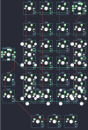

## mechwild/murphpad

[layout](murphpad-kle.json) - [PCB](murphpad.kicad_pcb)

{:loading="lazy"}

[Open in keyboard-layout-editor](http://www.keyboard-layout-editor.com/##@@_x:2.25;&=0,1&=0,2&=0,3&=0,4%0A%0A%0A5,0;&@_x:2.25&y:0.25;&=1,1&=1,2&=1,3&=1,4;&@_x:2.25;&=2,1%0A%0A%0A0,0&=2,2&=2,3&_c=#777777&h:2;&=2,4%0A%0A%0A1,0;&@_x:1&y:-0.5&c=#cccccc;&=3,0%0A%0A%0A4,0;&@_x:2.25&y:-0.5;&=3,1%0A%0A%0A0,0&=3,2&=3,3;&@_x:1;&=4,0&_x:0.25;&=4,1%0A%0A%0A2,0&=4,2&=4,3&_c=#777777&h:2;&=4,4%0A%0A%0A3,0;&@_x:1&c=#cccccc;&=5,0&_x:0.25&c=#777777&w:2;&=5,1%0A%0A%0A2,0&_c=#cccccc;&=5,3%0A%0A%0A3,0;&@_x:2.75&y:0.5;&=0,0&=1,0&=2,0;&@_x:6.25&y:-7.75;&=0,4%0A%0A%0A5,1%0A%0A%0A%0A%0A%0Ae1;&@_x:6.5&y:1.25;&=2,4%0A%0A%0A1,1&_x:0.25&c=#777777&h:2;&=2,1%0A%0A%0A0,1;&@_y:-0.5&c=#cccccc;&=3,0%0A%0A%0A4,1%0A%0A%0A%0A%0A%0Ae0;&@_x:6.5&y:-0.5;&=3,4%0A%0A%0A1,1;&@_x:2.25&y:3.75&c=#777777&h:2;&=4,1%0A%0A%0A2,1&_x:2.0&c=#cccccc;&=4,4%0A%0A%0A3,1;&@_x:3.25;&=5,2%0A%0A%0A2,1&_c=#777777&w:2;&=5,4%0A%0A%0A3,1;&@_x:2.25&y:0.25&c=#cccccc;&=4,1%0A%0A%0A2,2&_x:2.0;&=4,4%0A%0A%0A3,2;&@_x:2.25;&=5,1%0A%0A%0A2,2&=5,2%0A%0A%0A2,2&=5,3%0A%0A%0A3,2&=5,4%0A%0A%0A3,2)

{:loading="lazy"}

