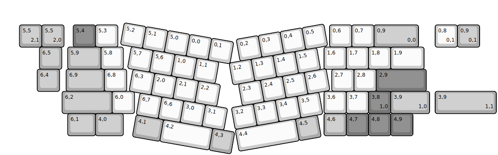
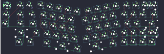

## mechwild/obe

[layout](obe-kle.json) - [PCB](obe.kicad_pcb)

{:loading="lazy"}

[Open in keyboard-layout-editor](http://www.keyboard-layout-editor.com/##@@_x:1.8&y:1.05&c=#aaaaaa;&=5,5%0A%0A%0A2,0&_x:0.42&c=#777777;&=5,4&_c=#cccccc;&=5,3&_x:9.53;&=0,6&=0,7&_c=#aaaaaa&w:2;&=0,9%0A%0A%0A0,0;&@_x:1.7;&=6,5&_x:0.27&w:1.5;&=5,9&_c=#cccccc;&=5,8&_x:9.03;&=1,6&=1,7&=1,8&_w:1.5;&=1,9;&@_x:1.6&c=#aaaaaa;&=6,4&_x:0.3&w:1.72;&=6,9&_c=#cccccc;&=6,8&_x:9.23;&=2,7&=2,8&_c=#777777&w:2.25;&=2,9;&@_x:2.72&c=#aaaaaa&w:2.25;&=6,2&_c=#cccccc;&=6,0&_x:8.53;&=3,6&=3,7&_c=#777777;&=3,8%0A%0A%0A1,0&_c=#aaaaaa&w:1.75;&=3,9%0A%0A%0A1,0;&@_x:2.97&w:1.25;&=6,1&_w:1.25;&=4,0&_x:9.03;&=4,6&_c=#777777;&=4,7&=4,8&=4,9;&@_r:10&rx:2.75&ry:3.75&x:2.25&y:-3.25&c=#cccccc;&=5,2&=5,1&=5,0&=0,0&=0,1;&@_x:2.75;&=5,7&=5,6&=1,0&=1,1;&@_x:3.0;&=6,3&=2,0&=2,1&=2,2;&@_x:3.5;&=6,7&=6,6&=3,0&=3,1;&@_x:3.5&c=#aaaaaa&w:1.25;&=4,1&_c=#cccccc&w:2.25;&=4,2&_c=#aaaaaa;&=4,3;&@_r:-10&rx:12&ry:4.25&x:-1&y:-2.75&c=#cccccc;&=0,2&=0,3&=0,4&=0,5;&@_x:-1.5;&=1,2&=1,3&=1,4&=1,5;&@_x:-1.25;&=2,3&=2,4&=2,5&=2,6;&@_x:-1.75;&=3,2&=3,3&=3,4&=3,5;&@_x:-1.75&w:2.75;&=4,4&_c=#aaaaaa;&=4,5;&@_r:0&rx:0&ry:0&x:0.8&y:1.05;&=5,5%0A%0A%0A2,1%0A%0A%0A%0A%0A%0Ae0&_x:17.7&c=#cccccc;&=0,8%0A%0A%0A0,1&_c=#aaaaaa;&=0,9%0A%0A%0A0,1;&@_x:19.5&y:2.0&w:2.75;&=3,9%0A%0A%0A1,1)

{:loading="lazy"}

