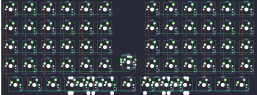

## mechwild/waka60

[layout](waka60-kle.json) - [PCB](waka60.kicad_pcb)

{:loading="lazy"}

[Open in keyboard-layout-editor](http://www.keyboard-layout-editor.com/##@@_y:0.25&c=#777777;&=0,0&_c=#cccccc;&=0,1&=0,2&=0,3&=0,4&=0,5&_x:1.5;&=5,0&=5,1&=5,2&=5,3&=5,4&_c=#aaaaaa;&=5,5;&@=1,0&_c=#cccccc;&=1,1&=1,2&=1,3&=1,4&=1,5&_x:1.5;&=6,0&=6,1&=6,2&=6,3&=6,4&=6,5;&@_c=#aaaaaa;&=2,0&_c=#cccccc;&=2,1&=2,2&=2,3&=2,4&=2,5&_x:1.5;&=7,0&=7,1&=7,2&=7,3&=7,4&_c=#777777;&=7,5;&@_x:6.25&y:-0.205;&=3,6%0A%0A%0A1,0;&@_y:-0.795&c=#aaaaaa;&=3,0&_c=#cccccc;&=3,1&=3,2&=3,3&=3,4&=3,5&_x:1.5;&=8,0&=8,1&=8,2&=8,3&=8,4&_c=#aaaaaa;&=8,5;&@_x:0.25;&=4,0&=4,1&=4,2&_c=#cccccc&w:7;&=4,6%0A%0A%0A0,0&_c=#aaaaaa;&=9,3&=9,4&=9,5;&@_x:6.25&y:-3.205&c=#777777;&=3,6%0A%0A%0A1,1%0A%0A%0A%0A%0A%0Ae0;&@_x:3.25&y:2.455&c=#aaaaaa&w:2;&=4,3%0A%0A%0A0,1&=4,5%0A%0A%0A0,1&=4,6%0A%0A%0A0,1&=9,0%0A%0A%0A0,1&_w:2;&=9,2%0A%0A%0A0,1;&@_x:3.25&w:2;&=4,3%0A%0A%0A0,2&_w:3;&=4,6%0A%0A%0A0,2&_w:2;&=9,2%0A%0A%0A0,2;&@_x:3.25;&=4,3%0A%0A%0A0,3&=4,4%0A%0A%0A0,3&_w:3;&=4,6%0A%0A%0A0,3&=9,1%0A%0A%0A0,3&=9,2%0A%0A%0A0,3;&@_x:3.25;&=4,3%0A%0A%0A0,4&=4,4%0A%0A%0A0,4&=4,5%0A%0A%0A0,4&=4,6%0A%0A%0A0,4&=9,0%0A%0A%0A0,4&=9,1%0A%0A%0A0,4&=9,2%0A%0A%0A0,4;&@_x:3.25;&=4,3%0A%0A%0A0,5&_w:2;&=4,4%0A%0A%0A0,5&=4,6%0A%0A%0A0,5&_w:2;&=9,1%0A%0A%0A0,5&=9,2%0A%0A%0A0,5)

{:loading="lazy"}

