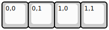

## meishi2/meishi2

[layout](meishi2-kle.json) - [PCB](meishi2.kicad_pcb)

{:loading="lazy"}

[Open in keyboard-layout-editor](http://www.keyboard-layout-editor.com/##@@=0,0&=0,1&=1,0&=1,1)

{:loading="lazy"}

