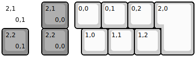
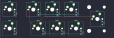
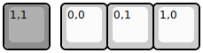

## merge/iso_macro

[layout](iso_macro-kle.json) - [PCB](iso_macro.kicad_pcb)

{:loading="lazy"}

[Open in keyboard-layout-editor](http://www.keyboard-layout-editor.com/##@@_x:1.5&c=#8f8f8f;&=2,1%0A%0A%0A0,0&_x:0.25&c=#cccccc;&=0,0&=0,1&=0,2&_x:0.25&w:1.25&h:2&w2:1.5&h2:1&x2:-0.25;&=2,0;&@_x:1.5&c=#8f8f8f;&=2,2%0A%0A%0A0,0&_x:0.5&c=#cccccc;&=1,0&=1,1&=1,2;&@_y:-2&d:true;&=2,1%0A%0A%0A0,1;&@_c=#8f8f8f;&=2,2%0A%0A%0A0,1)

{:loading="lazy"}

## merge/uc1

[layout](uc1-kle.json) - [PCB](uc1.kicad_pcb)

{:loading="lazy"}

[Open in keyboard-layout-editor](http://www.keyboard-layout-editor.com/##@@_c=#8f8f8f;&=1,1&_x:0.25&c=#cccccc;&=0,0&=0,1&=1,0)

{:loading="lazy"}

