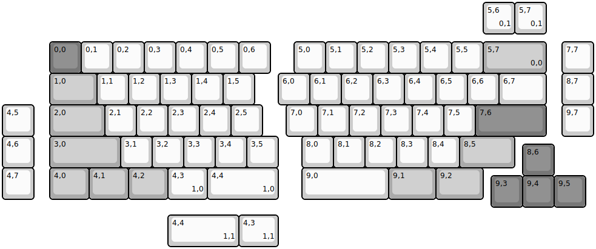
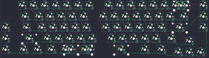

## merge/um70

[layout](um70-kle.json) - [PCB](um70.kicad_pcb)

{:loading="lazy"}

[Open in keyboard-layout-editor](http://www.keyboard-layout-editor.com/##@@_x:1.5&y:1.25&c=#777777;&=0,0&_c=#cccccc;&=0,1&=0,2&=0,3&=0,4&=0,5&=0,6&_x:0.75;&=5,0&=5,1&=5,2&=5,3&=5,4&=5,5&_c=#aaaaaa&w:2;&=5,7%0A%0A%0A0,0&_x:0.5&c=#cccccc;&=7,7;&@_x:1.5&c=#aaaaaa&w:1.5;&=1,0&_c=#cccccc;&=1,1&=1,2&=1,3&=1,4&=1,5&_x:0.75;&=6,0&=6,1&=6,2&=6,3&=6,4&=6,5&=6,6&_w:1.5;&=6,7&_x:0.5;&=8,7;&@=4,5&_x:0.5&c=#aaaaaa&w:1.75;&=2,0&_c=#cccccc;&=2,1&=2,2&=2,3&=2,4&=2,5&_x:0.75;&=7,0&=7,1&=7,2&=7,3&=7,4&=7,5&_c=#777777&w:2.25;&=7,6&_x:0.5&c=#cccccc;&=9,7;&@=4,6&_x:0.5&c=#aaaaaa&w:2.25;&=3,0&_c=#cccccc;&=3,1&=3,2&=3,3&=3,4&=3,5&_x:0.75;&=8,0&=8,1&=8,2&=8,3&=8,4&_c=#aaaaaa&w:1.75;&=8,5;&@_x:16.5&y:-0.75&c=#777777;&=8,6;&@_y:-0.25&c=#cccccc;&=4,7&_x:0.5&c=#aaaaaa&w:1.25;&=4,0&_w:1.25;&=4,1&_w:1.25;&=4,2&_c=#cccccc&w:1.25;&=4,3%0A%0A%0A1,0&_w:2.25;&=4,4%0A%0A%0A1,0&_x:0.75&w:2.75;&=9,0&_c=#aaaaaa&w:1.5;&=9,1&_w:1.5;&=9,2;&@_x:15.5&y:-0.75&c=#777777;&=9,3&=9,4&=9,5;&@_x:15.25&y:-6.5&c=#cccccc;&=5,6%0A%0A%0A0,1&=5,7%0A%0A%0A0,1;&@_x:5.25&y:5.75&w:2.25;&=4,4%0A%0A%0A1,1&_w:1.25;&=4,3%0A%0A%0A1,1)

{:loading="lazy"}

