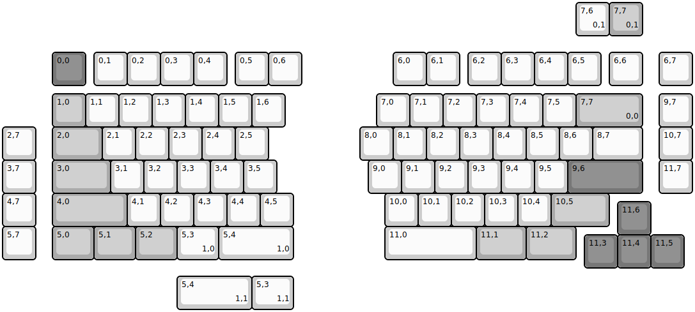
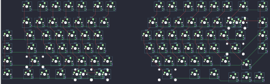

## merge/um80

[layout](um80-kle.json) - [PCB](um80.kicad_pcb)

{:loading="lazy"}

[Open in keyboard-layout-editor](http://www.keyboard-layout-editor.com/##@@_x:1.5&y:1.5&c=#777777;&=0,0&_x:0.25&c=#cccccc;&=0,1&=0,2&=0,3&=0,4&_x:0.25;&=0,5&=0,6&_x:2.75;&=6,0&=6,1&_x:0.25;&=6,2&=6,3&=6,4&=6,5&_x:0.25;&=6,6&_x:0.5;&=6,7;&@_x:1.5&y:0.25&c=#aaaaaa;&=1,0&_c=#cccccc;&=1,1&=1,2&=1,3&=1,4&=1,5&=1,6&_x:2.75;&=7,0&=7,1&=7,2&=7,3&=7,4&=7,5&_c=#aaaaaa&w:2;&=7,7%0A%0A%0A0,0&_x:0.5&c=#cccccc;&=9,7;&@=2,7&_x:0.5&c=#aaaaaa&w:1.5;&=2,0&_c=#cccccc;&=2,1&=2,2&=2,3&=2,4&=2,5&_x:2.75;&=8,0&=8,1&=8,2&=8,3&=8,4&=8,5&=8,6&_w:1.5;&=8,7&_x:0.5;&=10,7;&@=3,7&_x:0.5&c=#aaaaaa&w:1.75;&=3,0&_c=#cccccc;&=3,1&=3,2&=3,3&=3,4&=3,5&_x:2.75;&=9,0&=9,1&=9,2&=9,3&=9,4&=9,5&_c=#777777&w:2.25;&=9,6&_x:0.5&c=#cccccc;&=11,7;&@=4,7&_x:0.5&c=#aaaaaa&w:2.25;&=4,0&_c=#cccccc;&=4,1&=4,2&=4,3&=4,4&=4,5&_x:2.75;&=10,0&=10,1&=10,2&=10,3&=10,4&_c=#aaaaaa&w:1.75;&=10,5;&@_x:18.5&y:-0.75&c=#777777;&=11,6;&@_y:-0.25&c=#cccccc;&=5,7&_x:0.5&c=#aaaaaa&w:1.25;&=5,0&_w:1.25;&=5,1&_w:1.25;&=5,2&_c=#cccccc&w:1.25;&=5,3%0A%0A%0A1,0&_w:2.25;&=5,4%0A%0A%0A1,0&_x:2.75&w:2.75;&=11,0&_c=#aaaaaa&w:1.5;&=11,1&_w:1.5;&=11,2;&@_x:17.5&y:-0.75&c=#777777;&=11,3&=11,4&=11,5;&@_x:17.25&y:-8.0&c=#cccccc;&=7,6%0A%0A%0A0,1&_c=#aaaaaa;&=7,7%0A%0A%0A0,1;&@_x:5.25&y:7.25&c=#cccccc&w:2.25;&=5,4%0A%0A%0A1,1&_w:1.25;&=5,3%0A%0A%0A1,1)

{:loading="lazy"}

