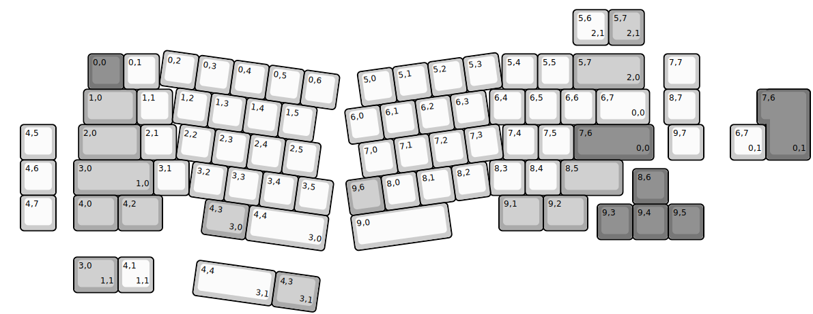
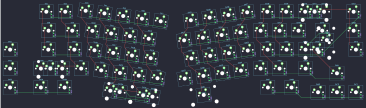

## merge/uma

[layout](uma-kle.json) - [PCB](uma.kicad_pcb)

{:loading="lazy"}

[Open in keyboard-layout-editor](http://www.keyboard-layout-editor.com/##@@_x:2.41&y:1.45&c=#777777;&=0,0&_c=#cccccc;&=0,1&_x:9.66;&=5,4&=5,5&_c=#aaaaaa&w:2;&=5,7%0A%0A%0A2,0&_x:0.56&c=#cccccc;&=7,7;&@_x:2.28&c=#aaaaaa&w:1.5;&=1,0&_c=#cccccc;&=1,1&_x:8.94;&=6,4&=6,5&=6,6&_w:1.5;&=6,7%0A%0A%0A0,0&_x:0.41;&=8,7;&@_x:0.5;&=4,5&_x:0.64&c=#aaaaaa&w:1.75;&=2,0&_c=#cccccc;&=2,1&_x:9.2;&=7,4&=7,5&_c=#777777&w:2.25;&=7,6%0A%0A%0A0,0&_x:0.41&c=#cccccc;&=9,7;&@_x:0.5;&=4,6&_x:0.5&c=#aaaaaa&w:2.25;&=3,0%0A%0A%0A1,0&_c=#cccccc;&=3,1&_x:8.47;&=8,3&=8,4&_c=#aaaaaa&w:1.75;&=8,5;&@_x:17.75&y:-0.75&c=#777777;&=8,6;&@_x:0.5&y:-0.25&c=#cccccc;&=4,7&_x:0.5&c=#aaaaaa&w:1.25;&=4,0&_w:1.25;&=4,2&_x:9.48&w:1.25;&=9,1&_w:1.25;&=9,2;&@_x:16.75&y:-0.75&c=#777777;&=9,3&=9,4&=9,5;&@_r:8&rx:1.75&x:2.97&y:0.93&c=#cccccc;&=0,2&=0,3&=0,4&=0,5&=0,6;&@_x:3.47;&=1,2&=1,3&=1,4&=1,5;&@_x:3.72;&=2,2&=2,3&_n:true;&=2,4&=2,5;&@_x:4.22;&=3,2&=3,3&=3,4&=3,5;&@_x:4.72&c=#aaaaaa&w:1.25;&=4,3%0A%0A%0A3,0&_c=#cccccc&w:2.25;&=4,4%0A%0A%0A3,0;&@_r:-8&x:7.87&y:-2.83;&=5,0&=5,1&=5,2&=5,3;&@_x:7.37;&=6,0&=6,1&=6,2&=6,3;&@_x:7.62;&=7,0&_n:true;&=7,1&=7,2&=7,3;&@_x:7.12&c=#aaaaaa;&=9,6&_c=#cccccc;&=8,0&=8,1&=8,2;&@_x:7.12&w:2.75;&=9,0;&@_r:0&rx:0&x:16.07&y:0.2;&=5,6%0A%0A%0A2,1&_c=#aaaaaa;&=5,7%0A%0A%0A2,1;&@_x:21.5&y:1.25&c=#777777&w:1.25&h:2&w2:1.5&h2:1&x2:-0.25;&=7,6%0A%0A%0A0,1;&@_x:20.5&c=#cccccc;&=6,7%0A%0A%0A0,1;&@_x:2&y:2.75&c=#aaaaaa&w:1.25;&=3,0%0A%0A%0A1,1&_c=#cccccc;&=4,1%0A%0A%0A1,1;&@_r:8&rx:1.75&x:4.72&y:6.68&w:2.25;&=4,4%0A%0A%0A3,1&_c=#aaaaaa&w:1.25;&=4,3%0A%0A%0A3,1)

{:loading="lazy"}

