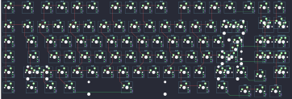

## metamechs/timberwolf

[layout](timberwolf-kle.json) - [PCB](timberwolf.kicad_pcb)

{:loading="lazy"}

[Open in keyboard-layout-editor](http://www.keyboard-layout-editor.com/##@@_x:2.5&c=#aaaaaa;&=0,0&_x:0.25&c=#777777;&=1,0&_x:0.25&c=#aaaaaa;&=0,1&=1,1&=0,2&=1,2&_x:0.5;&=0,3&=1,3&=0,4&=1,4&_x:0.5;&=0,5&=1,5&=0,6&=1,6&_x:0.25;&=1,7&=0,8&=1,8;&@_x:19.25;&=2,8%0A%0A%0A0,0&=3,8%0A%0A%0A0,0;&@_x:2.5&y:-0.75;&=2,0&_x:0.25&c=#cccccc;&=3,0&=2,1&=3,1&=2,2&=3,2&=2,3&=3,3&=2,4&=3,4&=2,5&=3,5&=2,6&=3,6&_c=#aaaaaa&w:2;&=2,7%0A%0A%0A1,0;&@_x:19.25&y:-0.25&c=#cccccc&w:2&h:0.25&d:true;&=%0A%0A%0A0,0;&@_x:2.5&y:-0.75&c=#aaaaaa;&=4,0&_x:0.25&w:1.5;&=5,0&_c=#cccccc;&=4,1&=5,1&=4,2&=5,2&=4,3&=5,3&=4,4&=5,4&=4,5&=5,5&=4,6&=5,6&_w:1.5;&=4,7%0A%0A%0A2,0&_x:0.25&c=#aaaaaa;&=4,8%0A%0A%0A0,0&_c=#cccccc&w:0.25&h:2&d:true;&=%0A%0A%0A0,0&_c=#aaaaaa;&=5,8%0A%0A%0A0,0;&@_x:2.5;&=6,0&_x:0.25&w:1.75;&=7,0&_c=#cccccc;&=6,1&=7,1&=6,2&=7,2&=6,3&=7,3&=6,4&=7,4&=6,5&=7,5&=6,6&_c=#777777&w:2.25;&=6,7%0A%0A%0A2,0&_x:0.25&c=#aaaaaa;&=6,8%0A%0A%0A0,0&_x:0.25;&=7,8%0A%0A%0A0,0;&@_x:2.5;&=8,0&_x:0.25&w:2.25;&=9,0%0A%0A%0A3,0&_c=#cccccc;&=9,1&=8,2&=9,2&=8,3&=9,3&=8,4&=9,4&=8,5&=9,5&=8,6&_c=#aaaaaa&w:1.75;&=9,6%0A%0A%0A4,0&=8,7%0A%0A%0A4,0&_x:1.5;&=9,8%0A%0A%0A0,0;&@_x:19&y:-0.75;&=8,8;&@_x:2.5&y:-0.25;&=10,0&_x:0.25&w:1.5;&=11,0&=10,1&_w:1.5;&=11,1&_c=#cccccc&w:6;&=11,3&_c=#aaaaaa&w:1.5;&=10,5&=11,5&_w:1.5;&=10,6;&@_x:18&y:-0.75;&=10,7&=11,7&=10,8;&@_x:24.75&y:-5.5&c=#cccccc&w:2&h:0.25&d:true;&=%0A%0A%0A0,1;&@_x:22.25&y:-0.75&c=#aaaaaa;&=2,7%0A%0A%0A1,1&=3,7%0A%0A%0A1,1&_x:0.5;&=2,8%0A%0A%0A0,1&=3,8%0A%0A%0A0,1;&@_x:22.75&c=#777777&w:1.25&h:2&w2:1.5&h2:1&x2:-0.25;&=6,7%0A%0A%0A2,1&_x:0.25&c=#cccccc&w:0.25&h:2&d:true;&=%0A%0A%0A0,1&_x:0.25&c=#aaaaaa;&=4,8%0A%0A%0A0,1&=5,8%0A%0A%0A0,1;&@_x:22.0&c=#cccccc;&=7,6%0A%0A%0A2,1&_x:1.75&c=#aaaaaa;&=6,8%0A%0A%0A0,1&=7,8%0A%0A%0A0,1;&@_w:1.25;&=9,0%0A%0A%0A3,1&_c=#cccccc;&=8,1%0A%0A%0A3,1&_x:19.25&c=#aaaaaa&w:2.75;&=9,6%0A%0A%0A4,1&_x:1.5;&=9,8%0A%0A%0A0,1)

{:loading="lazy"}

