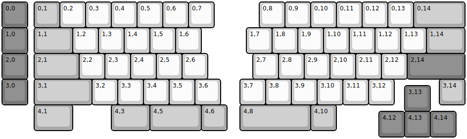
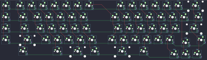

## mincedshon/ecila

[layout](ecila-kle.json) - [PCB](ecila.kicad_pcb)

{:loading="lazy"}

[Open in keyboard-layout-editor](http://www.keyboard-layout-editor.com/##@@_c=#777777;&=0,0&_x:0.25&c=#aaaaaa;&=0,1&_c=#cccccc;&=0,2&=0,3&=0,4&=0,5&=0,6&=0,7&_x:1.75;&=0,8&=0,9&=0,10&=0,11&=0,12&=0,13&_c=#aaaaaa&w:2;&=0,14;&@_c=#777777;&=1,0&_x:0.25&c=#aaaaaa&w:1.5;&=1,1&_c=#cccccc;&=1,2&=1,3&=1,4&=1,5&=1,6&_x:1.75;&=1,7&=1,8&=1,9&=1,10&=1,11&=1,12&=1,13&_c=#aaaaaa&w:1.5;&=1,14;&@_c=#777777;&=2,0&_x:0.25&c=#aaaaaa&w:1.75;&=2,1&_c=#cccccc;&=2,2&=2,3&=2,4&=2,5&=2,6&_x:1.75;&=2,7&=2,8&=2,9&=2,10&=2,11&=2,12&_c=#777777&w:2.25;&=2,14;&@=3,0&_x:0.25&c=#aaaaaa&w:2.25;&=3,1&_c=#cccccc;&=3,2&=3,3&=3,4&=3,5&=3,6&_x:0.75;&=3,7&=3,8&=3,9&=3,10&=3,11&=3,12&_x:1.75&c=#aaaaaa;&=3,14;&@_x:15.65&y:-0.75&c=#777777;&=3,13;&@_x:1.25&y:-0.25&c=#aaaaaa&w:1.5;&=4,1&_x:1.5&w:1.5;&=4,3&_w:2;&=4,5&=4,6&_x:0.5&w:2.75;&=4,8&=4,10;&@_x:14.65&y:-0.75&c=#777777;&=4,12&=4,13&=4,14)

{:loading="lazy"}

