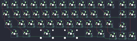

## mini_ashen_40/mini_ashen_40

[layout](mini_ashen_40-kle.json) - [PCB](mini_ashen_40.kicad_pcb)

{:loading="lazy"}

[Open in keyboard-layout-editor](http://www.keyboard-layout-editor.com/##@@_c=#777777;&=0,0&_c=#aaaaaa;&=0,1&=0,2&=0,3&=0,4&=0,5&=0,6&=0,7&=0,8&=0,9&=0,10&_x:1.25;&=0,11&=0,12;&@_c=#cccccc&w:1.25;&=1,0&=1,1&=1,2&=1,3&=1,4&=1,5&=1,6&=1,7&=1,8&=1,9&_c=#777777&w:1.75;&=1,10&_x:0.25&c=#cccccc;&=1,11&=1,12;&@_w:1.75;&=2,0&=2,1&=2,2&=2,3&=2,4&=2,5&=2,6&=2,7&=2,8&=2,9&_w:1.25;&=2,10;&@_x:12.25&y:-0.75;&=2,11;&@_x:11.0&y:-3.25;&=2,12;&@_x:1&y:2.0;&=3,0&_w:1.5;&=3,1&_w:2.75;&=3,3&_w:2.25;&=3,6&_w:1.5;&=3,8&=3,9;&@_x:11.25&y:-0.75;&=3,10&=3,11&=3,12)

{:loading="lazy"}

