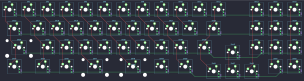

## misonoworks/chocolate-bar

[layout](chocolate-bar-kle.json) - [PCB](chocolate-bar.kicad_pcb)

{:loading="lazy"}

[Open in keyboard-layout-editor](http://www.keyboard-layout-editor.com/##@@_c=#777777;&=0,0&_c=#cccccc;&=0,1&=0,2&=0,3&=0,4&=0,5&=0,6&=0,7&=0,8&=0,9&=0,10&_c=#777777;&=0,11&_x:1&c=#cccccc;&=0,13&=0,14&=0,15;&@_c=#777777&w:1.5;&=1,0&_c=#cccccc;&=1,1&=1,2&=1,3&=1,4&=1,5&=1,6&=1,7&=1,8&=1,9&_c=#777777&w:1.5;&=1,11&_x:1.0&c=#cccccc;&=1,13&=1,14&=1,15;&@_c=#777777&w:2;&=2,0&_c=#cccccc;&=2,1&=2,2&=2,3&=2,4&=2,5&=2,6&=2,7&=2,8&_c=#777777&w:1.5;&=2,11&_x:1.5&c=#cccccc;&=2,13&=2,14&=2,15;&@_x:11.75&y:-0.75&c=#777777;&=2,12;&@_y:-0.25&w:1.5;&=3,0&_w:1.5;&=3,1&=3,2&_c=#cccccc&w:2;&=3,3&_w:2;&=3,5&_c=#777777;&=3,6&_w:1.5;&=3,8&_x:3.5&c=#cccccc;&=3,14&_c=#777777;&=3,15;&@_x:10.75&y:-0.75;&=3,11&=3,12&=3,13)

{:loading="lazy"}

