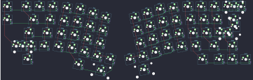

## mkultra/boardrun/bizarre

[layout](bizarre-kle.json) - [PCB](bizarre.kicad_pcb)

{:loading="lazy"}

[Open in keyboard-layout-editor](http://www.keyboard-layout-editor.com/##@@_x:2.5&y:0.21;&=0,0&_x:0.43&c=#777777;&=0,1&_c=#cccccc;&=0,16&=0,2&_x:9.16;&=0,11&=0,12&=0,13&_c=#aaaaaa&w:2;&=0,14%0A%0A%0A0,0;&@_x:2.5&c=#cccccc;&=1,0&_x:0.73&c=#aaaaaa&w:1.5;&=1,1&_c=#cccccc;&=1,2&_x:9.56;&=1,11&=1,12&=1,13&_w:1.5;&=1,14%0A%0A%0A1,0;&@_x:3.75&c=#aaaaaa&w:1.75;&=2,1&_c=#cccccc;&=2,2&_x:10.0;&=2,11&=2,12&_c=#777777&w:2.25;&=2,14%0A%0A%0A1,0;&@_x:3.05&c=#aaaaaa&w:2.25;&=3,0%0A%0A%0A2,0&_c=#cccccc;&=3,2&_x:10.4;&=3,11&_c=#aaaaaa&w:1.75;&=3,12&_c=#777777;&=3,14;&@_x:3.8&c=#aaaaaa&w:1.5;&=4,1&_x:11.65&w:1.5;&=4,11&_c=#777777;&=4,13&=4,14&=4,15;&@_r:12&rx:11.5&x:-3.25&y:1&c=#cccccc;&=0,4;&@_x:-4.25&y:-0.87;&=0,3&_x:1.0;&=0,5;&@_x:-1.25&y:-0.88;&=0,6;&@_x:-3.25&y:-0.25;&=1,4;&@_x:-4.25&y:-0.87;&=1,3&_x:1.0;&=1,5;&@_x:-1.25&y:-0.88;&=1,6;&@_x:-3.25&y:-0.25;&=2,4;&@_x:-4.25&y:-0.87;&=2,3&_x:1.0;&=2,5;&@_x:-1.25&y:-0.88;&=2,6;&@_x:-3.25&y:-0.25;&=3,4;&@_x:-4.25&y:-0.87;&=3,3&_x:1.0;&=3,5;&@_x:-1.25&y:-0.88;&=3,6&=4,6;&@_x:-2.75&y:-0.12&c=#aaaaaa&w:1.5;&=4,4;&@_x:-1.25&y:-0.88&c=#cccccc&w:2;&=4,5;&@_r:-12&x:2.25&y:-5.25;&=0,9;&@_x:1.25&y:-0.87;&=0,8&_x:1.0;&=0,10;&@_x:0.25&y:-0.88;&=0,7;&@_x:2.25&y:-0.25;&=1,9;&@_x:1.25&y:-0.87;&=1,8&_x:1.0;&=1,10;&@_x:0.25&y:-0.88;&=1,7;&@_x:2.25&y:-0.25;&=2,9;&@_x:1.25&y:-0.87;&=2,8&_x:1.0;&=2,10;&@_x:0.25&y:-0.88;&=2,7;&@_x:2.25&y:-0.25;&=3,9;&@_x:1.25&y:-0.87;&=3,8&_x:1.0;&=3,10;&@_x:-0.75&y:-0.88;&=4,7&=3,7;&@_x:-0.75&w:2.75;&=4,8;&@_r:0&rx:0&x:21.77&y:0.21;&=0,14%0A%0A%0A0,1&=0,15%0A%0A%0A0,1;&@_x:22.54&c=#777777&w:1.25&h:2&w2:1.5&h2:1&x2:-0.25;&=2,14%0A%0A%0A1,1;&@_x:21.52&c=#cccccc;&=2,13%0A%0A%0A1,1;&@_c=#aaaaaa&w:1.25;&=3,0%0A%0A%0A2,1&=3,1%0A%0A%0A2,1)

{:loading="lazy"}

