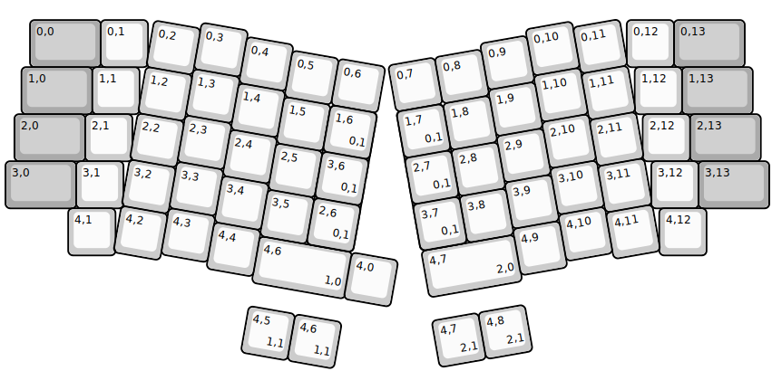
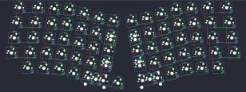

## mkultra/boardrun/classic

[layout](classic-kle.json) - [PCB](classic.kicad_pcb)

{:loading="lazy"}

[Open in keyboard-layout-editor](http://www.keyboard-layout-editor.com/##@@_x:0.56&y:0.35&c=#aaaaaa&w:1.5;&=0,0&_x:12.15&w:1.5;&=0,13;&@_x:0.38&w:1.5;&=1,0&_c=#cccccc;&=1,1&_x:11.5&c=#aaaaaa&w:1.5;&=1,13;&@_x:0.23&w:1.5;&=2,0&_x:12.82&w:1.5;&=2,13;&@_x:0.04&w:1.5;&=3,0&_x:13.19&w:1.5;&=3,13;&@_rx:2.5&x:-0.44&y:0.35&c=#cccccc;&=0,1;&@_x:-0.77&y:1.0;&=2,1;&@_x:-0.96;&=3,1;&@_x:-1.13;&=4,1;&@_rx:15.25&x:-2.04&y:0.35;&=0,12;&@_x:-1.87;&=1,12;&@_x:-1.7;&=2,12;&@_rx:16&x:-2.27&y:3.35;&=3,12;&@_x:-2.1;&=4,12;&@_r:10&rx:0&x:6.22&y:3.91&w:2;&=4,6%0A%0A%0A1,0&_x:-0.02;&=4,0;&@_rx:2&x:2.25;&=0,3;&@_x:1.25&y:-0.87;&=0,2&_x:1.0;&=0,4;&@_x:4.25&y:-0.88;&=0,5&=0,6;&@_x:2.25&y:-0.25;&=1,3;&@_x:1.25&y:-0.87;&=1,2&_x:1.0;&=1,4;&@_x:4.25&y:-0.88;&=1,5&_c=#aaaaaa&h:1.5;&=1,6%0A%0A%0A0,0;&@_x:2.25&y:-0.25&c=#cccccc;&=2,3;&@_x:1.25&y:-0.87;&=2,2&_x:1.0;&=2,4;&@_x:4.25&y:-0.88;&=2,5;&@_x:5.25&y:-0.5&c=#aaaaaa&h:1.5;&=3,6%0A%0A%0A0,0;&@_x:2.25&y:-0.75&c=#cccccc;&=3,3;&@_x:1.25&y:-0.87;&=3,2&_x:1.0;&=3,4;&@_x:4.25&y:-0.88;&=3,5;&@_x:2.25&y:-0.25;&=4,3;&@_x:1.25&y:-0.87;&=4,2&_x:1.0;&=4,4;&@_r:-10&rx:0&x:7.79&y:6.73&w:2;&=4,7%0A%0A%0A2,0;&@_rx:14.25&x:-3.25;&=0,10;&@_x:-4.25&y:-0.87;&=0,9&_x:1.0;&=0,11;&@_x:-6.25&y:-0.88;&=0,7&=0,8;&@_x:-3.25&y:-0.25;&=1,10;&@_x:-4.25&y:-0.87;&=1,9&_x:1.0;&=1,11;&@_x:-6.25&y:-0.88&c=#aaaaaa&h:1.5;&=1,7%0A%0A%0A0,0&_c=#cccccc;&=1,8;&@_x:-3.25&y:-0.25;&=2,10;&@_x:-4.25&y:-0.87;&=2,9&_x:1.0;&=2,11;&@_x:-5.25&y:-0.88;&=2,8;&@_x:-6.25&y:-0.5&c=#aaaaaa&h:1.5;&=3,7%0A%0A%0A0,0;&@_x:-3.25&y:-0.75&c=#cccccc;&=3,10;&@_x:-4.25&y:-0.87;&=3,9&_x:1.0;&=3,11;&@_x:-5.25&y:-0.88;&=3,8;&@_x:-3.25&y:-0.25;&=4,10;&@_x:-4.25&y:-0.87;&=4,9&_x:1.0;&=4,11;&@_r:10&rx:0&x:6.25&y:5.41;&=4,5%0A%0A%0A1,1&=4,6%0A%0A%0A1,1;&@_rx:2&x:5.25&y:1.25;&=1,6%0A%0A%0A0,1;&@_x:5.25;&=3,6%0A%0A%0A0,1;&@_x:5.25;&=2,6%0A%0A%0A0,1;&@_r:-10&rx:0&x:7.75&y:8.23;&=4,7%0A%0A%0A2,1&=4,8%0A%0A%0A2,1;&@_rx:14.25&x:-6.25&y:1.25;&=1,7%0A%0A%0A0,1;&@_x:-6.25;&=2,7%0A%0A%0A0,1;&@_x:-6.25;&=3,7%0A%0A%0A0,1)

{:loading="lazy"}

