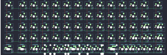

## mkultra/boardwalk

[layout](boardwalk-kle.json) - [PCB](boardwalk.kicad_pcb)

{:loading="lazy"}

[Open in keyboard-layout-editor](http://www.keyboard-layout-editor.com/##@@_c=#aaaaaa&w:1.5;&=0,0&_c=#cccccc;&=0,1&=0,2&=0,3&=0,4&=0,5&_c=#aaaaaa;&=0,6&=0,7&_c=#cccccc;&=0,8&=0,9&=0,10&=0,11&=0,12&_c=#aaaaaa&w:1.5;&=0,13;&@_w:1.5;&=1,0&_c=#cccccc;&=1,1&=1,2&=1,3&=1,4&=1,5&_c=#aaaaaa;&=1,6&=1,7&_c=#cccccc;&=1,8&=1,9&=1,10&=1,11&=1,12&_c=#aaaaaa&w:1.5;&=1,13;&@_w:1.5;&=2,0&_c=#cccccc;&=2,1&=2,2&=2,3&=2,4&=2,5&_c=#aaaaaa;&=2,6&=2,7&_c=#cccccc;&=2,8&=2,9&=2,10&=2,11%0A%0A%0A0,0&=2,12%0A%0A%0A0,0&_c=#aaaaaa&w:1.5;&=2,13%0A%0A%0A0,0;&@_w:1.5;&=3,0&_c=#cccccc;&=3,1&=3,2&=3,3&=3,4&=3,5&_c=#aaaaaa;&=3,6&=3,7&_c=#cccccc;&=3,8&=3,9&=3,10&=3,11%0A%0A%0A1,0&=3,12%0A%0A%0A1,0&_c=#aaaaaa&w:1.5;&=3,13%0A%0A%0A1,0;&@_w:1.5;&=4,0%0A%0A%0A2,0&=4,1%0A%0A%0A2,0&=4,2%0A%0A%0A2,0&=4,3%0A%0A%0A2,0&=4,4%0A%0A%0A2,0&=4,5%0A%0A%0A2,0&=4,6%0A%0A%0A2,0&=4,7%0A%0A%0A2,0&=4,8%0A%0A%0A2,0&=4,9%0A%0A%0A2,0&=4,10%0A%0A%0A2,0&=4,11%0A%0A%0A2,0&=4,12%0A%0A%0A2,0&_w:1.5;&=4,13%0A%0A%0A2,0;&@_x:15.25&y:-3&c=#cccccc;&=2,11%0A%0A%0A0,1&_c=#aaaaaa&w:1.5;&=2,12%0A%0A%0A0,1&=2,13%0A%0A%0A0,1;&@_x:15.25&w:1.5;&=3,11%0A%0A%0A1,1&_c=#777777;&=3,12%0A%0A%0A1,1&_c=#aaaaaa;&=3,13%0A%0A%0A1,1;&@_y:1.25&w:1.5;&=4,0%0A%0A%0A2,1&=4,1%0A%0A%0A2,1&_w:1.5;&=4,2%0A%0A%0A2,1&_w:7;&=4,6%0A%0A%0A2,1&_w:1.5;&=4,11%0A%0A%0A2,1&=4,12%0A%0A%0A2,1&_w:1.5;&=4,13%0A%0A%0A2,1;&@_y:0.25&w:1.5&d:true;&=%0A%0A%0A2,2&=4,1%0A%0A%0A2,2&=4,2%0A%0A%0A2,2&=4,3%0A%0A%0A2,2&=4,4%0A%0A%0A2,2&_w:2;&=4,5%0A%0A%0A2,2&_w:2;&=4,7%0A%0A%0A2,2&=4,9%0A%0A%0A2,2&=4,10%0A%0A%0A2,2&=4,11%0A%0A%0A2,2&=4,12%0A%0A%0A2,2&_w:1.5&d:true;&=%0A%0A%0A2,2;&@_y:0.25&w:1.25;&=4,0%0A%0A%0A2,3&_w:1.25;&=4,1%0A%0A%0A2,3&=4,2%0A%0A%0A2,3&=4,3%0A%0A%0A2,3&_w:2;&=4,4%0A%0A%0A2,3&_w:2;&=4,6%0A%0A%0A2,3&=4,8%0A%0A%0A2,3&_w:1.25;&=4,9%0A%0A%0A2,3&_w:1.25;&=4,10%0A%0A%0A2,3&_c=#777777;&=4,11%0A%0A%0A2,3&=4,12%0A%0A%0A2,3&=4,13%0A%0A%0A2,3;&@_y:0.25&c=#aaaaaa&w:1.25;&=4,0%0A%0A%0A2,4&_w:1.25;&=4,1%0A%0A%0A2,4&=4,2%0A%0A%0A2,4&_w:6.25;&=4,5%0A%0A%0A2,4&=4,9%0A%0A%0A2,4&_w:1.25;&=4,10%0A%0A%0A2,4&_c=#777777;&=4,11%0A%0A%0A2,4&=4,12%0A%0A%0A2,4&=4,13%0A%0A%0A2,4)

{:loading="lazy"}

