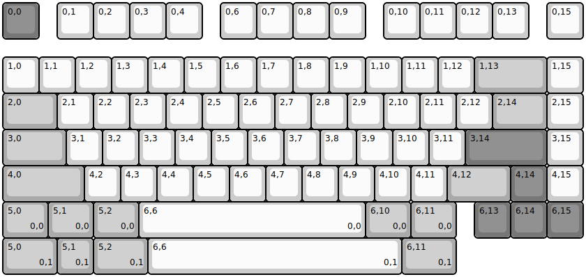
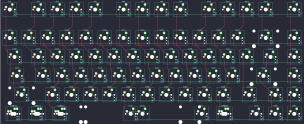
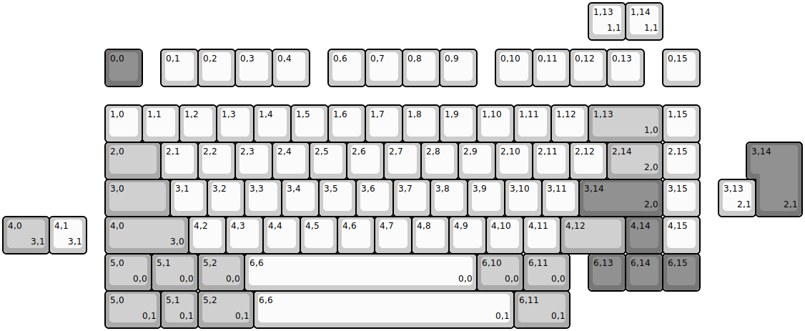
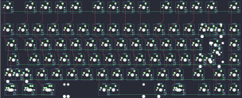

## mode/m75/m75h

[layout](m75h-kle.json) - [PCB](m75h.kicad_pcb)

{:loading="lazy"}

[Open in keyboard-layout-editor](http://www.keyboard-layout-editor.com/##@@_c=#777777;&=0,0&_x:0.5&c=#cccccc;&=0,1&=0,2&=0,3&=0,4&_x:0.5;&=0,6&=0,7&=0,8&=0,9&_x:0.5;&=0,10&=0,11&=0,12&=0,13&_x:0.5;&=0,15;&@_y:0.5;&=1,0&=1,1&=1,2&=1,3&=1,4&=1,5&=1,6&=1,7&=1,8&=1,9&=1,10&=1,11&=1,12&_c=#aaaaaa&w:2;&=1,13&_c=#cccccc;&=1,15;&@_c=#aaaaaa&w:1.5;&=2,0&_c=#cccccc;&=2,1&=2,2&=2,3&=2,4&=2,5&=2,6&=2,7&=2,8&=2,9&=2,10&=2,11&=2,12&_c=#aaaaaa&w:1.5;&=2,14&_c=#cccccc;&=2,15;&@_c=#aaaaaa&w:1.75;&=3,0&_c=#cccccc;&=3,1&=3,2&=3,3&=3,4&=3,5&=3,6&=3,7&=3,8&=3,9&=3,10&=3,11&_c=#777777&w:2.25;&=3,14&_c=#cccccc;&=3,15;&@_c=#aaaaaa&w:2.25;&=4,0&_c=#cccccc;&=4,2&=4,3&=4,4&=4,5&=4,6&=4,7&=4,8&=4,9&=4,10&=4,11&_c=#aaaaaa&w:1.75;&=4,12&_c=#777777;&=4,14&_c=#cccccc;&=4,15;&@_c=#aaaaaa&w:1.25;&=5,0%0A%0A%0A0,0&_w:1.25;&=5,1%0A%0A%0A0,0&_w:1.25;&=5,2%0A%0A%0A0,0&_c=#cccccc&w:6.25;&=6,6%0A%0A%0A0,0&_c=#aaaaaa&w:1.25;&=6,10%0A%0A%0A0,0&_w:1.25;&=6,11%0A%0A%0A0,0&_x:0.5&c=#777777;&=6,13&=6,14&=6,15;&@_c=#aaaaaa&w:1.5;&=5,0%0A%0A%0A0,1&=5,1%0A%0A%0A0,1&_w:1.5;&=5,2%0A%0A%0A0,1&_c=#cccccc&w:7;&=6,6%0A%0A%0A0,1&_c=#aaaaaa&w:1.5;&=6,11%0A%0A%0A0,1)

{:loading="lazy"}

## mode/m75/m75s

[layout](m75s-kle.json) - [PCB](m75s.kicad_pcb)

{:loading="lazy"}

[Open in keyboard-layout-editor](http://www.keyboard-layout-editor.com/##@@_x:2.75&y:1.25&c=#777777;&=0,0&_x:0.5&c=#cccccc;&=0,1&=0,2&=0,3&=0,4&_x:0.5;&=0,6&=0,7&=0,8&=0,9&_x:0.5;&=0,10&=0,11&=0,12&=0,13&_x:0.5;&=0,15;&@_x:2.75&y:0.5;&=1,0&=1,1&=1,2&=1,3&=1,4&=1,5&=1,6&=1,7&=1,8&=1,9&=1,10&=1,11&=1,12&_c=#aaaaaa&w:2;&=1,13%0A%0A%0A1,0&_c=#cccccc;&=1,15;&@_x:2.75&c=#aaaaaa&w:1.5;&=2,0&_c=#cccccc;&=2,1&=2,2&=2,3&=2,4&=2,5&=2,6&=2,7&=2,8&=2,9&=2,10&=2,11&=2,12&_c=#aaaaaa&w:1.5;&=2,14%0A%0A%0A2,0&_c=#cccccc;&=2,15;&@_x:2.75&c=#aaaaaa&w:1.75;&=3,0&_c=#cccccc;&=3,1&=3,2&=3,3&=3,4&=3,5&=3,6&=3,7&=3,8&=3,9&=3,10&=3,11&_c=#777777&w:2.25;&=3,14%0A%0A%0A2,0&_c=#cccccc;&=3,15;&@_x:2.75&c=#aaaaaa&w:2.25;&=4,0%0A%0A%0A3,0&_c=#cccccc;&=4,2&=4,3&=4,4&=4,5&=4,6&=4,7&=4,8&=4,9&=4,10&=4,11&_c=#aaaaaa&w:1.75;&=4,12&_c=#777777;&=4,14&_c=#cccccc;&=4,15;&@_x:2.75&c=#aaaaaa&w:1.25;&=5,0%0A%0A%0A0,0&_w:1.25;&=5,1%0A%0A%0A0,0&_w:1.25;&=5,2%0A%0A%0A0,0&_c=#cccccc&w:6.25;&=6,6%0A%0A%0A0,0&_c=#aaaaaa&w:1.25;&=6,10%0A%0A%0A0,0&_w:1.25;&=6,11%0A%0A%0A0,0&_x:0.5&c=#777777;&=6,13&=6,14&=6,15;&@_x:15.75&y:-7.75&c=#cccccc;&=1,13%0A%0A%0A1,1&=1,14%0A%0A%0A1,1;&@_x:20.25&y:2.75&c=#777777&w:1.25&h:2&w2:1.5&h2:1&x2:-0.25;&=3,14%0A%0A%0A2,1;&@_x:19.25&c=#cccccc;&=3,13%0A%0A%0A2,1;&@_c=#aaaaaa&w:1.25;&=4,0%0A%0A%0A3,1&_c=#cccccc;&=4,1%0A%0A%0A3,1;&@_x:2.75&y:1.0&c=#aaaaaa&w:1.5;&=5,0%0A%0A%0A0,1&=5,1%0A%0A%0A0,1&_w:1.5;&=5,2%0A%0A%0A0,1&_c=#cccccc&w:7;&=6,6%0A%0A%0A0,1&_c=#aaaaaa&w:1.5;&=6,11%0A%0A%0A0,1)

{:loading="lazy"}

