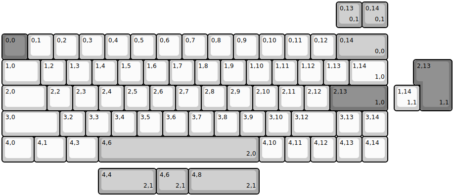
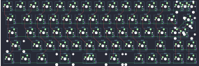

## mokey/mokey63

[layout](mokey63-kle.json) - [PCB](mokey63.kicad_pcb)

{:loading="lazy"}

[Open in keyboard-layout-editor](http://www.keyboard-layout-editor.com/##@@_y:1.25&c=#777777;&=0,0&_c=#cccccc;&=0,1&=0,2&=0,3&=0,4&=0,5&=0,6&=0,7&=0,8&=0,9&=0,10&=0,11&=0,12&_c=#aaaaaa&w:2;&=0,14%0A%0A%0A0,0;&@_c=#cccccc&w:1.5;&=1,0&=1,2&=1,3&=1,4&=1,5&=1,6&=1,7&=1,8&=1,9&=1,10&=1,11&=1,12&=1,13&_w:1.5;&=1,14%0A%0A%0A1,0;&@_w:1.75;&=2,0&=2,2&=2,3&=2,4&=2,5&=2,6&=2,7&=2,8&=2,9&=2,10&=2,11&=2,12&_c=#777777&w:2.25;&=2,13%0A%0A%0A1,0;&@_c=#cccccc&w:2.25;&=3,0&=3,2&=3,3&=3,4&=3,5&=3,6&=3,7&=3,8&=3,9&=3,10&_w:1.75;&=3,12&=3,13&=3,14;&@_w:1.25;&=4,0&_w:1.25;&=4,1&_w:1.25;&=4,3&_c=#aaaaaa&w:6.25;&=4,6%0A%0A%0A2,0&_c=#cccccc;&=4,10&=4,11&=4,12&=4,13&=4,14;&@_x:13&y:-6.25&c=#aaaaaa;&=0,13%0A%0A%0A0,1&=0,14%0A%0A%0A0,1;&@_x:16.25&y:1.25&c=#777777&w:1.25&h:2&w2:1.5&h2:1&x2:-0.25;&=2,13%0A%0A%0A1,1;&@_x:15.25&c=#cccccc;&=1,14%0A%0A%0A1,1;&@_x:3.75&y:2.25&c=#aaaaaa&w:2.25;&=4,4%0A%0A%0A2,1&_w:1.25;&=4,6%0A%0A%0A2,1&_w:2.75;&=4,8%0A%0A%0A2,1)

{:loading="lazy"}

