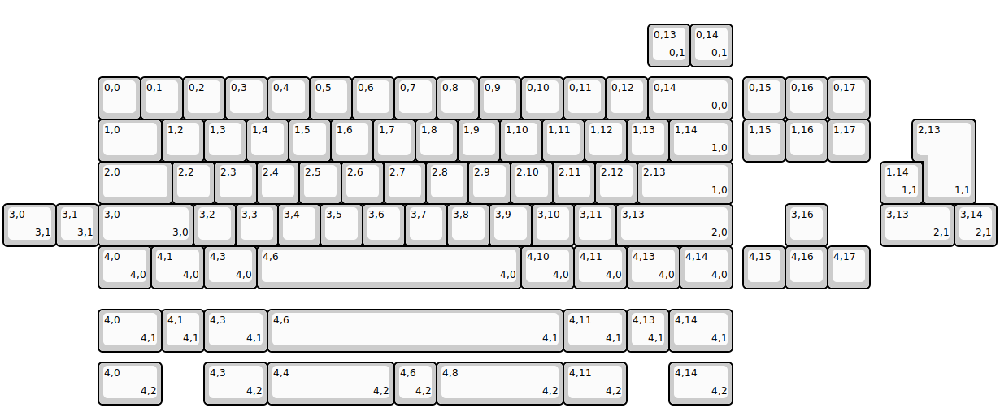
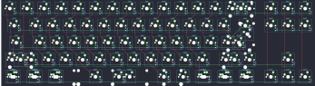

## mokey/xox70

[layout](xox70-kle.json) - [PCB](xox70.kicad_pcb)

{:loading="lazy"}

[Open in keyboard-layout-editor](http://www.keyboard-layout-editor.com/##@@_x:2.25&y:1.75;&=0,0&=0,1&=0,2&=0,3&=0,4&=0,5&=0,6&=0,7&=0,8&=0,9&=0,10&=0,11&=0,12&_w:2;&=0,14%0A%0A%0A0,0&_x:0.25;&=0,15&=0,16&=0,17;&@_x:2.25&w:1.5;&=1,0&=1,2&=1,3&=1,4&=1,5&=1,6&=1,7&=1,8&=1,9&=1,10&=1,11&=1,12&=1,13&_w:1.5;&=1,14%0A%0A%0A1,0&_x:0.25;&=1,15&=1,16&=1,17;&@_x:2.25&w:1.75;&=2,0&=2,2&=2,3&=2,4&=2,5&=2,6&=2,7&=2,8&=2,9&=2,10&=2,11&=2,12&_w:2.25;&=2,13%0A%0A%0A1,0;&@_x:2.25&w:2.25;&=3,0%0A%0A%0A3,0&=3,2&=3,3&=3,4&=3,5&=3,6&=3,7&=3,8&=3,9&=3,10&=3,11&_w:2.75;&=3,13%0A%0A%0A2,0&_x:1.25;&=3,16;&@_x:2.25&w:1.25;&=4,0%0A%0A%0A4,0&_w:1.25;&=4,1%0A%0A%0A4,0&_w:1.25;&=4,3%0A%0A%0A4,0&_w:6.25;&=4,6%0A%0A%0A4,0&_w:1.25;&=4,10%0A%0A%0A4,0&_w:1.25;&=4,11%0A%0A%0A4,0&_w:1.25;&=4,13%0A%0A%0A4,0&_w:1.25;&=4,14%0A%0A%0A4,0&_x:0.25;&=4,15&=4,16&=4,17;&@_x:15.25&y:-6.25;&=0,13%0A%0A%0A0,1&=0,14%0A%0A%0A0,1;&@_x:21.75&y:1.25&w:1.25&h:2&w2:1.5&h2:1&x2:-0.25;&=2,13%0A%0A%0A1,1;&@_x:20.75;&=1,14%0A%0A%0A1,1;&@_w:1.25;&=3,0%0A%0A%0A3,1&=3,1%0A%0A%0A3,1&_x:18.5&w:1.75;&=3,13%0A%0A%0A2,1&=3,14%0A%0A%0A2,1;&@_x:2.25&y:1.5&w:1.5;&=4,0%0A%0A%0A4,1&=4,1%0A%0A%0A4,1&_w:1.5;&=4,3%0A%0A%0A4,1&_w:7;&=4,6%0A%0A%0A4,1&_w:1.5;&=4,11%0A%0A%0A4,1&=4,13%0A%0A%0A4,1&_w:1.5;&=4,14%0A%0A%0A4,1;&@_x:2.25&y:0.25&w:1.5;&=4,0%0A%0A%0A4,2&_x:1.0&w:1.5;&=4,3%0A%0A%0A4,2&_w:3;&=4,4%0A%0A%0A4,2&=4,6%0A%0A%0A4,2&_w:3;&=4,8%0A%0A%0A4,2&_w:1.5;&=4,11%0A%0A%0A4,2&_x:1.0&w:1.5;&=4,14%0A%0A%0A4,2)

{:loading="lazy"}

