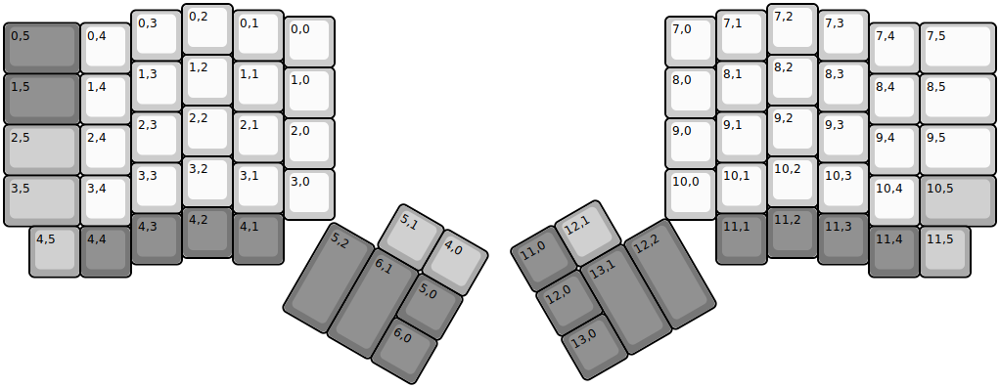
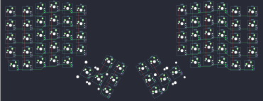

## momoka/ergo

[layout](ergo-kle.json) - [PCB](ergo.kicad_pcb)

{:loading="lazy"}

[Open in keyboard-layout-editor](http://www.keyboard-layout-editor.com/##@@_x:3.5;&=0,2&_x:10.5;&=7,2;&@_x:2.5&y:-0.875;&=0,3&_x:1.0;&=0,1&_x:8.5;&=7,1&_x:1.0;&=7,3;&@_x:5.5&y:-0.875;&=0,0&_x:6.5;&=7,0;&@_y:-0.875&c=#777777&w:1.5;&=0,5&_c=#cccccc;&=0,4&_x:14.5;&=7,4&_w:1.5;&=7,5;&@_x:3.5&y:-0.375;&=1,2&_x:10.5;&=8,2;&@_x:2.5&y:-0.875;&=1,3&_x:1.0;&=1,1&_x:8.5;&=8,1&_x:1.0;&=8,3;&@_x:5.5&y:-0.875;&=1,0&_x:6.5;&=8,0;&@_y:-0.875&c=#777777&w:1.5;&=1,5&_c=#cccccc;&=1,4&_x:14.5;&=8,4&_w:1.5;&=8,5;&@_x:3.5&y:-0.375;&=2,2&_x:10.5;&=9,2;&@_x:2.5&y:-0.875;&=2,3&_x:1.0;&=2,1&_x:8.5;&=9,1&_x:1.0;&=9,3;&@_x:5.5&y:-0.875;&=2,0&_x:6.5;&=9,0;&@_y:-0.875&c=#aaaaaa&w:1.5;&=2,5&_c=#cccccc;&=2,4&_x:14.5;&=9,4&_w:1.5;&=9,5;&@_x:3.5&y:-0.375;&=3,2&_x:10.5;&=10,2;&@_x:2.5&y:-0.875;&=3,3&_x:1.0;&=3,1&_x:8.5;&=10,1&_x:1.0;&=10,3;&@_x:5.5&y:-0.875;&=3,0&_x:6.5;&=10,0;&@_y:-0.875&c=#aaaaaa&w:1.5;&=3,5&_c=#cccccc;&=3,4&_x:14.5;&=10,4&_c=#aaaaaa&w:1.5;&=10,5;&@_x:3.5&y:-0.375&c=#777777;&=4,2&_x:10.5;&=11,2;&@_x:2.5&y:-0.875;&=4,3&_x:1.0;&=4,1&_x:8.5;&=11,1&_x:1.0;&=11,3;&@_x:0.5&y:-0.75&c=#aaaaaa;&=4,5&_c=#777777;&=4,4&_x:14.5;&=11,4&_c=#aaaaaa;&=11,5;&@_r:30&rx:6.5&ry:4.25&x:1.0&y:-1.0;&=5,1&=4,0;&@_c=#777777&h:2;&=5,2&_h:2;&=6,1&=5,0;&@_x:2.0;&=6,0;&@_r:-30&rx:13&x:-3&y:-1.0;&=11,0&_c=#aaaaaa;&=12,1;&@_x:-3&c=#777777;&=12,0&_h:2;&=13,1&_h:2;&=12,2;&@_x:-3;&=13,0)

{:loading="lazy"}

