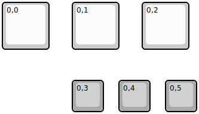
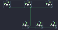

## momokai/momokai_tap_trio

[layout](momokai_tap_trio-kle.json) - [PCB](momokai_tap_trio.kicad_pcb)

{:loading="lazy"}

[Open in keyboard-layout-editor](http://www.keyboard-layout-editor.com/##@@_w:1.5&h:1.5;&=0,0&_x:0.75&w:1.5&h:1.5;&=0,1&_x:0.75&w:1.5&h:1.5;&=0,2;&@_x:2.25&y:1.5&c=#aaaaaa;&=0,3&_x:0.5;&=0,4&_x:0.5;&=0,5)

{:loading="lazy"}

