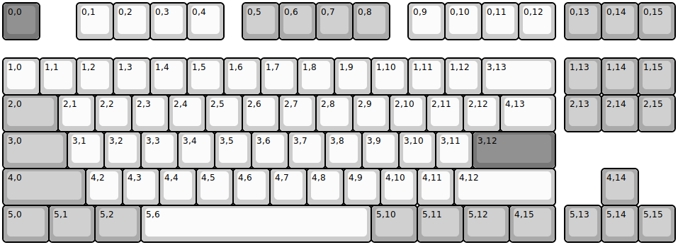
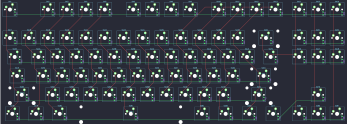
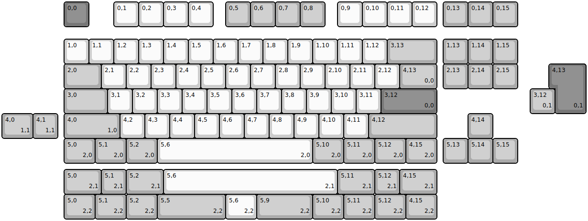
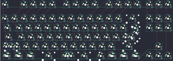

## monstargear/xo87/xo87_rgb

[layout](xo87_rgb-kle.json) - [PCB](xo87_rgb.kicad_pcb)

{:loading="lazy"}

[Open in keyboard-layout-editor](http://www.keyboard-layout-editor.com/##@@_c=#777777;&=0,0&_x:1&c=#cccccc;&=0,1&=0,2&=0,3&=0,4&_x:0.5&c=#aaaaaa;&=0,5&=0,6&=0,7&=0,8&_x:0.5&c=#cccccc;&=0,9&=0,10&=0,11&=0,12&_x:0.25&c=#aaaaaa;&=0,13&=0,14&=0,15;&@_y:0.5&c=#cccccc;&=1,0&=1,1&=1,2&=1,3&=1,4&=1,5&=1,6&=1,7&=1,8&=1,9&=1,10&=1,11&=1,12&_w:2;&=3,13&_x:0.25&c=#aaaaaa;&=1,13&=1,14&=1,15;&@_w:1.5;&=2,0&_c=#cccccc;&=2,1&=2,2&=2,3&=2,4&=2,5&=2,6&=2,7&=2,8&=2,9&=2,10&=2,11&=2,12&_w:1.5;&=4,13&_x:0.25&c=#aaaaaa;&=2,13&=2,14&=2,15;&@_w:1.75;&=3,0&_c=#cccccc;&=3,1&=3,2&=3,3&=3,4&=3,5&=3,6&=3,7&=3,8&=3,9&=3,10&=3,11&_c=#777777&w:2.25;&=3,12;&@_c=#aaaaaa&w:2.25;&=4,0&_c=#cccccc;&=4,2&=4,3&=4,4&=4,5&=4,6&=4,7&=4,8&=4,9&=4,10&=4,11&_w:2.75;&=4,12&_x:1.25&c=#aaaaaa;&=4,14;&@_w:1.25;&=5,0&_w:1.25;&=5,1&_w:1.25;&=5,2&_c=#cccccc&w:6.25;&=5,6&_c=#aaaaaa&w:1.25;&=5,10&_w:1.25;&=5,11&_w:1.25;&=5,12&_w:1.25;&=4,15&_x:0.25;&=5,13&=5,14&=5,15)

{:loading="lazy"}

## monstargear/xo87/xo87_solderable

[layout](xo87_solderable-kle.json) - [PCB](xo87_solderable.kicad_pcb)

{:loading="lazy"}

[Open in keyboard-layout-editor](http://www.keyboard-layout-editor.com/##@@_x:2.5&c=#777777;&=0,0&_x:1.0&c=#cccccc;&=0,1&=0,2&=0,3&=0,4&_x:0.5&c=#aaaaaa;&=0,5&=0,6&=0,7&=0,8&_x:0.5&c=#cccccc;&=0,9&=0,10&=0,11&=0,12&_x:0.25&c=#aaaaaa;&=0,13&=0,14&=0,15;&@_x:2.5&y:0.5&c=#cccccc;&=1,0&=1,1&=1,2&=1,3&=1,4&=1,5&=1,6&=1,7&=1,8&=1,9&=1,10&=1,11&=1,12&_c=#aaaaaa&w:2;&=3,13&_x:0.25;&=1,13&=1,14&=1,15;&@_x:2.5&w:1.5;&=2,0&_c=#cccccc;&=2,1&=2,2&=2,3&=2,4&=2,5&=2,6&=2,7&=2,8&=2,9&=2,10&=2,11&=2,12&_c=#aaaaaa&w:1.5;&=4,13%0A%0A%0A0,0&_x:0.25;&=2,13&=2,14&=2,15;&@_x:2.5&w:1.75;&=3,0&_c=#cccccc;&=3,1&=3,2&=3,3&=3,4&=3,5&=3,6&=3,7&=3,8&=3,9&=3,10&=3,11&_c=#777777&w:2.25;&=3,12%0A%0A%0A0,0;&@_x:2.5&c=#aaaaaa&w:2.25;&=4,0%0A%0A%0A1,0&_c=#cccccc;&=4,2&=4,3&=4,4&=4,5&=4,6&=4,7&=4,8&=4,9&=4,10&=4,11&_c=#aaaaaa&w:2.75;&=4,12&_x:1.25;&=4,14;&@_x:2.5&w:1.25;&=5,0%0A%0A%0A2,0&_w:1.25;&=5,1%0A%0A%0A2,0&_w:1.25;&=5,2%0A%0A%0A2,0&_c=#cccccc&w:6.26;&=5,6%0A%0A%0A2,0&_x:-0.01&c=#aaaaaa&w:1.25;&=5,10%0A%0A%0A2,0&_w:1.25;&=5,11%0A%0A%0A2,0&_w:1.25;&=5,12%0A%0A%0A2,0&_w:1.25;&=4,15%0A%0A%0A2,0&_x:0.25;&=5,13&=5,14&=5,15;&@_x:22.25&y:-4.0&c=#777777&w:1.25&h:2&w2:1.5&h2:1&x2:-0.25;&=4,13%0A%0A%0A0,1;&@_x:21.25&c=#aaaaaa;&=3,12%0A%0A%0A0,1;&@_w:1.25;&=4,0%0A%0A%0A1,1&=4,1%0A%0A%0A1,1;&@_x:2.5&y:1.25&w:1.5;&=5,0%0A%0A%0A2,1&=5,1%0A%0A%0A2,1&_w:1.5;&=5,2%0A%0A%0A2,1&_c=#cccccc&w:7;&=5,6%0A%0A%0A2,1&_c=#aaaaaa&w:1.5;&=5,11%0A%0A%0A2,1&=5,12%0A%0A%0A2,1&_w:1.5;&=4,15%0A%0A%0A2,1;&@_x:2.5&w:1.25;&=5,0%0A%0A%0A2,2&_w:1.25;&=5,1%0A%0A%0A2,2&_w:1.25;&=5,2%0A%0A%0A2,2&_w:2.75;&=5,5%0A%0A%0A2,2&_c=#cccccc&w:1.25;&=5,6%0A%0A%0A2,2&_c=#aaaaaa&w:2.25;&=5,9%0A%0A%0A2,2&_w:1.25;&=5,10%0A%0A%0A2,2&_w:1.25;&=5,11%0A%0A%0A2,2&_w:1.25;&=5,12%0A%0A%0A2,2&_w:1.25;&=4,15%0A%0A%0A2,2)

{:loading="lazy"}

