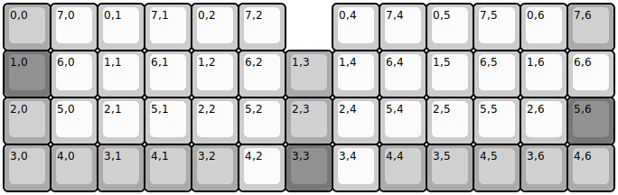
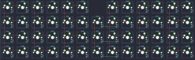

## montsinger/rebound/rebound-rev4

[layout](rebound-rev4-kle.json) - [PCB](rebound-rev4.kicad_pcb)

{:loading="lazy"}

[Open in keyboard-layout-editor](http://www.keyboard-layout-editor.com/##@@_c=#aaaaaa;&=0,0&_c=#cccccc;&=7,0&=0,1&=7,1&=0,2&=7,2&_x:1;&=0,4&=7,4&=0,5&=7,5&=0,6&_c=#aaaaaa;&=7,6;&@_c=#777777;&=1,0&_c=#cccccc;&=6,0&=1,1&=6,1&=1,2&=6,2&_c=#aaaaaa;&=1,3&_c=#cccccc;&=1,4&=6,4&=1,5&=6,5&=1,6&=6,6;&@_c=#aaaaaa;&=2,0&_c=#cccccc;&=5,0&=2,1&=5,1&=2,2&=5,2&_c=#aaaaaa;&=2,3&_c=#cccccc;&=2,4&=5,4&=2,5&=5,5&=2,6&_c=#777777;&=5,6;&@_c=#aaaaaa;&=3,0&=4,0&=3,1&=4,1&=3,2&_c=#cccccc;&=4,2&_c=#777777;&=3,3&_c=#cccccc;&=3,4&_c=#aaaaaa;&=4,4&=3,5&=4,5&=3,6&=4,6)

{:loading="lazy"}

