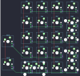

## mrt1ddl3s/knobgoblin

[layout](knobgoblin-kle.json) - [PCB](knobgoblin.kicad_pcb)

{:loading="lazy"}

[Open in keyboard-layout-editor](http://www.keyboard-layout-editor.com/##@@_x:1.25;&=0,1&=0,2&=0,3&=0,4;&@_x:1.25;&=1,1&=1,2&=1,3&=1,4%0A%0A%0A2,0;&@_x:1.25;&=2,1&=2,2&=2,3&=2,4%0A%0A%0A2,0;&@_y:-0.75;&=3,0;&@_x:1.25&y:-0.25;&=3,1&=3,2&=3,3&_c=#777777;&=3,4%0A%0A%0A1,0;&@_y:-0.25&c=#cccccc;&=4,0;&@_x:1.25&y:-0.75&c=#aaaaaa;&=4,1%0A%0A%0A0,0&_c=#cccccc;&=4,2%0A%0A%0A0,0&=4,3&_c=#777777;&=4,4%0A%0A%0A1,0;&@_x:5.5&y:-4.0&c=#cccccc&h:2;&=1,4%0A%0A%0A2,1;&@_x:5.5&y:1.0&c=#777777&h:2;&=3,4%0A%0A%0A1,1;&@_x:1.25&y:1.25&c=#cccccc&w:2;&=4,1%0A%0A%0A0,1)

{:loading="lazy"}

