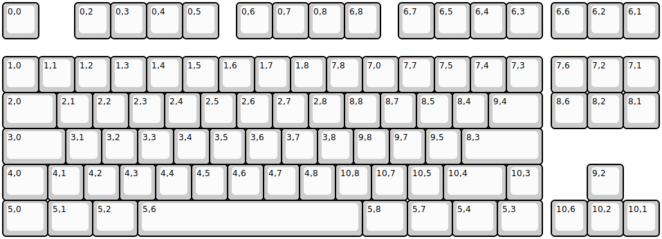
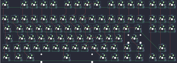

## mt/ncr80

[layout](ncr80-kle.json) - [PCB](ncr80.kicad_pcb)

{:loading="lazy"}

[Open in keyboard-layout-editor](http://www.keyboard-layout-editor.com/##@@=0,0&_x:1;&=0,2&=0,3&=0,4&=0,5&_x:0.5;&=0,6&=0,7&=0,8&=6,8&_x:0.5;&=6,7&=6,5&=6,4&=6,3&_x:0.25;&=6,6&=6,2&=6,1%0ABreak;&@_y:0.5;&=1,0%0A%60&=1,1%0A1&=1,2%0A2&=1,3%0A3&=1,4%0A4&=1,5%0A5&=1,6%0A6&=1,7%0A7&=1,8%0A8&=7,8%0A9&=7,0%0A0&=7,7%0A-&=7,5%0A=&=7,4&=7,3&_x:0.25;&=7,6&=7,2&=7,1;&@_w:1.5;&=2,0&=2,1&=2,2&=2,3&=2,4&=2,5&=2,6&=2,7&=2,8&=8,8&=8,7&=8,5%0A%5B&=8,4%0A%5D&_w:1.5;&=9,4%0A%5C&_x:0.25;&=8,6&=8,2&=8,1;&@_w:1.75;&=3,0&=3,1&=3,2&=3,3&=3,4&=3,5&=3,6&=3,7&=3,8&=9,8&=9,7%0A/;&=9,5%0A'&_w:2.25;&=8,3;&@_w:1.25;&=4,0&=4,1&=4,2&=4,3&=4,4&=4,5&=4,6&=4,7&=4,8&=10,8%0A,&=10,7%0A.&=10,5%0A//&_w:1.75;&=10,4&=10,3&_x:1.25;&=9,2;&@_w:1.25;&=5,0&_w:1.25;&=5,1&_w:1.25;&=5,2&_w:6.25;&=5,6&_w:1.25;&=5,8&_w:1.25;&=5,7&_w:1.25;&=5,4&_w:1.25;&=5,3&_x:0.25;&=10,6&=10,2&=10,1)

{:loading="lazy"}

