## mwstudio/alicekk

[layout](alicekk-kle.json) - [PCB](alicekk.kicad_pcb)

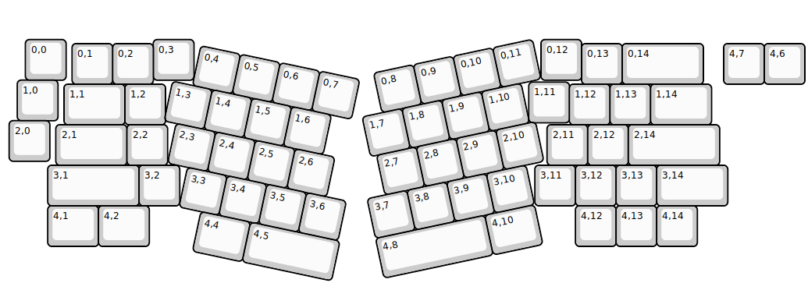{:loading="lazy"}

[Open in keyboard-layout-editor](http://www.keyboard-layout-editor.com/##@@_x:0.55&y:0.9;&=0,0&_x:2.15;&=0,3&_x:8.55;&=0,12;&@_x:14.25&y:-0.9;&=0,13&_w:2;&=0,14&_x:0.5;&=4,7&=4,6&_x:-18.05;&=0,1&=0,2;&@_x:0.35&y:-0.1;&=1,0;&@_x:12.95&y:-0.95;&=1,11;&@_x:1.5&y:-0.95&w:1.5;&=1,1&=1,2&_x:9.95;&=1,12&=1,13&_w:1.5;&=1,14;&@_x:0.15&y:-0.1;&=2,0;&@_x:1.3&y:-0.9&w:1.75;&=2,1&=2,2&_x:9.35;&=2,11&=2,12&_w:2.25;&=2,14;&@_x:1.1&w:2.25;&=3,1&=3,2&_x:8.75;&=3,11&=3,12&=3,13&_w:1.75;&=3,14;&@_x:1.1&w:1.25;&=4,1&_w:1.25;&=4,2&_x:10.5;&=4,12&=4,13&=4,14;&@_r:12&x:5&y:-6.0;&=0,4&=0,5&=0,6&=0,7;&@_x:4.5;&=1,3&=1,4&=1,5&=1,6;&@_x:4.8;&=2,3&=2,4&=2,5&=2,6;&@_x:5.3;&=3,3&=3,4&=3,5&=3,6;&@_x:5.85&w:1.25;&=4,4&_w:2.25;&=4,5;&@_r:-12&x:8.55&y:-1.4;&=0,8&=0,9&=0,10&=0,11;&@_x:8.05;&=1,7&=1,8&=1,9&=1,10;&@_x:8.2;&=2,7&=2,8&=2,9&=2,10;&@_x:7.75;&=3,7&=3,8&=3,9&=3,10;&@_x:7.75&w:2.75;&=4,8&_w:1.25;&=4,10)

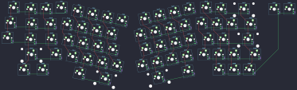{:loading="lazy"}

## mwstudio/mw65-rgb

[layout](mw65-rgb-kle.json) - [PCB](mw65-rgb.kicad_pcb)

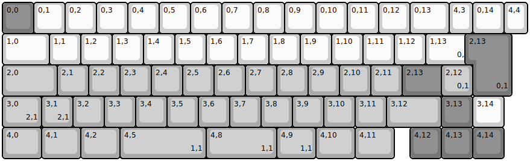{:loading="lazy"}

[Open in keyboard-layout-editor](http://www.keyboard-layout-editor.com/##@@_c=#777777;&=0,0&_c=#cccccc;&=0,1&=0,2&=0,3&=0,4&=0,5&=0,6&=0,7&=0,8&=0,9&=0,10&=0,11&=0,12&_w:1.25;&=0,13&_w:0.75;&=4,3&=0,14&_w:0.75;&=4,4;&@_w:1.5;&=1,0&=1,1&=1,2&=1,3&=1,4&=1,5&=1,6&=1,7&=1,8&=1,9&=1,10&=1,11&=1,12&_w:1.5;&=1,13%0A%0A%0A0,0&_c=#aaaaaa;&=1,14;&@_w:1.75;&=2,0&=2,1&=2,2&=2,3&=2,4&=2,5&=2,6&=2,7&=2,8&=2,9&=2,10&=2,11&_c=#777777&w:2.25;&=2,13%0A%0A%0A0,0&_c=#cccccc;&=2,14;&@_c=#aaaaaa&w:2.25;&=3,0%0A%0A%0A2,0&=3,2&=3,3&=3,4&=3,5&=3,6&=3,7&=3,8&=3,9&=3,10&=3,11&_w:1.75;&=3,12&_c=#777777;&=3,13&_c=#cccccc;&=3,14;&@_c=#aaaaaa&w:1.25;&=4,0&_w:1.25;&=4,1&_w:1.25;&=4,2&_w:6.25;&=4,6%0A%0A%0A1,0&_w:1.25;&=4,10&_w:1.25;&=4,11&_x:0.5&c=#777777;&=4,12&=4,13&=4,14;&@_x:15.0&y:-4&w:1.25&h:2&w2:1.5&h2:1&x2:-0.25;&=2,13%0A%0A%0A0,1;&@_x:14.0&c=#aaaaaa;&=2,12%0A%0A%0A0,1;&@_w:1.25;&=3,0%0A%0A%0A2,1&=3,1%0A%0A%0A2,1;&@_x:3.75&w:2.75;&=4,5%0A%0A%0A1,1&_w:2.25;&=4,8%0A%0A%0A1,1&_w:1.25;&=4,9%0A%0A%0A1,1)

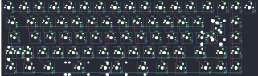{:loading="lazy"}

## mwstudio/mw65_black

[layout](mw65_black-kle.json) - [PCB](mw65_black.kicad_pcb)

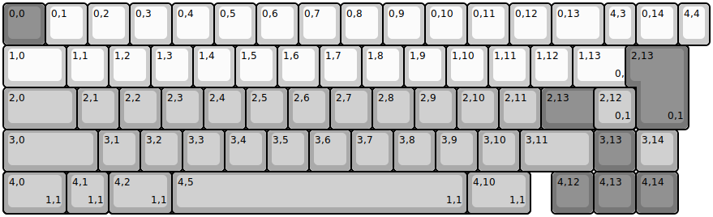{:loading="lazy"}

[Open in keyboard-layout-editor](http://www.keyboard-layout-editor.com/##@@_c=#777777;&=0,0&_c=#cccccc;&=0,1&=0,2&=0,3&=0,4&=0,5&=0,6&=0,7&=0,8&=0,9&=0,10&=0,11&=0,12&_w:1.25;&=0,13&_w:0.75;&=4,3&=0,14&_w:0.75;&=4,4;&@_w:1.5;&=1,0&=1,1&=1,2&=1,3&=1,4&=1,5&=1,6&=1,7&=1,8&=1,9&=1,10&=1,11&=1,12&_w:1.5;&=1,13%0A%0A%0A0,0&_c=#aaaaaa;&=1,14;&@_w:1.75;&=2,0&=2,1&=2,2&=2,3&=2,4&=2,5&=2,6&=2,7&=2,8&=2,9&=2,10&=2,11&_c=#777777&w:2.25;&=2,13%0A%0A%0A0,0&_c=#aaaaaa;&=2,14;&@_w:2.25;&=3,0&=3,1&=3,2&=3,3&=3,4&=3,5&=3,6&=3,7&=3,8&=3,9&=3,10&_w:1.75;&=3,11&_c=#777777;&=3,13&_c=#aaaaaa;&=3,14;&@_w:1.25;&=4,0%0A%0A%0A1,0&_w:1.25;&=4,1%0A%0A%0A1,0&_w:1.25;&=4,2%0A%0A%0A1,0&_w:6.25;&=4,5%0A%0A%0A1,0&_w:1.25;&=4,9%0A%0A%0A1,0&_w:1.25;&=4,10%0A%0A%0A1,0&_x:0.5&c=#777777;&=4,12&=4,13&=4,14;&@_x:15.0&y:-4&w:1.25&h:2&w2:1.5&h2:1&x2:-0.25;&=2,13%0A%0A%0A0,1;&@_x:14.0&c=#aaaaaa;&=2,12%0A%0A%0A0,1;&@_y:1&w:1.5;&=4,0%0A%0A%0A1,1&=4,1%0A%0A%0A1,1&_w:1.5;&=4,2%0A%0A%0A1,1&_w:7;&=4,5%0A%0A%0A1,1&_w:1.5;&=4,10%0A%0A%0A1,1)

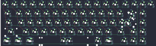{:loading="lazy"}

## mwstudio/mw660

[layout](mw660-kle.json) - [PCB](mw660.kicad_pcb)

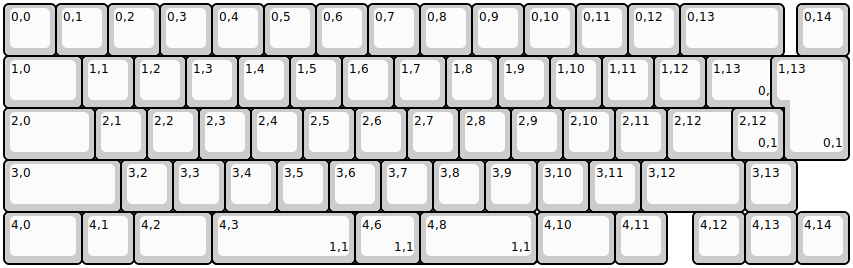{:loading="lazy"}

[Open in keyboard-layout-editor](http://www.keyboard-layout-editor.com/##@@=0,0&=0,1&=0,2&=0,3&=0,4&=0,5&=0,6&=0,7&=0,8&=0,9&=0,10&=0,11&=0,12&_w:2;&=0,13&_x:0.25;&=0,14;&@_w:1.5;&=1,0&=1,1&=1,2&=1,3&=1,4&=1,5&=1,6&=1,7&=1,8&=1,9&=1,10&=1,11&=1,12&_w:1.5;&=1,13%0A%0A%0A0,0&_x:0.25;&=1,14;&@_w:1.75;&=2,0&=2,1&=2,2&=2,3&=2,4&=2,5&=2,6&=2,7&=2,8&=2,9&=2,10&=2,11&_w:2.25;&=2,12%0A%0A%0A0,0;&@_w:2.25;&=3,0&=3,2&=3,3&=3,4&=3,5&=3,6&=3,7&=3,8&=3,9&=3,10&=3,11&_w:2;&=3,12&=3,13;&@_w:1.5;&=4,0&=4,1&_w:1.5;&=4,2&_w:6.25;&=4,6%0A%0A%0A1,0&_w:1.5;&=4,10&=4,11&_x:0.5;&=4,12&=4,13&=4,14;&@_x:15.0&y:-4&w:1.25&h:2&w2:1.5&h2:1&x2:-0.25;&=1,13%0A%0A%0A0,1;&@_x:14.0;&=2,12%0A%0A%0A0,1;&@_x:4.0&y:1&w:2.75;&=4,3%0A%0A%0A1,1&_w:1.25;&=4,6%0A%0A%0A1,1&_w:2.25;&=4,8%0A%0A%0A1,1)

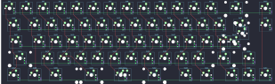{:loading="lazy"}

## mwstudio/mw75-r2

[layout](mw75-r2-kle.json) - [PCB](mw75-r2.kicad_pcb)

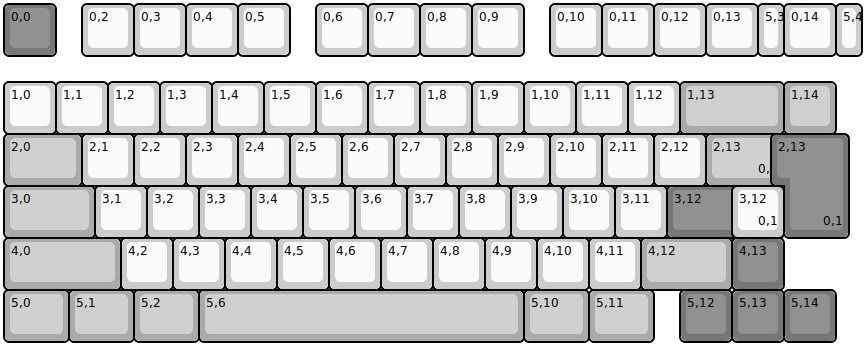{:loading="lazy"}

[Open in keyboard-layout-editor](http://www.keyboard-layout-editor.com/##@@_c=#777777;&=0,0&_x:0.5&c=#cccccc;&=0,2&=0,3&=0,4&=0,5&_x:0.5;&=0,6&=0,7&=0,8&=0,9&_x:0.5;&=0,10&=0,11&=0,12&=0,13&_w:0.5;&=5,3&=0,14&_w:0.5;&=5,4;&@_y:0.5;&=1,0&=1,1&=1,2&=1,3&=1,4&=1,5&=1,6&=1,7&=1,8&=1,9&=1,10&=1,11&=1,12&_c=#aaaaaa&w:2;&=1,13&=1,14;&@_w:1.5;&=2,0&_c=#cccccc;&=2,1&=2,2&=2,3&=2,4&=2,5&=2,6&=2,7&=2,8&=2,9&=2,10&=2,11&=2,12&_c=#aaaaaa&w:1.5;&=2,13%0A%0A%0A0,0&_c=#cccccc;&=2,14;&@_c=#aaaaaa&w:1.75;&=3,0&_c=#cccccc;&=3,1&=3,2&=3,3&=3,4&=3,5&=3,6&=3,7&=3,8&=3,9&=3,10&=3,11&_c=#777777&w:2.25;&=3,12%0A%0A%0A0,0;&@_c=#aaaaaa&w:2.25;&=4,0&_c=#cccccc;&=4,2&=4,3&=4,4&=4,5&=4,6&=4,7&=4,8&=4,9&=4,10&=4,11&_c=#aaaaaa&w:1.75;&=4,12&_c=#777777;&=4,13;&@_c=#aaaaaa&w:1.25;&=5,0&_w:1.25;&=5,1&_w:1.25;&=5,2&_w:6.25;&=5,6&_w:1.25;&=5,10&_w:1.25;&=5,11&_x:0.5&c=#777777;&=5,12&=5,13&=5,14;&@_x:15.0&y:-4.0&w:1.25&h:2&w2:1.5&h2:1&x2:-0.25;&=2,13%0A%0A%0A0,1;&@_x:14.0&c=#cccccc;&=3,12%0A%0A%0A0,1)

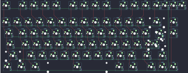{:loading="lazy"}

## mwstudio/mw80

[layout](mw80-kle.json) - [PCB](mw80.kicad_pcb)

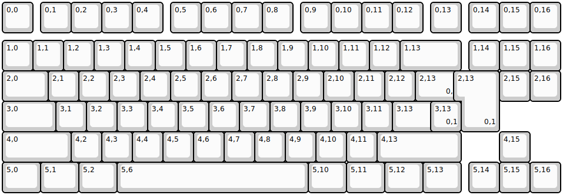{:loading="lazy"}

[Open in keyboard-layout-editor](http://www.keyboard-layout-editor.com/##@@=0,0&_x:0.25;&=0,1&=0,2&=0,3&=0,4&_x:0.25;&=0,5&=0,6&=0,7&=0,8&_x:0.25;&=0,9&=0,10&=0,11&=0,12&_x:0.25;&=0,13&_x:0.25;&=0,14&=0,15&=0,16;&@_y:0.25;&=1,0&=1,1&=1,2&=1,3&=1,4&=1,5&=1,6&=1,7&=1,8&=1,9&=1,10&=1,11&=1,12&_w:2;&=1,13&_x:0.25;&=1,14&=1,15&=1,16;&@_w:1.5;&=2,0&=2,1&=2,2&=2,3&=2,4&=2,5&=2,6&=2,7&=2,8&=2,9&=2,10&=2,11&=2,12&_w:1.5;&=2,13%0A%0A%0A0,0&_x:0.25;&=2,14&=2,15&=2,16;&@_w:1.75;&=3,0&=3,1&=3,2&=3,3&=3,4&=3,5&=3,6&=3,7&=3,8&=3,9&=3,10&=3,11&_w:2.25;&=3,13%0A%0A%0A0,0;&@_w:2.25;&=4,0&=4,2&=4,3&=4,4&=4,5&=4,6&=4,7&=4,8&=4,9&=4,10&=4,11&_w:2.75;&=4,13&_x:1.25;&=4,15;&@_w:1.25;&=5,0&_w:1.25;&=5,1&_w:1.25;&=5,2&_w:6.25;&=5,6&_w:1.25;&=5,10&_w:1.25;&=5,11&_w:1.25;&=5,12&_w:1.25;&=5,13&_x:0.25;&=5,14&=5,15&=5,16;&@_x:15.0&y:-4.0&w:1.25&h:2&w2:1.5&h2:1&x2:-0.25;&=2,13%0A%0A%0A0,1;&@_x:14.0;&=3,13%0A%0A%0A0,1)

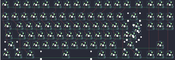{:loading="lazy"}

