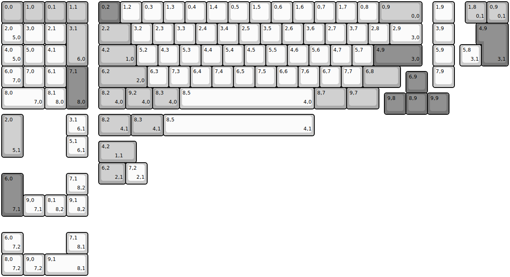
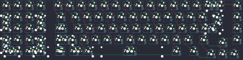

## mysticworks/wyvern

[layout](wyvern-kle.json) - [PCB](wyvern.kicad_pcb)

{:loading="lazy"}

[Open in keyboard-layout-editor](http://www.keyboard-layout-editor.com/##@@_c=#aaaaaa;&=0,0&=1,0&=0,1&=1,1&_x:0.5&c=#777777;&=0,2&_c=#cccccc;&=1,2&=0,3&=1,3&=0,4&=1,4&=0,5&=1,5&=0,6&=1,6&=0,7&=1,7&=0,8&_c=#aaaaaa&w:2;&=0,9%0A%0A%0A0,0&_x:0.5&c=#cccccc;&=1,9;&@=2,0%0A%0A%0A5,0&=3,0&=2,1&_c=#aaaaaa&h:2;&=3,1%0A%0A%0A6,0&_x:0.5&w:1.5;&=2,2&_c=#cccccc;&=3,2&=2,3&=3,3&=2,4&=3,4&=2,5&=3,5&=2,6&=3,6&=2,7&=3,7&=2,8&_w:1.5;&=2,9%0A%0A%0A3,0&_x:0.5;&=3,9;&@=4,0%0A%0A%0A5,0&=5,0&=4,1&_x:1.5&c=#aaaaaa&w:1.75;&=4,2%0A%0A%0A1,0&_c=#cccccc;&=5,2&=4,3&=5,3&=4,4&=5,4&=4,5&=5,5&=4,6&=5,6&=4,7&=5,7&_c=#777777&w:2.25;&=4,9%0A%0A%0A3,0&_x:0.5&c=#cccccc;&=5,9;&@=6,0%0A%0A%0A7,0&=7,0&=6,1&_c=#777777&h:2;&=7,1%0A%0A%0A8,0&_x:0.5&c=#aaaaaa&w:2.25;&=6,2%0A%0A%0A2,0&_c=#cccccc;&=6,3&=7,3&=6,4&=7,4&=6,5&=7,5&=6,6&=7,6&=6,7&=7,7&_c=#aaaaaa&w:1.75;&=6,8&_x:1.5&c=#cccccc;&=7,9;&@_x:18.75&y:-0.75&c=#777777;&=6,9;&@_y:-0.25&c=#cccccc&w:2;&=8,0%0A%0A%0A7,0&=8,1%0A%0A%0A8,0&_x:1.5&c=#aaaaaa&w:1.25;&=8,2%0A%0A%0A4,0&_w:1.25;&=9,2%0A%0A%0A4,0&_w:1.25;&=8,3%0A%0A%0A4,0&_c=#cccccc&w:6.25;&=8,5%0A%0A%0A4,0&_c=#aaaaaa&w:1.5;&=8,7&_w:1.5;&=9,7;&@_x:17.75&y:-0.75&c=#777777;&=9,8&=8,9&=9,9;&@_x:22.25&y:-4.25&w:1.25&h:2&w2:1.5&h2:1&x2:-0.25;&=4,9%0A%0A%0A3,1;&@_x:21.25&c=#cccccc;&=5,8%0A%0A%0A3,1;&@_y:2.25&c=#aaaaaa&h:2;&=2,0%0A%0A%0A5,1&_x:2&c=#cccccc;&=3,1%0A%0A%0A6,1&_x:0.5&c=#aaaaaa&w:1.5;&=8,2%0A%0A%0A4,1&_w:1.5;&=8,3%0A%0A%0A4,1&_c=#cccccc&w:7;&=8,5%0A%0A%0A4,1;&@_x:3;&=5,1%0A%0A%0A6,1;&@_x:4.5&y:-0.75&c=#aaaaaa&w:1.25&w2:1.75&l:true;&=4,2%0A%0A%0A1,1;&@_x:4.5&w:1.25;&=6,2%0A%0A%0A2,1&_c=#cccccc;&=7,2%0A%0A%0A2,1;&@_y:-0.5&c=#777777&h:2;&=6,0%0A%0A%0A7,1&_x:2&c=#cccccc;&=7,1%0A%0A%0A8,2;&@_x:1;&=9,0%0A%0A%0A7,1&=8,1%0A%0A%0A8,2&=9,1%0A%0A%0A8,2;&@_y:0.75;&=6,0%0A%0A%0A7,2&_x:2;&=7,1%0A%0A%0A8,1;&@=8,0%0A%0A%0A7,2&=9,0%0A%0A%0A7,2&_w:2;&=9,1%0A%0A%0A8,1;&@_rx:0.25&x:21.25&c=#aaaaaa;&=1,8%0A%0A%0A0,1&=0,9%0A%0A%0A0,1)

{:loading="lazy"}

