## nasp/G_IDB60

[layout](G_IDB60-kle.json) - [PCB](G_IDB60.kicad_pcb)

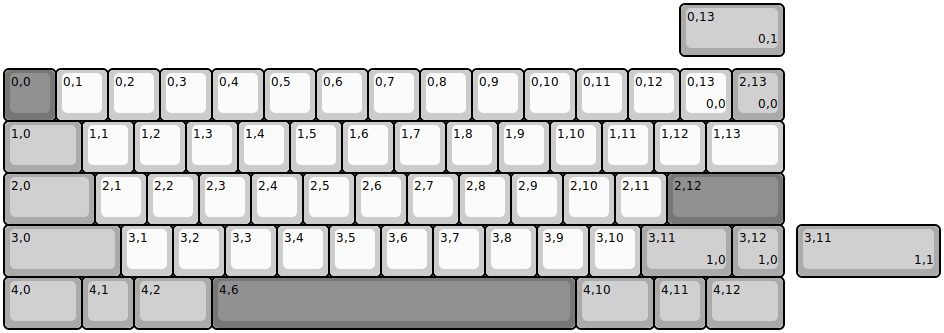{:loading="lazy"}

[Open in keyboard-layout-editor](http://www.keyboard-layout-editor.com/##@_name=G_IDB60;&@_y:1.25&c=#777777;&=0,0&_c=#cccccc;&=0,1&=0,2&=0,3&=0,4&=0,5&=0,6&=0,7&=0,8&=0,9&=0,10&=0,11&=0,12&=0,13%0A%0A%0A0,0&_c=#aaaaaa;&=2,13%0A%0A%0A0,0;&@_w:1.5;&=1,0&_c=#cccccc;&=1,1&=1,2&=1,3&=1,4&=1,5&=1,6&=1,7&=1,8&=1,9&=1,10&=1,11&=1,12&_w:1.5;&=1,13;&@_c=#aaaaaa&w:1.75;&=2,0&_c=#cccccc;&=2,1&=2,2&=2,3&=2,4&=2,5&=2,6&=2,7&=2,8&=2,9&=2,10&=2,11&_c=#777777&w:2.25;&=2,12;&@_c=#aaaaaa&w:2.25;&=3,0&_c=#cccccc;&=3,1&=3,2&=3,3&=3,4&=3,5&=3,6&=3,7&=3,8&=3,9&=3,10&_c=#aaaaaa&w:1.75;&=3,11%0A%0A%0A1,0&=3,12%0A%0A%0A1,0;&@_w:1.5;&=4,0&=4,1&_w:1.5;&=4,2&_c=#777777&w:7;&=4,6&_c=#aaaaaa&w:1.5;&=4,10&=4,11&_w:1.5;&=4,12;&@_x:13&y:-6.25&w:2;&=0,13%0A%0A%0A0,1;&@_x:15.25&y:3.25&w:2.75;&=3,11%0A%0A%0A1,1)

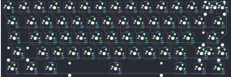{:loading="lazy"}

## nasp/candybar_ortho

[layout](candybar_ortho-kle.json) - [PCB](candybar_ortho.kicad_pcb)

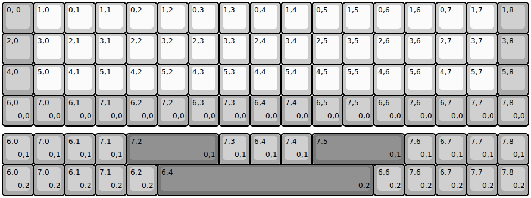{:loading="lazy"}

[Open in keyboard-layout-editor](http://www.keyboard-layout-editor.com/##@@_c=#aaaaaa;&=0,%200&_c=#cccccc;&=1,0&=0,1&=1,1&=0,2&=1,2&=0,3&=1,3&=0,4&=1,4&=0,5&=1,5&=0,6&=1,6&=0,7&=1,7&_c=#aaaaaa;&=1,8;&@=2,0&_c=#cccccc;&=3,0&=2,1&=3,1&=2,2&=3,2&=2,3&=3,3&=2,4&=3,4&=2,5&=3,5&=2,6&=3,6&=2,7&=3,7&_c=#aaaaaa;&=3,8;&@=4,0&_c=#cccccc;&=5,0&=4,1&=5,1&=4,2&=5,2&=4,3&=5,3&=4,4&=5,4&=4,5&=5,5&=4,6&=5,6&=4,7&=5,7&_c=#aaaaaa;&=5,8;&@=6,0%0A%0A%0A0,0&=7,0%0A%0A%0A0,0&=6,1%0A%0A%0A0,0&=7,1%0A%0A%0A0,0&=6,2%0A%0A%0A0,0&=7,2%0A%0A%0A0,0&=6,3%0A%0A%0A0,0&=7,3%0A%0A%0A0,0&=6,4%0A%0A%0A0,0&=7,4%0A%0A%0A0,0&=6,5%0A%0A%0A0,0&=7,5%0A%0A%0A0,0&=6,6%0A%0A%0A0,0&=7,6%0A%0A%0A0,0&=6,7%0A%0A%0A0,0&=7,7%0A%0A%0A0,0&=7,8%0A%0A%0A0,0;&@_y:0.25;&=6,0%0A%0A%0A0,1&=7,0%0A%0A%0A0,1&=6,1%0A%0A%0A0,1&=7,1%0A%0A%0A0,1&_c=#777777&w:3;&=7,2%0A%0A%0A0,1&_c=#aaaaaa;&=7,3%0A%0A%0A0,1&=6,4%0A%0A%0A0,1&=7,4%0A%0A%0A0,1&_c=#777777&w:3;&=7,5%0A%0A%0A0,1&_c=#aaaaaa;&=7,6%0A%0A%0A0,1&=6,7%0A%0A%0A0,1&=7,7%0A%0A%0A0,1&=7,8%0A%0A%0A0,1;&@=6,0%0A%0A%0A0,2&=7,0%0A%0A%0A0,2&=6,1%0A%0A%0A0,2&=7,1%0A%0A%0A0,2&=6,2%0A%0A%0A0,2&_c=#777777&w:7;&=6,4%0A%0A%0A0,2&_c=#aaaaaa;&=6,6%0A%0A%0A0,2&=7,6%0A%0A%0A0,2&=6,7%0A%0A%0A0,2&=7,7%0A%0A%0A0,2&=7,8%0A%0A%0A0,2)

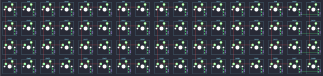{:loading="lazy"}

## nasp/nop60

[layout](nop60-kle.json) - [PCB](nop60.kicad_pcb)

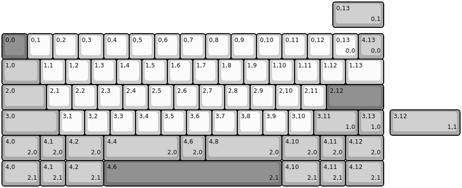{:loading="lazy"}

[Open in keyboard-layout-editor](http://www.keyboard-layout-editor.com/##@_name=NOP60;&@_y:1.25&c=#777777;&=0,0&_c=#cccccc;&=0,1&=0,2&=0,3&=0,4&=0,5&=0,6&=0,7&=0,8&=0,9&=0,10&=0,11&=0,12&=0,13%0A%0A%0A0,0&_c=#aaaaaa;&=4,13%0A%0A%0A0,0;&@_w:1.5;&=1,0&_c=#cccccc;&=1,1&=1,2&=1,3&=1,4&=1,5&=1,6&=1,7&=1,8&=1,9&=1,10&=1,11&=1,12&_w:1.5;&=1,13;&@_c=#aaaaaa&w:1.75;&=2,0&_c=#cccccc;&=2,1&=2,2&=2,3&=2,4&=2,5&=2,6&=2,7&=2,8&=2,9&=2,10&=2,11&_c=#777777&w:2.25;&=2,12;&@_c=#aaaaaa&w:2.25;&=3,0&_c=#cccccc;&=3,1&=3,2&=3,3&=3,4&=3,5&=3,6&=3,7&=3,8&=3,9&=3,10&_c=#aaaaaa&w:1.75;&=3,11%0A%0A%0A1,0&=3,13%0A%0A%0A1,0;&@_w:1.5;&=4,0%0A%0A%0A2,0&=4,1%0A%0A%0A2,0&_w:1.5;&=4,2%0A%0A%0A2,0&_w:3;&=4,4%0A%0A%0A2,0&=4,6%0A%0A%0A2,0&_w:3;&=4,8%0A%0A%0A2,0&_w:1.5;&=4,10%0A%0A%0A2,0&=4,11%0A%0A%0A2,0&_w:1.5;&=4,12%0A%0A%0A2,0;&@_x:13&y:-6.25&w:2;&=0,13%0A%0A%0A0,1;&@_x:15.25&y:3.25&w:2.75;&=3,12%0A%0A%0A1,1;&@_y:1.0&w:1.5;&=4,0%0A%0A%0A2,1&=4,1%0A%0A%0A2,1&_w:1.5;&=4,2%0A%0A%0A2,1&_c=#777777&w:7;&=4,6%0A%0A%0A2,1&_c=#aaaaaa&w:1.5;&=4,10%0A%0A%0A2,1&=4,11%0A%0A%0A2,1&_w:1.5;&=4,12%0A%0A%0A2,1)

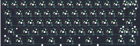{:loading="lazy"}

## nasp/phoenix45-ortho

[layout](phoenix45-ortho-kle.json) - [PCB](phoenix45-ortho.kicad_pcb)

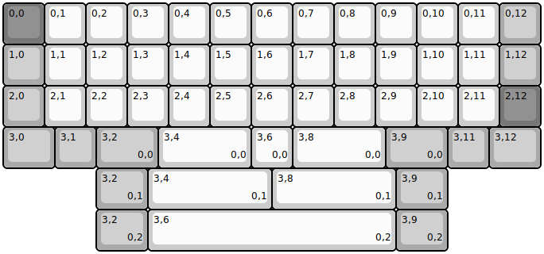{:loading="lazy"}

[Open in keyboard-layout-editor](http://www.keyboard-layout-editor.com/##@@_c=#777777;&=0,0&_c=#cccccc;&=0,1&=0,2&=0,3&=0,4&=0,5&=0,6&=0,7&=0,8&=0,9&=0,10&=0,11&_c=#aaaaaa;&=0,12;&@=1,0&_c=#cccccc;&=1,1&=1,2&=1,3&=1,4&=1,5&=1,6&=1,7&=1,8&=1,9&=1,10&=1,11&_c=#aaaaaa;&=1,12;&@=2,0&_c=#cccccc;&=2,1&=2,2&=2,3&=2,4&=2,5&=2,6&=2,7&=2,8&=2,9&=2,10&=2,11&_c=#777777;&=2,12;&@_c=#aaaaaa&w:1.25;&=3,0&=3,1&_w:1.5;&=3,2%0A%0A%0A0,0&_c=#cccccc&w:2.25;&=3,4%0A%0A%0A0,0&=3,6%0A%0A%0A0,0&_w:2.25;&=3,8%0A%0A%0A0,0&_c=#aaaaaa&w:1.5;&=3,9%0A%0A%0A0,0&=3,11&_w:1.25;&=3,12;&@_x:2.25&w:1.25;&=3,2%0A%0A%0A0,1&_c=#cccccc&w:3;&=3,4%0A%0A%0A0,1&_w:3;&=3,8%0A%0A%0A0,1&_c=#aaaaaa&w:1.25;&=3,9%0A%0A%0A0,1;&@_x:2.25&w:1.25;&=3,2%0A%0A%0A0,2&_c=#cccccc&w:6;&=3,6%0A%0A%0A0,2&_c=#aaaaaa&w:1.25;&=3,9%0A%0A%0A0,2)

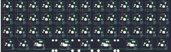{:loading="lazy"}

## nasp/plexus75

[layout](plexus75-kle.json) - [PCB](plexus75.kicad_pcb)

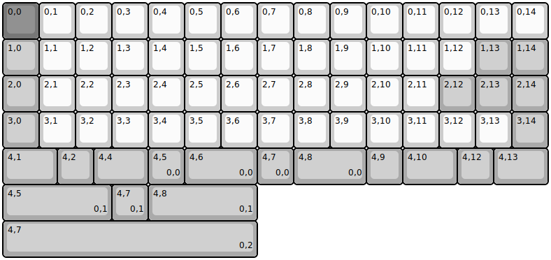{:loading="lazy"}

[Open in keyboard-layout-editor](http://www.keyboard-layout-editor.com/##@@_c=#777777;&=0,0&_c=#cccccc;&=0,1&=0,2&=0,3&=0,4&=0,5&=0,6&=0,7&=0,8&=0,9&=0,10&=0,11&=0,12&=0,13&=0,14;&@_c=#aaaaaa;&=1,0&_c=#cccccc;&=1,1&=1,2&=1,3&=1,4&=1,5&=1,6&=1,7&=1,8&=1,9&=1,10&=1,11&=1,12&_c=#aaaaaa;&=1,13&=1,14;&@=2,0&_c=#cccccc;&=2,1&=2,2&=2,3&=2,4&=2,5&=2,6&=2,7&=2,8&=2,9&=2,10&=2,11&_c=#aaaaaa;&=2,12&=2,13&=2,14;&@=3,0&_c=#cccccc;&=3,1&=3,2&=3,3&=3,4&=3,5&=3,6&=3,7&=3,8&=3,9&=3,10&=3,11&=3,12&=3,13&_c=#aaaaaa;&=3,14;&@_w:1.5;&=4,1&=4,2&_w:1.5;&=4,4&=4,5%0A%0A%0A0,0&_w:2;&=4,6%0A%0A%0A0,0&=4,7%0A%0A%0A0,0&_w:2;&=4,8%0A%0A%0A0,0&=4,9&_w:1.5;&=4,10&=4,12&_w:1.5;&=4,13;&@_w:3;&=4,5%0A%0A%0A0,1&=4,7%0A%0A%0A0,1&_w:3;&=4,8%0A%0A%0A0,1;&@_w:7;&=4,7%0A%0A%0A0,2)

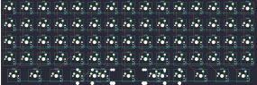{:loading="lazy"}

## nasp/plexus75_he

[layout](plexus75_he-kle.json) - [PCB](plexus75_he.kicad_pcb)

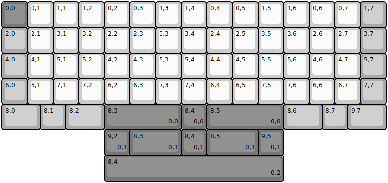{:loading="lazy"}

[Open in keyboard-layout-editor](http://www.keyboard-layout-editor.com/##@@_c=#777777;&=0,0&_c=#cccccc;&=0,1&=1,1&=1,2&=0,2&=0,3&=1,3&=1,4&=0,4&=0,5&=1,5&=1,6&=0,6&=0,7&_c=#aaaaaa;&=1,7;&@=2,0&_c=#cccccc;&=2,1&=3,1&=3,2&=2,2&=2,3&=3,3&=3,4&=2,4&=2,5&=3,5&=3,6&=2,6&=2,7&_c=#aaaaaa;&=3,7;&@=4,0&_c=#cccccc;&=4,1&=5,1&=5,2&=4,2&=4,3&=5,3&=5,4&=4,4&=4,5&=5,5&=5,6&=4,6&=4,7&_c=#aaaaaa;&=5,7;&@=6,0&_c=#cccccc;&=6,1&=7,1&=7,2&=6,2&=6,3&=7,3&=7,4&=6,4&=6,5&=7,5&=7,6&=6,6&=6,7&_c=#aaaaaa;&=7,7;&@_w:1.5;&=8,0&=8,1&_w:1.5;&=8,2&_c=#777777&w:3;&=8,3%0A%0A%0A0,0&=8,4%0A%0A%0A0,0&_w:3;&=8,5%0A%0A%0A0,0&_c=#aaaaaa&w:1.5;&=8,6&=8,7&_w:1.5;&=9,7;&@_x:4&c=#777777;&=9,2%0A%0A%0A0,1&_w:2;&=8,3%0A%0A%0A0,1&=8,4%0A%0A%0A0,1&_w:2;&=8,5%0A%0A%0A0,1&=9,5%0A%0A%0A0,1;&@_x:4&w:7;&=8,4%0A%0A%0A0,2)

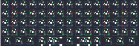{:loading="lazy"}

## nasp/pursuit40

[layout](pursuit40-kle.json) - [PCB](pursuit40.kicad_pcb)

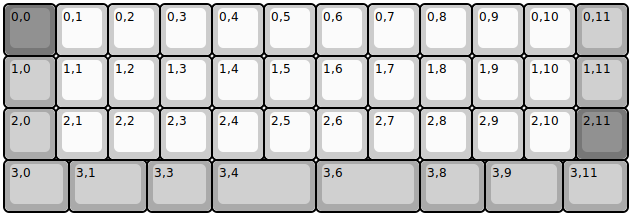{:loading="lazy"}

[Open in keyboard-layout-editor](http://www.keyboard-layout-editor.com/##@@_c=#777777;&=0,0&_c=#cccccc;&=0,1&=0,2&=0,3&=0,4&=0,5&=0,6&=0,7&=0,8&=0,9&=0,10&_c=#aaaaaa;&=0,11;&@=1,0&_c=#cccccc;&=1,1&=1,2&=1,3&=1,4&=1,5&=1,6&=1,7&=1,8&=1,9&=1,10&_c=#aaaaaa;&=1,11;&@=2,0&_c=#cccccc;&=2,1&=2,2&=2,3&=2,4&=2,5&=2,6&=2,7&=2,8&=2,9&=2,10&_c=#777777;&=2,11;&@_c=#aaaaaa&w:1.25;&=3,0&_w:1.5;&=3,1&_w:1.25;&=3,3&_w:2;&=3,4&_w:2;&=3,6&_w:1.25;&=3,8&_w:1.5;&=3,9&_w:1.25;&=3,11)

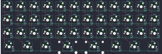{:loading="lazy"}

## nasp/quark

[layout](quark-kle.json) - [PCB](quark.kicad_pcb)

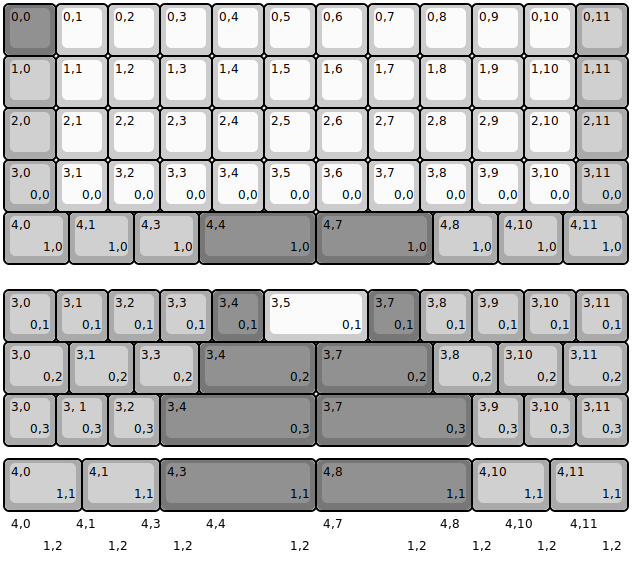{:loading="lazy"}

[Open in keyboard-layout-editor](http://www.keyboard-layout-editor.com/##@@_c=#777777;&=0,0&_c=#cccccc;&=0,1&=0,2&=0,3&=0,4&=0,5&=0,6&=0,7&=0,8&=0,9&=0,10&_c=#aaaaaa;&=0,11;&@=1,0&_c=#cccccc;&=1,1&=1,2&=1,3&=1,4&=1,5&=1,6&=1,7&=1,8&=1,9&=1,10&_c=#aaaaaa;&=1,11;&@=2,0&_c=#cccccc;&=2,1&=2,2&=2,3&=2,4&=2,5&=2,6&=2,7&=2,8&=2,9&=2,10&_c=#aaaaaa;&=2,11;&@=3,0%0A%0A%0A0,0&_c=#cccccc;&=3,1%0A%0A%0A0,0&=3,2%0A%0A%0A0,0&=3,3%0A%0A%0A0,0&=3,4%0A%0A%0A0,0&=3,5%0A%0A%0A0,0&=3,6%0A%0A%0A0,0&=3,7%0A%0A%0A0,0&=3,8%0A%0A%0A0,0&=3,9%0A%0A%0A0,0&=3,10%0A%0A%0A0,0&_c=#aaaaaa;&=3,11%0A%0A%0A0,0;&@_w:1.25;&=4,0%0A%0A%0A1,0&_w:1.25;&=4,1%0A%0A%0A1,0&_w:1.25;&=4,3%0A%0A%0A1,0&_c=#777777&w:2.25;&=4,4%0A%0A%0A1,0&_w:2.25;&=4,7%0A%0A%0A1,0&_c=#aaaaaa&w:1.25;&=4,8%0A%0A%0A1,0&_w:1.25;&=4,10%0A%0A%0A1,0&_w:1.25;&=4,11%0A%0A%0A1,0;&@_y:0.5;&=3,0%0A%0A%0A0,1&=3,1%0A%0A%0A0,1&=3,2%0A%0A%0A0,1&=3,3%0A%0A%0A0,1&_c=#777777;&=3,4%0A%0A%0A0,1&_c=#cccccc&w:2;&=3,5%0A%0A%0A0,1&_c=#777777;&=3,7%0A%0A%0A0,1&_c=#aaaaaa;&=3,8%0A%0A%0A0,1&=3,9%0A%0A%0A0,1&=3,10%0A%0A%0A0,1&=3,11%0A%0A%0A0,1;&@_w:1.25;&=3,0%0A%0A%0A0,2&_w:1.25;&=3,1%0A%0A%0A0,2&_w:1.25;&=3,3%0A%0A%0A0,2&_c=#777777&w:2.25;&=3,4%0A%0A%0A0,2&_w:2.25;&=3,7%0A%0A%0A0,2&_c=#aaaaaa&w:1.25;&=3,8%0A%0A%0A0,2&_w:1.25;&=3,10%0A%0A%0A0,2&_w:1.25;&=3,11%0A%0A%0A0,2;&@=3,0%0A%0A%0A0,3&=3,%201%0A%0A%0A0,3&=3,2%0A%0A%0A0,3&_c=#777777&w:3;&=3,4%0A%0A%0A0,3&_w:3;&=3,7%0A%0A%0A0,3&_c=#aaaaaa;&=3,9%0A%0A%0A0,3&=3,10%0A%0A%0A0,3&=3,11%0A%0A%0A0,3;&@_y:0.25&w:1.5;&=4,0%0A%0A%0A1,1&_w:1.5;&=4,1%0A%0A%0A1,1&_c=#777777&w:3;&=4,3%0A%0A%0A1,1&_w:3;&=4,8%0A%0A%0A1,1&_c=#aaaaaa&w:1.5;&=4,10%0A%0A%0A1,1&_w:1.5;&=4,11%0A%0A%0A1,1;&@_w:1.25&d:true;&=4,0%0A%0A%0A1,2&_w:1.25&d:true;&=4,1%0A%0A%0A1,2&_w:1.25&d:true;&=4,3%0A%0A%0A1,2&_c=#777777&w:2.25&d:true;&=4,4%0A%0A%0A1,2&_w:2.25&d:true;&=4,7%0A%0A%0A1,2&_c=#aaaaaa&w:1.25&d:true;&=4,8%0A%0A%0A1,2&_w:1.25&d:true;&=4,10%0A%0A%0A1,2&_w:1.25&d:true;&=4,11%0A%0A%0A1,2)

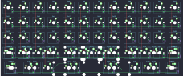{:loading="lazy"}

## nasp/quark_lp

[layout](quark_lp-kle.json) - [PCB](quark_lp.kicad_pcb)

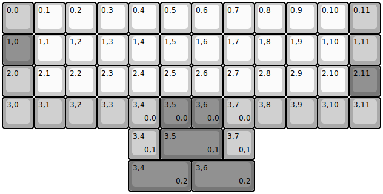{:loading="lazy"}

[Open in keyboard-layout-editor](http://www.keyboard-layout-editor.com/##@@_c=#aaaaaa;&=0,0&_c=#cccccc;&=0,1&=0,2&=0,3&=0,4&=0,5&=0,6&=0,7&=0,8&=0,9&=0,10&_c=#aaaaaa;&=0,11;&@_c=#777777;&=1,0&_c=#cccccc;&=1,1&=1,2&=1,3&=1,4&=1,5&=1,6&=1,7&=1,8&=1,9&=1,10&_c=#aaaaaa;&=1,11;&@=2,0&_c=#cccccc;&=2,1&=2,2&=2,3&=2,4&=2,5&=2,6&=2,7&=2,8&=2,9&=2,10&_c=#777777;&=2,11;&@_c=#aaaaaa;&=3,0&=3,1&=3,2&=3,3&=3,4%0A%0A%0A0,0&_c=#777777;&=3,5%0A%0A%0A0,0&=3,6%0A%0A%0A0,0&_c=#aaaaaa;&=3,7%0A%0A%0A0,0&=3,8&=3,9&=3,10&=3,11;&@_x:4;&=3,4%0A%0A%0A0,1&_c=#777777&w:2;&=3,5%0A%0A%0A0,1&_c=#aaaaaa;&=3,7%0A%0A%0A0,1;&@_x:4&c=#777777&w:2;&=3,4%0A%0A%0A0,2&_w:2;&=3,6%0A%0A%0A0,2)

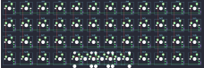{:loading="lazy"}

## nasp/quark_plus

[layout](quark_plus-kle.json) - [PCB](quark_plus.kicad_pcb)

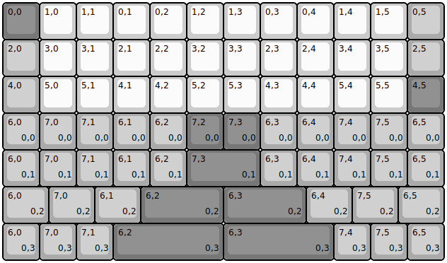{:loading="lazy"}

[Open in keyboard-layout-editor](http://www.keyboard-layout-editor.com/##@@_c=#777777;&=0,0&_c=#cccccc;&=1,0&=1,1&=0,1&=0,2&=1,2&=1,3&=0,3&=0,4&=1,4&=1,5&_c=#aaaaaa;&=0,5;&@=2,0&_c=#cccccc;&=3,0&=3,1&=2,1&=2,2&=3,2&=3,3&=2,3&=2,4&=3,4&=3,5&_c=#aaaaaa;&=2,5;&@_l:true;&=4,0&_c=#cccccc;&=5,0&=5,1&=4,1&=4,2&=5,2&=5,3&=4,3&=4,4&=5,4&=5,5&_c=#777777;&=4,5;&@_c=#aaaaaa;&=6,0%0A%0A%0A0,0&=7,0%0A%0A%0A0,0&=7,1%0A%0A%0A0,0&=6,1%0A%0A%0A0,0&=6,2%0A%0A%0A0,0&_c=#777777;&=7,2%0A%0A%0A0,0&=7,3%0A%0A%0A0,0&_c=#aaaaaa;&=6,3%0A%0A%0A0,0&=6,4%0A%0A%0A0,0&=7,4%0A%0A%0A0,0&=7,5%0A%0A%0A0,0&=6,5%0A%0A%0A0,0;&@=6,0%0A%0A%0A0,1&=7,0%0A%0A%0A0,1&=7,1%0A%0A%0A0,1&=6,1%0A%0A%0A0,1&=6,2%0A%0A%0A0,1&_c=#777777&w:2;&=7,3%0A%0A%0A0,1&_c=#aaaaaa;&=6,3%0A%0A%0A0,1&=6,4%0A%0A%0A0,1&=7,4%0A%0A%0A0,1&=7,5%0A%0A%0A0,1&=6,5%0A%0A%0A0,1;&@_w:1.25;&=6,0%0A%0A%0A0,2&_w:1.25;&=7,0%0A%0A%0A0,2&_w:1.25;&=6,1%0A%0A%0A0,2&_c=#777777&w:2.25;&=6,2%0A%0A%0A0,2&_w:2.25;&=6,3%0A%0A%0A0,2&_c=#aaaaaa&w:1.25;&=6,4%0A%0A%0A0,2&_w:1.25;&=7,5%0A%0A%0A0,2&_w:1.25;&=6,5%0A%0A%0A0,2;&@=6,0%0A%0A%0A0,3&=7,0%0A%0A%0A0,3&=7,1%0A%0A%0A0,3&_c=#777777&w:3;&=6,2%0A%0A%0A0,3&_w:3;&=6,3%0A%0A%0A0,3&_c=#aaaaaa;&=7,4%0A%0A%0A0,3&=7,5%0A%0A%0A0,3&=6,5%0A%0A%0A0,3)

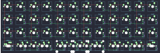{:loading="lazy"}

## nasp/quark_squared

[layout](quark_squared-kle.json) - [PCB](quark_squared.kicad_pcb)

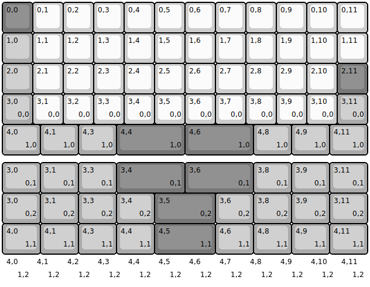{:loading="lazy"}

[Open in keyboard-layout-editor](http://www.keyboard-layout-editor.com/##@@_c=#777777;&=0,0&_c=#cccccc;&=0,1&=0,2&=0,3&=0,4&=0,5&=0,6&=0,7&=0,8&=0,9&=0,10&=0,11;&@_c=#aaaaaa;&=1,0&_c=#cccccc;&=1,1&=1,2&=1,3&=1,4&=1,5&=1,6&=1,7&=1,8&=1,9&=1,10&=1,11;&@_c=#aaaaaa;&=2,0&_c=#cccccc;&=2,1&=2,2&=2,3&=2,4&=2,5&=2,6&=2,7&=2,8&=2,9&=2,10&_c=#777777;&=2,11;&@_c=#aaaaaa;&=3,0%0A%0A%0A0,0&_c=#cccccc;&=3,1%0A%0A%0A0,0&=3,2%0A%0A%0A0,0&=3,3%0A%0A%0A0,0&=3,4%0A%0A%0A0,0&=3,5%0A%0A%0A0,0&=3,6%0A%0A%0A0,0&=3,7%0A%0A%0A0,0&=3,8%0A%0A%0A0,0&=3,9%0A%0A%0A0,0&=3,10%0A%0A%0A0,0&_c=#aaaaaa;&=3,11%0A%0A%0A0,0;&@_w:1.25;&=4,0%0A%0A%0A1,0&_w:1.25;&=4,1%0A%0A%0A1,0&_w:1.25;&=4,3%0A%0A%0A1,0&_c=#777777&w:2.25;&=4,4%0A%0A%0A1,0&_w:2.25;&=4,6%0A%0A%0A1,0&_c=#aaaaaa&w:1.25;&=4,8%0A%0A%0A1,0&_w:1.25;&=4,9%0A%0A%0A1,0&_w:1.25;&=4,11%0A%0A%0A1,0;&@_y:0.25&w:1.25;&=3,0%0A%0A%0A0,1&_w:1.25;&=3,1%0A%0A%0A0,1&_w:1.25;&=3,3%0A%0A%0A0,1&_c=#777777&w:2.25;&=3,4%0A%0A%0A0,1&_w:2.25;&=3,6%0A%0A%0A0,1&_c=#aaaaaa&w:1.25;&=3,8%0A%0A%0A0,1&_w:1.25;&=3,9%0A%0A%0A0,1&_w:1.25;&=3,11%0A%0A%0A0,1;&@_w:1.25;&=3,0%0A%0A%0A0,2&_w:1.25;&=3,1%0A%0A%0A0,2&_w:1.25;&=3,3%0A%0A%0A0,2&_w:1.25;&=3,4%0A%0A%0A0,2&_c=#777777&w:2;&=3,5%0A%0A%0A0,2&_c=#aaaaaa&w:1.25;&=3,6%0A%0A%0A0,2&_w:1.25;&=3,8%0A%0A%0A0,2&_w:1.25;&=3,9%0A%0A%0A0,2&_w:1.25;&=3,11%0A%0A%0A0,2;&@_w:1.25;&=4,0%0A%0A%0A1,1&_w:1.25;&=4,1%0A%0A%0A1,1&_w:1.25;&=4,3%0A%0A%0A1,1&_w:1.25;&=4,4%0A%0A%0A1,1&_c=#777777&w:2;&=4,5%0A%0A%0A1,1&_c=#aaaaaa&w:1.25;&=4,6%0A%0A%0A1,1&_w:1.25;&=4,8%0A%0A%0A1,1&_w:1.25;&=4,9%0A%0A%0A1,1&_w:1.25;&=4,11%0A%0A%0A1,1;&@_d:true;&=4,0%0A%0A%0A1,2&_c=#cccccc&d:true;&=4,1%0A%0A%0A1,2&_d:true;&=4,2%0A%0A%0A1,2&_d:true;&=4,3%0A%0A%0A1,2&_d:true;&=4,4%0A%0A%0A1,2&_d:true;&=4,5%0A%0A%0A1,2&_d:true;&=4,6%0A%0A%0A1,2&_d:true;&=4,7%0A%0A%0A1,2&_d:true;&=4,8%0A%0A%0A1,2&_d:true;&=4,9%0A%0A%0A1,2&_d:true;&=4,10%0A%0A%0A1,2&_c=#aaaaaa&d:true;&=4,11%0A%0A%0A1,2)

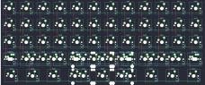{:loading="lazy"}

## nasp/snop60

[layout](snop60-kle.json) - [PCB](snop60.kicad_pcb)

{:loading="lazy"}

[Open in keyboard-layout-editor](http://www.keyboard-layout-editor.com/##@_name=SNOP60;&@_y:1.25&c=#777777;&=0,0&_c=#cccccc;&=0,1&=0,2&=0,3&=0,4&=0,5&=0,6&=0,7&=0,8&=0,9&=0,10&=0,11&=0,12&=0,13%0A%0A%0A0,0&_c=#aaaaaa;&=4,13%0A%0A%0A0,0;&@_w:1.5;&=1,0&_c=#cccccc;&=1,1&=1,2&=1,3&=1,4&=1,5&=1,6&=1,7&=1,8&=1,9&=1,10&=1,11&=1,12&_w:1.5;&=1,13;&@_c=#aaaaaa&w:1.75;&=2,0&_c=#cccccc;&=2,1&=2,2&=2,3&=2,4&=2,5&=2,6&=2,7&=2,8&=2,9&=2,10&=2,11&_c=#777777&w:2.25;&=2,12;&@_c=#aaaaaa&w:2.25;&=3,0&_c=#cccccc;&=3,1&=3,2&=3,3&=3,4&=3,5&=3,6&=3,7&=3,8&=3,9&=3,10&_c=#aaaaaa&w:1.75;&=3,11%0A%0A%0A1,0&=3,13%0A%0A%0A1,0;&@_w:1.5;&=4,0%0A%0A%0A2,0&=4,1%0A%0A%0A2,0&_w:1.5;&=4,2%0A%0A%0A2,0&_w:3;&=4,4%0A%0A%0A2,0&=4,6%0A%0A%0A2,0&_w:3;&=4,8%0A%0A%0A2,0&_w:1.5;&=4,10%0A%0A%0A2,0&=4,11%0A%0A%0A2,0&_w:1.5;&=4,12%0A%0A%0A2,0;&@_x:13&y:-6.25&w:2;&=0,13%0A%0A%0A0,1;&@_x:15.25&y:3.25&w:2.75;&=3,11%0A%0A%0A1,1;&@_y:1.0&w:1.5;&=4,0%0A%0A%0A2,1&=4,1%0A%0A%0A2,1&_w:1.5;&=4,2%0A%0A%0A2,1&_c=#777777&w:7;&=4,6%0A%0A%0A2,1&_c=#aaaaaa&w:1.5;&=4,10%0A%0A%0A2,1&=4,11%0A%0A%0A2,1&_w:1.5;&=4,12%0A%0A%0A2,1)

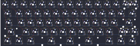{:loading="lazy"}

## nasp/ud40_ortho_alt

[layout](ud40_ortho_alt-kle.json) - [PCB](ud40_ortho_alt.kicad_pcb)

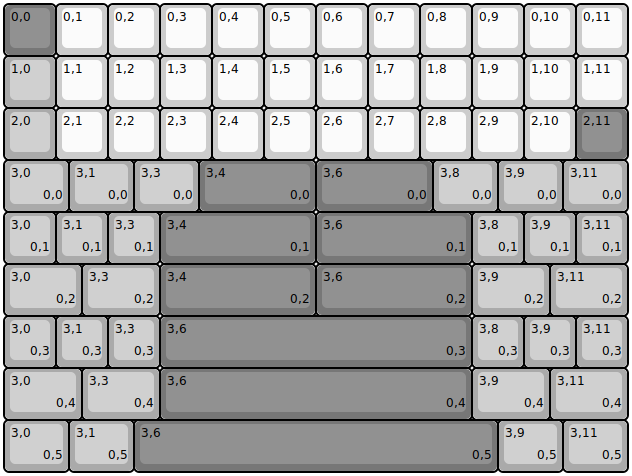{:loading="lazy"}

[Open in keyboard-layout-editor](http://www.keyboard-layout-editor.com/##@@_c=#777777;&=0,0&_c=#cccccc;&=0,1&=0,2&=0,3&=0,4&=0,5&=0,6&=0,7&=0,8&=0,9&=0,10&=0,11;&@_c=#aaaaaa;&=1,0&_c=#cccccc;&=1,1&=1,2&=1,3&=1,4&=1,5&=1,6&=1,7&=1,8&=1,9&=1,10&=1,11;&@_c=#aaaaaa;&=2,0&_c=#cccccc;&=2,1&=2,2&=2,3&=2,4&=2,5&=2,6&=2,7&=2,8&=2,9&=2,10&_c=#777777;&=2,11;&@_c=#aaaaaa&w:1.25;&=3,0%0A%0A%0A0,0&_w:1.25;&=3,1%0A%0A%0A0,0&_w:1.25;&=3,3%0A%0A%0A0,0&_c=#777777&w:2.25;&=3,4%0A%0A%0A0,0&_w:2.25;&=3,6%0A%0A%0A0,0&_c=#aaaaaa&w:1.25;&=3,8%0A%0A%0A0,0&_w:1.25;&=3,9%0A%0A%0A0,0&_w:1.25;&=3,11%0A%0A%0A0,0;&@=3,0%0A%0A%0A0,1&=3,1%0A%0A%0A0,1&=3,3%0A%0A%0A0,1&_c=#777777&w:3;&=3,4%0A%0A%0A0,1&_w:3;&=3,6%0A%0A%0A0,1&_c=#aaaaaa;&=3,8%0A%0A%0A0,1&=3,9%0A%0A%0A0,1&=3,11%0A%0A%0A0,1;&@_w:1.5;&=3,0%0A%0A%0A0,2&_w:1.5;&=3,3%0A%0A%0A0,2&_c=#777777&w:3;&=3,4%0A%0A%0A0,2&_w:3;&=3,6%0A%0A%0A0,2&_c=#aaaaaa&w:1.5;&=3,9%0A%0A%0A0,2&_w:1.5;&=3,11%0A%0A%0A0,2;&@=3,0%0A%0A%0A0,3&=3,1%0A%0A%0A0,3&=3,3%0A%0A%0A0,3&_c=#777777&w:6;&=3,6%0A%0A%0A0,3&_c=#aaaaaa;&=3,8%0A%0A%0A0,3&=3,9%0A%0A%0A0,3&=3,11%0A%0A%0A0,3;&@_w:1.5;&=3,0%0A%0A%0A0,4&_w:1.5;&=3,3%0A%0A%0A0,4&_c=#777777&w:6;&=3,6%0A%0A%0A0,4&_c=#aaaaaa&w:1.5;&=3,9%0A%0A%0A0,4&_w:1.5;&=3,11%0A%0A%0A0,4;&@_w:1.25;&=3,0%0A%0A%0A0,5&_w:1.25;&=3,1%0A%0A%0A0,5&_c=#777777&w:7;&=3,6%0A%0A%0A0,5&_c=#aaaaaa&w:1.25;&=3,9%0A%0A%0A0,5&_w:1.25;&=3,11%0A%0A%0A0,5)

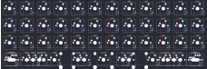{:loading="lazy"}

