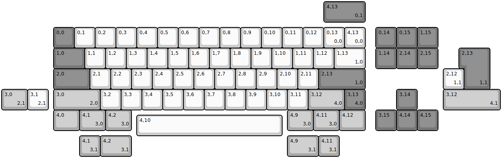
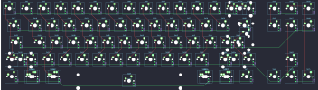
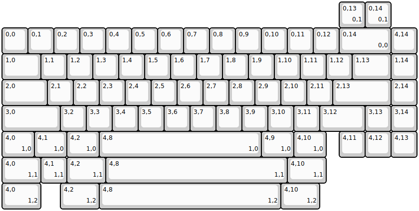
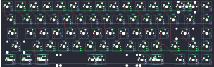

## neson_design/700e

[layout](700e-kle.json) - [PCB](700e.kicad_pcb)

{:loading="lazy"}

[Open in keyboard-layout-editor](http://www.keyboard-layout-editor.com/##@@_x:2.5&y:1.25&c=#777777;&=0,0&_c=#cccccc;&=0,1&=0,2&=0,3&=0,4&=0,5&=0,6&=0,7&=0,8&=0,9&=0,10&=0,11&=0,12&=0,13%0A%0A%0A0,0&=4,13%0A%0A%0A0,0&_x:0.5&c=#777777;&=0,14&=0,15&=1,15;&@_x:2.5&w:1.5;&=1,0&_c=#cccccc;&=1,1&=1,2&=1,3&=1,4&=1,5&=1,6&=1,7&=1,8&=1,9&=1,10&=1,11&=1,12&_w:1.5;&=1,13%0A%0A%0A1,0&_x:0.5&c=#777777;&=1,14&=2,14&=2,15;&@_x:2.5&w:1.75;&=2,0&_c=#cccccc;&=2,1&=2,2&=2,3&=2,4&=2,5&=2,6&=2,7&=2,8&=2,9&=2,10&=2,11&_c=#777777&w:2.25;&=2,13%0A%0A%0A1,0;&@_x:2.5&c=#aaaaaa&w:2.25;&=3,0%0A%0A%0A2,0&_c=#cccccc;&=3,2&=3,3&=3,4&=3,5&=3,6&=3,7&=3,8&=3,9&=3,10&=3,11&_c=#aaaaaa&w:1.75;&=3,12%0A%0A%0A4,0&_c=#777777;&=3,13%0A%0A%0A4,0&_x:1.5;&=3,14;&@_x:2.5&c=#aaaaaa&w:1.25;&=4,0&_w:1.25;&=4,1%0A%0A%0A3,0&_w:1.25;&=4,2%0A%0A%0A3,0&_x:7.5&w:1.25;&=4,9%0A%0A%0A3,0&_w:1.25;&=4,11%0A%0A%0A3,0&_w:1.25;&=4,12&_x:0.5&c=#777777;&=3,15&=4,14&=4,15;&@_x:6.5&y:-0.75&c=#cccccc&w:7;&=4,10;&@_x:15.5&y:-6.5&c=#777777&w:2;&=4,13%0A%0A%0A0,1;&@_x:22.25&y:1.25&w:1.25&h:2&w2:1.5&h2:1&x2:-0.25;&=2,13%0A%0A%0A1,1;&@_x:21.25&c=#cccccc;&=2,12%0A%0A%0A1,1;&@_c=#aaaaaa&w:1.25;&=3,0%0A%0A%0A2,1&_c=#cccccc;&=3,1%0A%0A%0A2,1&_x:19.0&c=#aaaaaa&w:2.75;&=3,12%0A%0A%0A4,1;&@_x:3.75&y:1.25;&=4,1%0A%0A%0A3,1&_w:1.5;&=4,2%0A%0A%0A3,1&_x:7.5&w:1.5;&=4,9%0A%0A%0A3,1&=4,11%0A%0A%0A3,1)

{:loading="lazy"}

## neson_design/n6

[layout](n6-kle.json) - [PCB](n6.kicad_pcb)

{:loading="lazy"}

[Open in keyboard-layout-editor](http://www.keyboard-layout-editor.com/##@@_y:1;&=0,0&=0,1&=0,2&=0,3&=0,4&=0,5&=0,6&=0,7&=0,8&=0,9&=0,10&=0,11&=0,12&_w:2;&=0,14%0A%0A%0A0,0&=4,14;&@_w:1.5;&=1,0&=1,1&=1,2&=1,3&=1,4&=1,5&=1,6&=1,7&=1,8&=1,9&=1,10&=1,11&=1,12&_w:1.5;&=1,13&=1,14;&@_w:1.75;&=2,0&=2,1&=2,2&=2,3&=2,4&=2,5&=2,6&=2,7&=2,8&=2,9&=2,10&=2,11&_w:2.25;&=2,13&=2,14;&@_w:2.25;&=3,0&=3,2&=3,3&=3,4&=3,5&=3,6&=3,7&=3,8&=3,9&=3,10&=3,11&_w:1.75;&=3,12&=3,13&=3,14;&@_w:1.25;&=4,0%0A%0A%0A1,0&_w:1.25;&=4,1%0A%0A%0A1,0&_w:1.25;&=4,2%0A%0A%0A1,0&_w:6.25;&=4,8%0A%0A%0A1,0&_w:1.25;&=4,9%0A%0A%0A1,0&_w:1.25;&=4,10%0A%0A%0A1,0&_x:0.5;&=4,11&=4,12&=4,13;&@_x:13&y:-6;&=0,13%0A%0A%0A0,1&=0,14%0A%0A%0A0,1;&@_y:5&w:1.5;&=4,0%0A%0A%0A1,1&=4,1%0A%0A%0A1,1&_w:1.5;&=4,2%0A%0A%0A1,1&_w:7;&=4,8%0A%0A%0A1,1&_w:1.5;&=4,10%0A%0A%0A1,1;&@_w:1.5;&=4,0%0A%0A%0A1,2&_x:0.75&w:1.5;&=4,2%0A%0A%0A1,2&_w:7;&=4,8%0A%0A%0A1,2&_w:1.5;&=4,10%0A%0A%0A1,2)

{:loading="lazy"}

