## nightly_boards/conde60

[layout](conde60-kle.json) - [PCB](conde60.kicad_pcb)

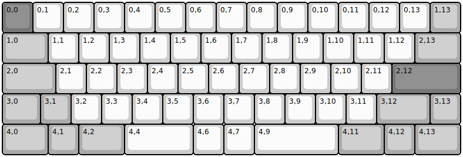{:loading="lazy"}

[Open in keyboard-layout-editor](http://www.keyboard-layout-editor.com/##@@_c=#777777;&=0,0&_c=#cccccc;&=0,1&=0,2&=0,3&=0,4&=0,5&=0,6&=0,7&=0,8&=0,9&=0,10&=0,11&=0,12&=0,13&_c=#aaaaaa;&=1,13;&@_w:1.5;&=1,0&_c=#cccccc;&=1,1&=1,2&=1,3&=1,4&=1,5&=1,6&=1,7&=1,8&=1,9&=1,10&=1,11&=1,12&_c=#aaaaaa&w:1.5;&=2,13;&@_w:1.75;&=2,0&_c=#cccccc;&=2,1&=2,2&=2,3&=2,4&=2,5&=2,6&=2,7&=2,8&=2,9&=2,10&=2,11&_c=#777777&w:2.25;&=2,12;&@_c=#aaaaaa&w:1.25;&=3,0&=3,1&_c=#cccccc;&=3,2&=3,3&=3,4&=3,5&=3,6&=3,7&=3,8&=3,9&=3,10&=3,11&_c=#aaaaaa&w:1.75;&=3,12&=3,13;&@_w:1.5;&=4,0&=4,1&_w:1.5;&=4,2&_c=#cccccc&w:2.25;&=4,4&=4,6&=4,7&_w:2.75;&=4,9&_c=#aaaaaa&w:1.5;&=4,11&=4,12&_w:1.5;&=4,13)

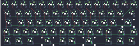{:loading="lazy"}

## nightly_boards/daily60

[layout](daily60-kle.json) - [PCB](daily60.kicad_pcb)

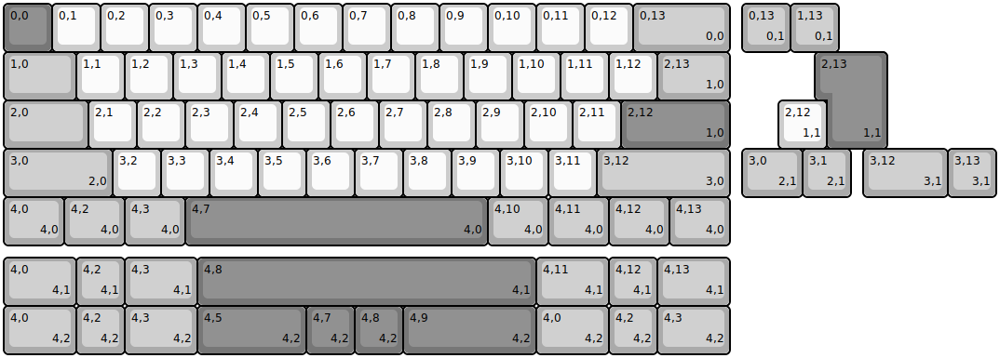{:loading="lazy"}

[Open in keyboard-layout-editor](http://www.keyboard-layout-editor.com/##@@_c=#777777;&=0,0&_c=#cccccc;&=0,1&=0,2&=0,3&=0,4&=0,5&=0,6&=0,7&=0,8&=0,9&=0,10&=0,11&=0,12&_c=#aaaaaa&w:2;&=0,13%0A%0A%0A0,0;&@_w:1.5;&=1,0&_c=#cccccc;&=1,1&=1,2&=1,3&=1,4&=1,5&=1,6&=1,7&=1,8&=1,9&=1,10&=1,11&=1,12&_c=#aaaaaa&w:1.5;&=2,13%0A%0A%0A1,0;&@_w:1.75;&=2,0&_c=#cccccc;&=2,1&=2,2&=2,3&=2,4&=2,5&=2,6&=2,7&=2,8&=2,9&=2,10&=2,11&_c=#777777&w:2.25;&=2,12%0A%0A%0A1,0;&@_c=#aaaaaa&w:2.25;&=3,0%0A%0A%0A2,0&_c=#cccccc;&=3,2&=3,3&=3,4&=3,5&=3,6&=3,7&=3,8&=3,9&=3,10&=3,11&_c=#aaaaaa&w:2.75;&=3,12%0A%0A%0A3,0;&@_w:1.25;&=4,0%0A%0A%0A4,0&_w:1.25;&=4,2%0A%0A%0A4,0&_w:1.25;&=4,3%0A%0A%0A4,0&_c=#777777&w:6.25;&=4,7%0A%0A%0A4,0&_c=#aaaaaa&w:1.25;&=4,10%0A%0A%0A4,0&_w:1.25;&=4,11%0A%0A%0A4,0&_w:1.25;&=4,12%0A%0A%0A4,0&_w:1.25;&=4,13%0A%0A%0A4,0;&@_x:15.25&y:-5;&=0,13%0A%0A%0A0,1&=1,13%0A%0A%0A0,1;&@_x:17.0&c=#777777&w:1.25&h:2&w2:1.5&h2:1&x2:-0.25;&=2,13%0A%0A%0A1,1;&@_x:16.0&c=#cccccc;&=2,12%0A%0A%0A1,1;&@_x:15.25&c=#aaaaaa&w:1.25;&=3,0%0A%0A%0A2,1&=3,1%0A%0A%0A2,1&_x:0.25&w:1.75;&=3,12%0A%0A%0A3,1&=3,13%0A%0A%0A3,1;&@_y:1.25&w:1.5;&=4,0%0A%0A%0A4,1&=4,2%0A%0A%0A4,1&_w:1.5;&=4,3%0A%0A%0A4,1&_c=#777777&w:7;&=4,8%0A%0A%0A4,1&_c=#aaaaaa&w:1.5;&=4,11%0A%0A%0A4,1&=4,12%0A%0A%0A4,1&_w:1.5;&=4,13%0A%0A%0A4,1;&@_w:1.5;&=4,0%0A%0A%0A4,2&=4,2%0A%0A%0A4,2&_w:1.5;&=4,3%0A%0A%0A4,2&_c=#777777&w:2.25;&=4,5%0A%0A%0A4,2&=4,7%0A%0A%0A4,2&=4,8%0A%0A%0A4,2&_w:2.75;&=4,9%0A%0A%0A4,2&_c=#aaaaaa&w:1.5;&=4,0%0A%0A%0A4,2&=4,2%0A%0A%0A4,2&_w:1.5;&=4,3%0A%0A%0A4,2)

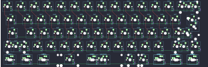{:loading="lazy"}

## nightly_boards/n2

[layout](n2-kle.json) - [PCB](n2.kicad_pcb)

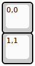{:loading="lazy"}

[Open in keyboard-layout-editor](http://www.keyboard-layout-editor.com/##@@=0,0;&@=1,1)

{:loading="lazy"}

## nightly_boards/n40o

[layout](n40o-kle.json) - [PCB](n40o.kicad_pcb)

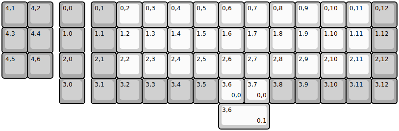{:loading="lazy"}

[Open in keyboard-layout-editor](http://www.keyboard-layout-editor.com/##@@_c=#aaaaaa;&=4,1&=4,2&_x:0.25;&=0,0&_x:0.25;&=0,1&_c=#cccccc;&=0,2&=0,3&=0,4&=0,5&=0,6&=0,7&=0,8&=0,9&=0,10&=0,11&_c=#aaaaaa;&=0,12;&@=4,3&=4,4&_x:0.25;&=1,0&_x:0.25;&=1,1&_c=#cccccc;&=1,2&=1,3&=1,4&=1,5&=1,6&=1,7&=1,8&=1,9&=1,10&=1,11&_c=#aaaaaa;&=1,12;&@=4,5&=4,6&_x:0.25;&=2,0&_x:0.25;&=2,1&_c=#cccccc;&=2,2&=2,3&=2,4&=2,5&=2,6&=2,7&=2,8&=2,9&=2,10&=2,11&_c=#aaaaaa;&=2,12;&@_x:2.25;&=3,0&_x:0.25;&=3,1&=3,2&=3,3&=3,4&=3,5&_c=#cccccc;&=3,6%0A%0A%0A0,0&=3,7%0A%0A%0A0,0&_c=#aaaaaa;&=3,8&=3,9&=3,10&=3,11&=3,12;&@_x:8.5&c=#cccccc&w:2;&=3,6%0A%0A%0A0,1)

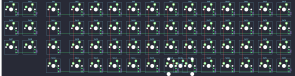{:loading="lazy"}

## nightly_boards/n60s

[layout](n60s-kle.json) - [PCB](n60s.kicad_pcb)

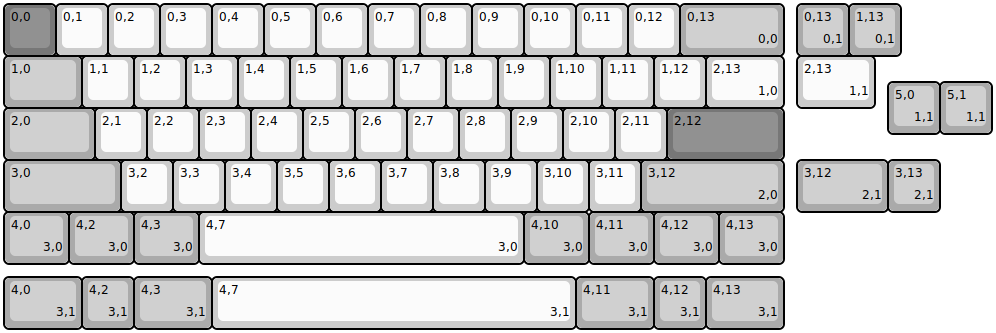{:loading="lazy"}

[Open in keyboard-layout-editor](http://www.keyboard-layout-editor.com/##@@_c=#777777;&=0,0&_c=#cccccc;&=0,1&=0,2&=0,3&=0,4&=0,5&=0,6&=0,7&=0,8&=0,9&=0,10&=0,11&=0,12&_c=#aaaaaa&w:2;&=0,13%0A%0A%0A0,0;&@_w:1.5;&=1,0&_c=#cccccc;&=1,1&=1,2&=1,3&=1,4&=1,5&=1,6&=1,7&=1,8&=1,9&=1,10&=1,11&=1,12&_w:1.5;&=2,13%0A%0A%0A1,0;&@_c=#aaaaaa&w:1.75;&=2,0&_c=#cccccc;&=2,1&=2,2&=2,3&=2,4&=2,5&=2,6&=2,7&=2,8&=2,9&=2,10&=2,11&_c=#777777&w:2.25;&=2,12;&@_c=#aaaaaa&w:2.25;&=3,0&_c=#cccccc;&=3,2&=3,3&=3,4&=3,5&=3,6&=3,7&=3,8&=3,9&=3,10&=3,11&_c=#aaaaaa&w:2.75;&=3,12%0A%0A%0A2,0;&@_w:1.25;&=4,0%0A%0A%0A3,0&_w:1.25;&=4,2%0A%0A%0A3,0&_w:1.25;&=4,3%0A%0A%0A3,0&_c=#cccccc&w:6.25;&=4,7%0A%0A%0A3,0&_c=#aaaaaa&w:1.25;&=4,10%0A%0A%0A3,0&_w:1.25;&=4,11%0A%0A%0A3,0&_w:1.25;&=4,12%0A%0A%0A3,0&_w:1.25;&=4,13%0A%0A%0A3,0;&@_x:15.25&y:-5.0;&=0,13%0A%0A%0A0,1&=1,13%0A%0A%0A0,1;&@_x:15.25&c=#cccccc&w:1.5;&=2,13%0A%0A%0A1,1;&@_x:17&y:-0.5&c=#aaaaaa;&=5,0%0A%0A%0A1,1&=5,1%0A%0A%0A1,1;&@_x:15.25&y:0.5&w:1.75;&=3,12%0A%0A%0A2,1&=3,13%0A%0A%0A2,1;&@_y:1.25&w:1.5;&=4,0%0A%0A%0A3,1&=4,2%0A%0A%0A3,1&_w:1.5;&=4,3%0A%0A%0A3,1&_c=#cccccc&w:7;&=4,7%0A%0A%0A3,1&_c=#aaaaaa&w:1.5;&=4,11%0A%0A%0A3,1&=4,12%0A%0A%0A3,1&_w:1.5;&=4,13%0A%0A%0A3,1)

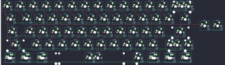{:loading="lazy"}

## nightly_boards/n87

[layout](n87-kle.json) - [PCB](n87.kicad_pcb)

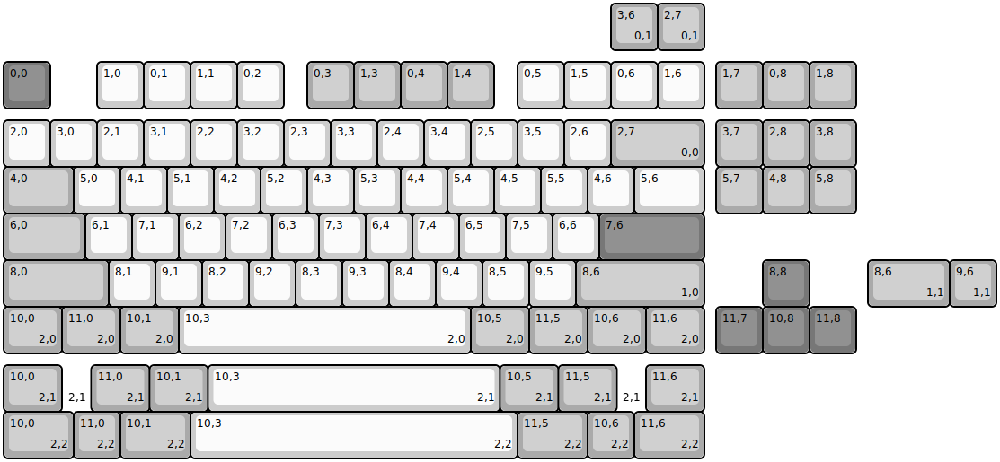{:loading="lazy"}

[Open in keyboard-layout-editor](http://www.keyboard-layout-editor.com/##@@_y:1.25&c=#777777;&=0,0&_x:1&c=#cccccc;&=1,0&=0,1&=1,1&=0,2&_x:0.5&c=#aaaaaa;&=0,3&=1,3&=0,4&=1,4&_x:0.5&c=#cccccc;&=0,5&=1,5&=0,6&=1,6&_x:0.25&c=#aaaaaa;&=1,7&=0,8&=1,8;&@_y:0.25&c=#cccccc;&=2,0&=3,0&=2,1&=3,1&=2,2&=3,2&=2,3&=3,3&=2,4&=3,4&=2,5&=3,5&=2,6&_c=#aaaaaa&w:2;&=2,7%0A%0A%0A0,0&_x:0.25;&=3,7&=2,8&=3,8;&@_w:1.5;&=4,0&_c=#cccccc;&=5,0&=4,1&=5,1&=4,2&=5,2&=4,3&=5,3&=4,4&=5,4&=4,5&=5,5&=4,6&_w:1.5;&=5,6&_x:0.25&c=#aaaaaa;&=5,7&=4,8&=5,8;&@_w:1.75;&=6,0&_c=#cccccc;&=6,1&=7,1&=6,2&=7,2&=6,3&=7,3&=6,4&=7,4&=6,5&=7,5&=6,6&_c=#777777&w:2.25;&=7,6;&@_c=#aaaaaa&w:2.25;&=8,0&_c=#cccccc;&=8,1&=9,1&=8,2&=9,2&=8,3&=9,3&=8,4&=9,4&=8,5&=9,5&_c=#aaaaaa&w:2.75;&=8,6%0A%0A%0A1,0&_x:1.25&c=#777777;&=8,8;&@_c=#aaaaaa&w:1.25;&=10,0%0A%0A%0A2,0&_w:1.25;&=11,0%0A%0A%0A2,0&_w:1.25;&=10,1%0A%0A%0A2,0&_c=#cccccc&w:6.25;&=10,3%0A%0A%0A2,0&_c=#aaaaaa&w:1.25;&=10,5%0A%0A%0A2,0&_w:1.25;&=11,5%0A%0A%0A2,0&_w:1.25;&=10,6%0A%0A%0A2,0&_w:1.25;&=11,6%0A%0A%0A2,0&_x:0.25&c=#777777;&=11,7&=10,8&=11,8;&@_x:13&y:-7.5&c=#aaaaaa;&=3,6%0A%0A%0A0,1&=2,7%0A%0A%0A0,1;&@_x:18.5&y:4.5&w:1.75;&=8,6%0A%0A%0A1,1&=9,6%0A%0A%0A1,1;&@_y:1.25&w:1.25;&=10,0%0A%0A%0A2,1&_w:0.625&d:true;&=%0A%0A%0A2,1&_w:1.25;&=11,0%0A%0A%0A2,1&_w:1.25;&=10,1%0A%0A%0A2,1&_c=#cccccc&w:6.25;&=10,3%0A%0A%0A2,1&_c=#aaaaaa&w:1.25;&=10,5%0A%0A%0A2,1&_w:1.25;&=11,5%0A%0A%0A2,1&_w:0.625&d:true;&=%0A%0A%0A2,1&_w:1.25;&=11,6%0A%0A%0A2,1;&@_w:1.5;&=10,0%0A%0A%0A2,2&=11,0%0A%0A%0A2,2&_w:1.5;&=10,1%0A%0A%0A2,2&_c=#cccccc&w:7;&=10,3%0A%0A%0A2,2&_c=#aaaaaa&w:1.5;&=11,5%0A%0A%0A2,2&=10,6%0A%0A%0A2,2&_w:1.5;&=11,6%0A%0A%0A2,2)

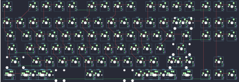{:loading="lazy"}

## nightly_boards/octopad

[layout](octopad-kle.json) - [PCB](octopad.kicad_pcb)

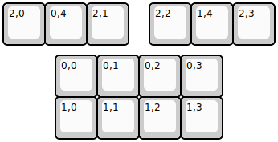{:loading="lazy"}

[Open in keyboard-layout-editor](http://www.keyboard-layout-editor.com/##@@=2,0&=0,4&=2,1&_x:0.5;&=2,2&=1,4&=2,3;&@_x:1.25&y:0.25;&=0,0&=0,1&=0,2&=0,3;&@_x:1.25;&=1,0&=1,1&=1,2&=1,3)

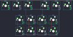{:loading="lazy"}

## nightly_boards/octopadplus

[layout](octopadplus-kle.json) - [PCB](octopadplus.kicad_pcb)

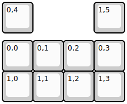{:loading="lazy"}

[Open in keyboard-layout-editor](http://www.keyboard-layout-editor.com/##@@=0,4%0A%0A%0A%0A%0A%0A%0A%0A%0AE0&_x:2;&=1,5%0A%0A%0A%0A%0A%0A%0A%0A%0AE1;&@_y:0.25;&=0,0&=0,1&=0,2&=0,3;&@=1,0&=1,1&=1,2&=1,3)

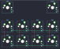{:loading="lazy"}

## nightly_boards/paraluman

[layout](paraluman-kle.json) - [PCB](paraluman.kicad_pcb)

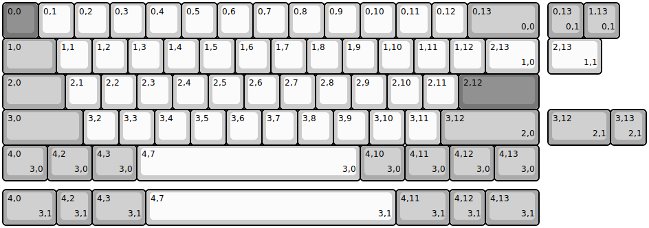{:loading="lazy"}

[Open in keyboard-layout-editor](http://www.keyboard-layout-editor.com/##@@_c=#777777;&=0,0&_c=#cccccc;&=0,1&=0,2&=0,3&=0,4&=0,5&=0,6&=0,7&=0,8&=0,9&=0,10&=0,11&=0,12&_c=#aaaaaa&w:2;&=0,13%0A%0A%0A0,0;&@_w:1.5;&=1,0&_c=#cccccc;&=1,1&=1,2&=1,3&=1,4&=1,5&=1,6&=1,7&=1,8&=1,9&=1,10&=1,11&=1,12&_w:1.5;&=2,13%0A%0A%0A1,0;&@_c=#aaaaaa&w:1.75;&=2,0&_c=#cccccc;&=2,1&=2,2&=2,3&=2,4&=2,5&=2,6&=2,7&=2,8&=2,9&=2,10&=2,11&_c=#777777&w:2.25;&=2,12;&@_c=#aaaaaa&w:2.25;&=3,0&_c=#cccccc;&=3,2&=3,3&=3,4&=3,5&=3,6&=3,7&=3,8&=3,9&=3,10&=3,11&_c=#aaaaaa&w:2.75;&=3,12%0A%0A%0A2,0;&@_w:1.25;&=4,0%0A%0A%0A3,0&_w:1.25;&=4,2%0A%0A%0A3,0&_w:1.25;&=4,3%0A%0A%0A3,0&_c=#cccccc&w:6.25;&=4,7%0A%0A%0A3,0&_c=#aaaaaa&w:1.25;&=4,10%0A%0A%0A3,0&_w:1.25;&=4,11%0A%0A%0A3,0&_w:1.25;&=4,12%0A%0A%0A3,0&_w:1.25;&=4,13%0A%0A%0A3,0;&@_x:15.25&y:-5;&=0,13%0A%0A%0A0,1&=1,13%0A%0A%0A0,1;&@_x:15.25&c=#cccccc&w:1.5;&=2,13%0A%0A%0A1,1;&@_x:15.25&y:1&c=#aaaaaa&w:1.75;&=3,12%0A%0A%0A2,1&=3,13%0A%0A%0A2,1;&@_y:1.25&w:1.5;&=4,0%0A%0A%0A3,1&=4,2%0A%0A%0A3,1&_w:1.5;&=4,3%0A%0A%0A3,1&_c=#cccccc&w:7;&=4,7%0A%0A%0A3,1&_c=#aaaaaa&w:1.5;&=4,11%0A%0A%0A3,1&=4,12%0A%0A%0A3,1&_w:1.5;&=4,13%0A%0A%0A3,1)

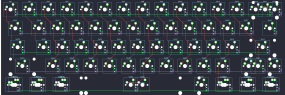{:loading="lazy"}

