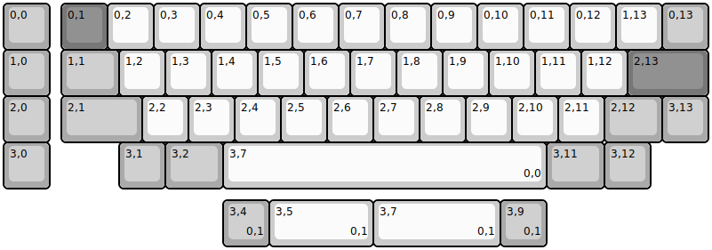
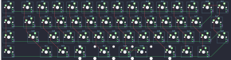

## nightmare/nightmare

[layout](nightmare-kle.json) - [PCB](nightmare.kicad_pcb)

{:loading="lazy"}

[Open in keyboard-layout-editor](http://www.keyboard-layout-editor.com/##@@_c=#aaaaaa;&=0,0&_x:0.25&c=#777777;&=0,1&_c=#cccccc;&=0,2&=0,3&=0,4&=0,5&=0,6&=0,7&=0,8&=0,9&=0,10&=0,11&=0,12&=1,13&_c=#aaaaaa;&=0,13;&@=1,0&_x:0.25&w:1.25;&=1,1&_c=#cccccc;&=1,2&=1,3&=1,4&=1,5&=1,6&=1,7&=1,8&=1,9&=1,10&=1,11&=1,12&_c=#777777&w:1.75;&=2,13;&@_c=#aaaaaa;&=2,0&_x:0.25&w:1.75;&=2,1&_c=#cccccc;&=2,2&=2,3&=2,4&=2,5&=2,6&=2,7&=2,8&=2,9&=2,10&=2,11&_c=#aaaaaa&w:1.25;&=2,12&=3,13;&@=3,0&_x:1.5;&=3,1&_w:1.25;&=3,2&_c=#cccccc&w:7;&=3,7%0A%0A%0A0,0&_c=#aaaaaa&w:1.25;&=3,11&=3,12;&@_x:4.75&y:0.25;&=3,4%0A%0A%0A0,1&_c=#cccccc&w:2.25;&=3,5%0A%0A%0A0,1&_w:2.75;&=3,7%0A%0A%0A0,1&_c=#aaaaaa;&=3,9%0A%0A%0A0,1)

{:loading="lazy"}

