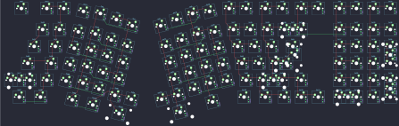

## nopunin10did/jabberwocky/v1/jabberwocky

[layout](jabberwocky-kle.json) - [PCB](jabberwocky.kicad_pcb)

{:loading="lazy"}

[Open in keyboard-layout-editor](http://www.keyboard-layout-editor.com/##@@_x:0.75&y:0.25&c=#777777;&=7,0&_x:0.5&c=#cccccc;&=1,1&=0,1&_x:8.75;&=0,6&=1,6&_x:0.13&c=#aaaaaa;&=0,7&=1,7&_x:0.12;&=0,0&=1,0&_x:0.25;&=0,8&=1,8&=0,9&=1,9;&@_x:2&y:0.25&c=#cccccc;&=4,0&=2,1&_x:9.25;&=2,6&=3,6&=2,7&_c=#aaaaaa&w:2;&=2,0%0A%0A%0A0,0&_x:1.25;&=2,8&=3,8&=2,9&=3,9;&@_x:1.25&w:1.5;&=6,0&_c=#cccccc;&=4,1&_x:9.75;&=4,6&=5,6&=4,7&_w:1.5;&=5,7%0A%0A%0A1,0&_x:1.5;&=4,8&=5,8&=4,9&_c=#aaaaaa&h:2;&=7,9%0A%0A%0A5,0;&@_x:0.75&w:1.75;&=7,1&_c=#cccccc;&=6,1&_x:10.25;&=6,6&=7,6&_c=#777777&w:2.25;&=7,7%0A%0A%0A1,0&_x:1.5&c=#cccccc;&=6,8&=7,8&=6,9;&@_c=#aaaaaa&w:2.25;&=8,0%0A%0A%0A2,0&_c=#cccccc;&=8,1&_x:10.75;&=8,6&_c=#aaaaaa&w:2.25;&=8,7%0A%0A%0A3,0&_c=#777777;&=9,7&_x:1.25&c=#cccccc;&=8,8&=9,8&=8,9&_c=#777777&h:2;&=11,9%0A%0A%0A6,0;&@_x:0.5&c=#aaaaaa&w:1.25;&=10,0&_w:1.25;&=10,1&_x:10.75&w:1.25;&=11,5&_w:1.25;&=10,6&_c=#777777;&=11,6&=10,7&=11,7&_x:0.25&c=#cccccc&w:2;&=10,8%0A%0A%0A4,0&=10,9;&@_r:14&rx:4&ry:2.5&x:1&y:-2.37;&=0,2;&@_y:-0.88;&=1,2&_x:1&c=#aaaaaa;&=1,3;&@_x:3&y:-0.87;&=0,3;&@_x:1&c=#cccccc;&=2,2;&@_y:-0.88;&=3,1&_x:1;&=3,2;&@_x:3&y:-0.87;&=2,3;&@_x:1&y:-0.25;&=4,2;&@_y:-0.88;&=5,1&_x:1;&=5,2;&@_x:3&y:-0.87;&=4,3;&@_x:1&y:-0.25;&=6,2;&@_y:-0.88;&=7,2&_x:1;&=7,3;&@_x:3&y:-0.87;&=6,3;&@_x:1&y:-0.25;&=8,2;&@_y:-0.88;&=9,1&_x:1;&=9,2;&@_x:3&y:-0.87;&=8,3&=9,3;&@_x:0.5&y:-0.13&c=#aaaaaa&w:1.25;&=10,2&_c=#cccccc&w:1.25;&=10,3;&@_x:3&y:-0.87&w:2;&=11,3;&@_r:-14&rx:13.25&x:-2.0&y:-2.37;&=0,5;&@_x:-3.0&y:-0.88&c=#aaaaaa;&=1,4&_x:1.0&c=#cccccc;&=1,5;&@_x:-4.0&y:-0.87&c=#aaaaaa;&=0,4;&@_x:-2.0&c=#cccccc;&=2,5;&@_x:-3.0&y:-0.88;&=3,4&_x:1.0;&=3,5;&@_x:-4.0&y:-0.87;&=2,4;&@_x:-2.0&y:-0.25;&=4,5;&@_x:-3.0&y:-0.88;&=5,4&_x:1.0;&=5,5;&@_x:-4.0&y:-0.87;&=4,4;&@_x:-2.0&y:-0.25;&=6,5;&@_x:-3.0&y:-0.88;&=7,4&_x:1.0;&=7,5;&@_x:-4.0&y:-0.87;&=6,4;&@_x:-2.0&y:-0.25;&=8,5;&@_x:-3.0&y:-0.88;&=9,4&_x:1.0;&=9,5;&@_x:-5.0&y:-0.87;&=10,4&=8,4;&@_x:-2.25&y:-0.13&c=#aaaaaa&w:1.25;&=10,5;&@_x:-5.0&y:-0.87&c=#cccccc&w:2.75;&=11,4;&@_r:0&rx:0&ry:0&x:24.0&y:1.5;&=3,7%0A%0A%0A0,1&=2,0%0A%0A%0A0,1;&@_x:24.75&c=#777777&w:1.25&h:2&w2:1.5&h2:1&x2:-0.25;&=7,7%0A%0A%0A1,1&_x:0.25&c=#aaaaaa;&=5,9%0A%0A%0A5,1;&@_x:23.75&c=#cccccc;&=6,7%0A%0A%0A1,1&_x:1.5&c=#aaaaaa;&=7,9%0A%0A%0A5,1;&@_x:26.25;&=9,9%0A%0A%0A6,1;&@_x:26.25&c=#777777;&=11,9%0A%0A%0A6,1;&@_y:0.25&c=#aaaaaa&w:1.25;&=8,0%0A%0A%0A2,1&=9,0%0A%0A%0A2,1&_x:12.75;&=9,6%0A%0A%0A3,1&_w:1.25;&=8,7%0A%0A%0A3,1&_x:2.25&c=#cccccc;&=10,8%0A%0A%0A4,1&=11,8%0A%0A%0A4,1)

{:loading="lazy"}

