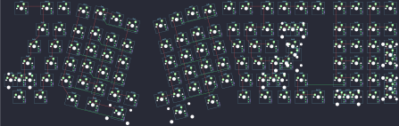

## nopunin10did/jabberwocky/v2/jabberwocky_v2

[layout](jabberwocky_v2-kle.json) - [PCB](jabberwocky_v2.kicad_pcb)

{:loading="lazy"}

[Open in keyboard-layout-editor](http://www.keyboard-layout-editor.com/##@@_x:0.75&y:0.25&c=#777777;&=0,2&_x:0.5&c=#cccccc;&=1,2&=0,3&_x:8.75;&=1,7&=0,8&_x:0.25&c=#aaaaaa;&=1,8&=0,9&=1,9&=5,9&_x:0.25;&=0,0&=1,0&=0,1&=1,1;&@_x:2&y:0.25&c=#cccccc;&=3,2&=2,3&_x:9.25;&=3,7&=2,8&=3,8&_c=#aaaaaa&w:2;&=2,9%0A%0A%0A0,0&_x:1.25;&=2,0&=3,0&=2,1&=3,1;&@_x:1.25&w:1.5;&=5,2&_c=#cccccc;&=4,3&_x:9.75;&=5,7&=4,8&=5,8&_w:1.5;&=4,9%0A%0A%0A1,0&_x:1.5;&=4,0&=5,0&=4,1&_c=#aaaaaa&h:2;&=5,1%0A%0A%0A5,0;&@_x:0.75&w:1.75;&=7,2&_c=#cccccc;&=6,3&_x:10.25;&=7,7&=6,8&_c=#777777&w:2.25;&=7,9%0A%0A%0A1,0&_x:1.5&c=#cccccc;&=6,0&=7,0&=6,1;&@_c=#aaaaaa&w:2.25;&=8,2%0A%0A%0A2,0&_c=#cccccc;&=8,3&_x:10.75;&=9,7&_c=#aaaaaa&w:2.25;&=9,8%0A%0A%0A3,0&_c=#777777;&=8,9&_x:1.25&c=#cccccc;&=8,0&=9,0&=8,1&_c=#777777&h:2;&=11,1%0A%0A%0A6,0;&@_x:0.5&c=#aaaaaa&w:1.25;&=11,2&_w:1.25;&=10,3&_x:10.75&w:1.25;&=11,7&_w:1.25;&=10,8&_c=#777777;&=11,8&=10,9&=11,9&_x:0.25&c=#cccccc&w:2;&=11,0%0A%0A%0A4,0&=10,1;&@_r:14&rx:4&ry:2.5&x:1&y:-2.37;&=0,4;&@_y:-0.88;&=1,3&_x:1&c=#aaaaaa;&=1,4;&@_x:3&y:-0.87;&=0,5;&@_x:1&c=#cccccc;&=2,4;&@_y:-0.88;&=3,3&_x:1;&=3,4;&@_x:3&y:-0.87;&=2,5;&@_x:1&y:-0.25;&=4,4;&@_y:-0.88;&=5,3&_x:1;&=5,4;&@_x:3&y:-0.87;&=4,5;&@_x:1&y:-0.25;&=6,4;&@_y:-0.88;&=7,3&_x:1;&=7,4;&@_x:3&y:-0.87;&=6,5;&@_x:1&y:-0.25;&=8,4;&@_y:-0.88;&=9,3&_x:1;&=9,4;&@_x:3&y:-0.87;&=8,5&=10,5;&@_x:0.5&y:-0.13&c=#aaaaaa&w:1.25;&=11,3&_c=#cccccc&w:1.25;&=10,4;&@_x:3&y:-0.87&w:2;&=11,4;&@_r:-14&rx:13.25&x:-2.0&y:-2.37;&=1,6;&@_x:-3.0&y:-0.88&c=#aaaaaa;&=0,6&_x:1.0&c=#cccccc;&=0,7;&@_x:-4.0&y:-0.87&c=#aaaaaa;&=1,5;&@_x:-2.0&c=#cccccc;&=3,6;&@_x:-3.0&y:-0.88;&=2,6&_x:1.0;&=2,7;&@_x:-4.0&y:-0.87;&=3,5;&@_x:-2.0&y:-0.25;&=5,6;&@_x:-3.0&y:-0.88;&=4,6&_x:1.0;&=4,7;&@_x:-4.0&y:-0.87;&=5,5;&@_x:-2.0&y:-0.25;&=7,6;&@_x:-3.0&y:-0.88;&=6,6&_x:1.0;&=6,7;&@_x:-4.0&y:-0.87;&=7,5;&@_x:-2.0&y:-0.25;&=9,6;&@_x:-3.0&y:-0.88;&=8,6&_x:1.0;&=8,7;&@_x:-5.0&y:-0.87;&=11,5&=9,5;&@_x:-2.25&y:-0.13&c=#aaaaaa&w:1.25;&=11,6;&@_x:-5.0&y:-0.87&c=#cccccc&w:2.75;&=10,6;&@_r:0&rx:0&ry:0&x:24.0&y:1.5;&=2,9%0A%0A%0A0,1&=3,9%0A%0A%0A0,1;&@_x:24.75&c=#777777&w:1.25&h:2&w2:1.5&h2:1&x2:-0.25;&=7,9%0A%0A%0A1,1&_x:0.25&c=#aaaaaa;&=5,1%0A%0A%0A5,1;&@_x:23.75&c=#cccccc;&=7,8%0A%0A%0A1,1&_x:1.5&c=#aaaaaa;&=7,1%0A%0A%0A5,1;&@_x:26.25;&=9,1%0A%0A%0A6,1;&@_x:26.25&c=#777777;&=11,1%0A%0A%0A6,1;&@_y:0.25&c=#aaaaaa&w:1.25;&=8,2%0A%0A%0A2,1&=9,2%0A%0A%0A2,1&_x:12.75;&=8,8%0A%0A%0A3,1&_w:1.25;&=9,8%0A%0A%0A3,1&_x:2.25&c=#cccccc;&=10,0%0A%0A%0A4,1&=11,0%0A%0A%0A4,1)

{:loading="lazy"}

