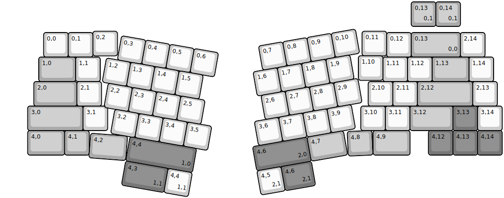
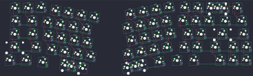

## noxary/valhalla

[layout](valhalla-kle.json) - [PCB](valhalla.kicad_pcb)

{:loading="lazy"}

[Open in keyboard-layout-editor](http://www.keyboard-layout-editor.com/##@@_x:3.7&y:1.2;&=0,2&_x:9.95;&=0,11;&@_x:1.7&y:-0.95;&=0,0&=0,1&_x:11.95;&=0,12&_c=#aaaaaa&w:2;&=0,13%0A%0A%0A0,0&_c=#cccccc;&=2,14;&@_x:14.5&y:-0.05;&=1,10;&@_x:1.5&y:-0.95&c=#aaaaaa&w:1.5;&=1,0&_c=#cccccc;&=1,1&_x:11.5;&=1,11&=1,12&_c=#aaaaaa&w:1.5;&=1,13&_c=#cccccc;&=1,14;&@_x:14.9;&=2,10&=2,11&_c=#aaaaaa&w:2.25;&=2,12&_c=#cccccc;&=2,13&_x:-18.85&c=#aaaaaa&w:1.75;&=2,0&_c=#cccccc;&=2,1;&@_x:1.05&c=#aaaaaa&w:2.25;&=3,0&_c=#cccccc;&=3,1&_x:10.3;&=3,10&=3,11&_c=#aaaaaa&w:1.75;&=3,12&_c=#777777;&=3,13&_c=#cccccc;&=3,14;&@_x:1.05&c=#aaaaaa&w:1.5;&=4,0&=4,1&_x:11.55&w:1.5;&=4,9&_x:0.75&c=#777777;&=4,12&=4,13&=4,14;&@_r:4.4&x:4.02&y:-1.19&c=#aaaaaa&w:1.5;&=4,2;&@_r:10&x:5.05&y:-5.56&c=#cccccc;&=0,3&=0,4&=0,5&=0,6;&@_x:4.6;&=1,2&=1,3&=1,4&=1,5;&@_x:4.85;&=2,2&=2,3&=2,4&=2,5;&@_x:5.3;&=3,2&=3,3&=3,4&=3,5;&@_x:6.1&c=#777777&w:2.75;&=4,4%0A%0A%0A1,0;&@_r:-10&x:9.95&y:-1.9&c=#cccccc;&=0,7&=0,8&=0,9&=0,10;&@_x:9.55;&=1,6&=1,7&=1,8&=1,9;&@_x:9.7;&=2,6&=2,7&=2,8&=2,9;&@_x:9.25;&=3,6&=3,7&=3,8&=3,9;&@_x:9&c=#777777&w:2.25;&=4,6%0A%0A%0A2,0&_c=#aaaaaa&w:1.5;&=4,7;&@_r:-2.5&x:13.8&y:-2.7;&=4,8;&@_r:0&x:16.65&y:-6.9;&=0,13%0A%0A%0A0,1&=0,14%0A%0A%0A0,1;&@_r:10&x:6.1&y:4.5&c=#777777&w:1.75;&=4,3%0A%0A%0A1,1&_c=#cccccc;&=4,4%0A%0A%0A1,1;&@_r:-10&x:9&y:2.1;&=4,5%0A%0A%0A2,1&_c=#777777&w:1.25;&=4,6%0A%0A%0A2,1)

{:loading="lazy"}

