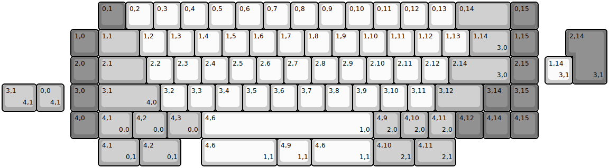
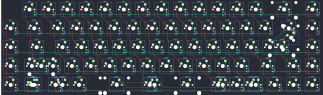
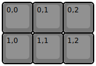
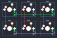
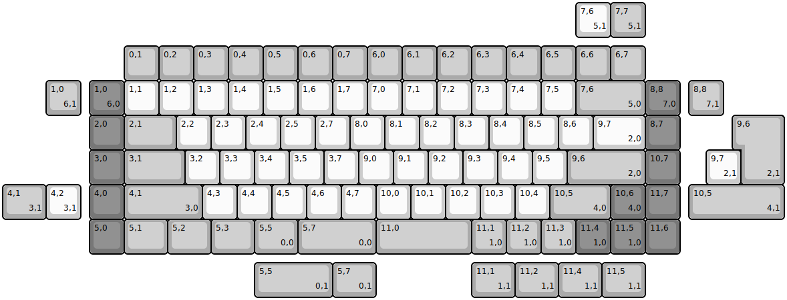
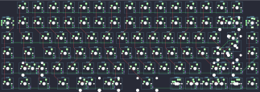
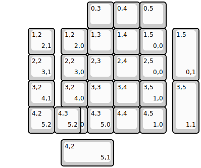
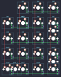

## nullbitsco/nibble

[layout](nibble-kle.json) - [PCB](nibble.kicad_pcb)

{:loading="lazy"}

[Open in keyboard-layout-editor](http://www.keyboard-layout-editor.com/##@@_x:3.5&c=#777777;&=0,1&_c=#cccccc;&=0,2&=0,3&=0,4&=0,5&=0,6&=0,7&=0,8&=0,9&=0,10&=0,11&=0,12&=0,13&_c=#aaaaaa&w:2;&=0,14&_c=#777777;&=0,15;&@_x:2.5;&=1,0&_c=#aaaaaa&w:1.5;&=1,1&_c=#cccccc;&=1,2&=1,3&=1,4&=1,5&=1,6&=1,7&=1,8&=1,9&=1,10&=1,11&=1,12&=1,13&_c=#aaaaaa&w:1.5;&=1,14%0A%0A%0A3,0&_c=#777777;&=1,15;&@_x:2.5;&=2,0&_c=#aaaaaa&w:1.75;&=2,1&_c=#cccccc;&=2,2&=2,3&=2,4&=2,5&=2,6&=2,7&=2,8&=2,9&=2,10&=2,11&=2,12&_c=#aaaaaa&w:2.25;&=2,14%0A%0A%0A3,0&_c=#777777;&=2,15;&@_x:2.5;&=3,0&_c=#aaaaaa&w:2.25;&=3,1%0A%0A%0A4,0&_c=#cccccc;&=3,2&=3,3&=3,4&=3,5&=3,6&=3,7&=3,8&=3,9&=3,10&=3,11&_c=#aaaaaa&w:1.75;&=3,12&_c=#777777;&=3,14&=3,15;&@_x:2.5;&=4,0&_c=#aaaaaa&w:1.25;&=4,1%0A%0A%0A0,0&_w:1.25;&=4,2%0A%0A%0A0,0&_w:1.25;&=4,3%0A%0A%0A0,0&_c=#cccccc&w:6.25;&=4,6%0A%0A%0A1,0&_c=#aaaaaa;&=4,9%0A%0A%0A2,0&=4,10%0A%0A%0A2,0&=4,11%0A%0A%0A2,0&_c=#777777;&=4,12&=4,14&=4,15;&@_x:20.75&y:-4&w:1.25&h:2&w2:1.5&h2:1&x2:-0.25;&=2,14%0A%0A%0A3,1;&@_x:19.75&c=#cccccc;&=1,14%0A%0A%0A3,1;&@_c=#aaaaaa&w:1.25;&=3,1%0A%0A%0A4,1&=0,0%0A%0A%0A4,1;&@_x:3.5&y:1&w:1.5;&=4,1%0A%0A%0A0,1&_w:1.5;&=4,2%0A%0A%0A0,1&_x:0.75&c=#cccccc&w:2.75;&=4,6%0A%0A%0A1,1&_w:1.25;&=4,9%0A%0A%0A1,1&_w:2.25;&=4,6%0A%0A%0A1,1&_c=#aaaaaa&w:1.5;&=4,10%0A%0A%0A2,1&_w:1.5;&=4,11%0A%0A%0A2,1)

{:loading="lazy"}

## nullbitsco/scramble

[layout](scramble-kle.json) - [PCB](scramble.kicad_pcb)

{:loading="lazy"}

[Open in keyboard-layout-editor](http://www.keyboard-layout-editor.com/##@@_c=#777777;&=0,0&=0,1&=0,2;&@=1,0&=1,1&=1,2)

{:loading="lazy"}

## nullbitsco/snap

[layout](snap-kle.json) - [PCB](snap.kicad_pcb)

{:loading="lazy"}

[Open in keyboard-layout-editor](http://www.keyboard-layout-editor.com/##@@_x:3.5&y:1.25&c=#aaaaaa;&=0,1&=0,2&=0,3&=0,4&=0,5&=0,6&=0,7&=6,0&=6,1&=6,2&=6,3&=6,4&=6,5&=6,6&=6,7;&@_x:2.5&c=#777777;&=1,0%0A%0A%0A6,0%0A%0A%0A%0A%0A%0Ae0&_c=#cccccc;&=1,1&=1,2&=1,3&=1,4&=1,5&=1,6&=1,7&=7,0&=7,1&=7,2&=7,3&=7,4&=7,5&_c=#aaaaaa&w:2;&=7,6%0A%0A%0A5,0&_c=#777777;&=8,8%0A%0A%0A7,0%0A%0A%0A%0A%0A%0Ae1;&@_x:2.5;&=2,0&_c=#aaaaaa&w:1.5;&=2,1&_c=#cccccc;&=2,2&=2,3&=2,4&=2,5&=2,7&=8,0&=8,1&=8,2&=8,3&=8,4&=8,5&=8,6&_w:1.5;&=9,7%0A%0A%0A2,0&_c=#777777;&=8,7;&@_x:2.5;&=3,0&_c=#aaaaaa&w:1.75;&=3,1&_c=#cccccc;&=3,2&=3,3&=3,4&=3,5&=3,7&=9,0&=9,1&=9,2&=9,3&=9,4&=9,5&_c=#aaaaaa&w:2.25;&=9,6%0A%0A%0A2,0&_c=#777777;&=10,7;&@_x:2.5;&=4,0&_c=#aaaaaa&w:2.25;&=4,1%0A%0A%0A3,0&_c=#cccccc;&=4,3&=4,4&=4,5&=4,6&=4,7&=10,0&=10,1&=10,2&=10,3&=10,4&_c=#aaaaaa&w:1.75;&=10,5%0A%0A%0A4,0&_c=#777777;&=10,6%0A%0A%0A4,0&=11,7;&@_x:2.5;&=5,0&_c=#aaaaaa&w:1.25;&=5,1&_w:1.25;&=5,2&_w:1.25;&=5,3&_w:1.25;&=5,5%0A%0A%0A0,0&_w:2.25;&=5,7%0A%0A%0A0,0&_w:2.75;&=11,0&=11,1%0A%0A%0A1,0&=11,2%0A%0A%0A1,0&=11,3%0A%0A%0A1,0&_c=#777777;&=11,4%0A%0A%0A1,0&=11,5%0A%0A%0A1,0&=11,6;&@_x:16.5&y:-7.25&c=#cccccc;&=7,6%0A%0A%0A5,1&_c=#aaaaaa;&=7,7%0A%0A%0A5,1;&@_x:1.25&y:1.25;&=1,0%0A%0A%0A6,1&_x:17.5;&=8,8%0A%0A%0A7,1;&@_x:21.25&w:1.25&h:2&w2:1.5&h2:1&x2:-0.25;&=9,6%0A%0A%0A2,1;&@_x:20.25&c=#cccccc;&=9,7%0A%0A%0A2,1;&@_c=#aaaaaa&w:1.25;&=4,1%0A%0A%0A3,1&_c=#cccccc;&=4,2%0A%0A%0A3,1&_x:17.5&c=#aaaaaa&w:2.75;&=10,5%0A%0A%0A4,1;&@_x:7.25&y:1.25&w:2.25;&=5,5%0A%0A%0A0,1&_w:1.25;&=5,7%0A%0A%0A0,1&_x:2.75&w:1.25;&=11,1%0A%0A%0A1,1&_w:1.25;&=11,2%0A%0A%0A1,1&_w:1.25;&=11,4%0A%0A%0A1,1&_w:1.25;&=11,5%0A%0A%0A1,1)

{:loading="lazy"}

## nullbitsco/tidbit

[layout](tidbit-kle.json) - [PCB](tidbit.kicad_pcb)

{:loading="lazy"}

[Open in keyboard-layout-editor](http://www.keyboard-layout-editor.com/##@@_x:3.25;&=0,3&=0,4&=0,5;&@_x:2.25;&=1,2%0A%0A%0A2,0%0A%0A%0A%0A%0A%0Ae0&=1,3&_x:-1.0;&=1,3&=1,4&=1,5%0A%0A%0A0,0;&@_x:2.25;&=2,2%0A%0A%0A3,0%0A%0A%0A%0A%0A%0Ae1&=2,3&=2,4&=2,5%0A%0A%0A0,0;&@_x:2.25;&=3,2%0A%0A%0A4,0%0A%0A%0A%0A%0A%0Ae2&=3,3&=3,4&=3,5%0A%0A%0A1,0;&@_x:2.25;&=4,2%0A%0A%0A5,0&=4,3%0A%0A%0A5,0&=4,4&=4,5%0A%0A%0A1,0;&@_x:1&y:-4;&=1,2%0A%0A%0A2,1&_x:4.5&h:2;&=1,5%0A%0A%0A0,1;&@_x:1;&=2,2%0A%0A%0A3,1;&@_x:1;&=3,2%0A%0A%0A4,1&_x:4.5&h:2;&=3,5%0A%0A%0A1,1;&@_x:1;&=4,2%0A%0A%0A5,2%0A%0A%0A%0A%0A%0Ae3&=4,3%0A%0A%0A5,2;&@_x:2.25&y:0.25&w:2;&=4,2%0A%0A%0A5,1)

{:loading="lazy"}

